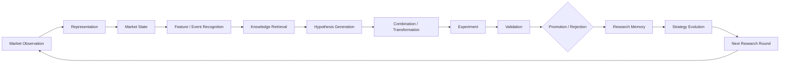

# HLENS-AutoResearch

> 一个长期演化的、模块化、可插拔、可验证的**加密市场自动化研究基础设施**。

**当前阶段：Architecture Bootstrap（架构准备）** — 仓库只包含目录规划与文档，**没有任何业务实现**。

## 它是什么 / 不是什么

HLENS-AutoResearch **不是**单纯的 Trading Bot、Backtest Framework、Alpha Library、LLM Agent 或 Strategy Bot。

它是一个**研究闭环**：



核心目标：持续吸收公开研究知识、已有策略、因子、特征、风控方法与**失败经验**，通过组合、条件化、交互、时序关系和实验验证，不断产生并检验新的研究假设。

## 架构原则（摘要）

1. **Freeze Contracts, Evolve Implementations** — 冻结契约，演化实现。
2. Domain Model 优先于具体技术实现。
3. Research Plane 与 Application Plane 分离。
4. 数据 / 实验 / 策略 / Feature / State / Risk / Outcome 全部版本化。
5. LLM、Backtest Engine 均为可替换 Provider。
6. 所有 Experiment 必须可复现；失败实验必须保存。
7. 禁止为了提高回测结果而修改 Validation Constitution。

完整原则见 [docs/architecture/00-overview.md](docs/architecture/00-overview.md)。

## 文档导航

| 区域 | 入口 |
|---|---|
| 项目状态（所有者驾驶舱） | [PROJECT_STATUS.md](PROJECT_STATUS.md) |
| 架构总览 | [docs/architecture/00-overview.md](docs/architecture/00-overview.md) |
| 研究宪法（Validation Constitution） | [docs/research/constitution.md](docs/research/constitution.md) |
| 路线图 | [docs/research/roadmap.md](docs/research/roadmap.md) |
| 架构决策记录 | [docs/adr/README.md](docs/adr/README.md) |
| AI 协作规范 | [CLAUDE.md](CLAUDE.md) · [AGENTS.md](AGENTS.md) |

## 目录结构

```
hlens-autoresearch/
├── docs/            架构、研究、ADR 文档（当前唯一有实质内容的部分）
├── apps/            Application Plane：api / worker / web
├── core/            Domain 模型、Contracts、Lifecycle、Errors（冻结层）
├── research/        Research Plane：features / states / events / outcomes / hypotheses / experiments / validation
├── strategies/      已晋升（promoted）的策略定义
├── risk/            风控策略定义
├── plugins/         Provider 插件实现
├── data/            本地开发数据挂载点（不入库，见 03-data.md）
├── infrastructure/  部署、容器、可观测性配置
└── tests/           测试
```

每个目录下的 `README.md` 说明其职责边界。

## 状态

当前进度见 [PROJECT_STATUS.md](PROJECT_STATUS.md)。

## 开发环境

- Python 3.13，由 [uv](https://docs.astral.sh/uv/) 管理，与系统 Python 隔离（[ADR-0003](docs/adr/0003-python-version-and-uv.md)）。
- 依赖保持最小：`pydantic`（契约）+ `pytest` / `ruff` / `mypy`（工程基线）。

```bash
uv sync                                   # 创建 .venv 并安装依赖
uv run pytest                             # 测试
uv run ruff check . && uv run ruff format --check .   # lint
uv run mypy                               # 类型检查
uv run python -m core.contracts.registry  # 重新导出 schemas/
```

`schemas/` 中的 JSON Schema 由契约生成并随仓库提交：契约变更必须在 diff 中可见，
`tests/test_contracts.py` 会检查两者是否一致。
