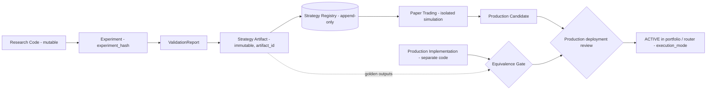

# ADR-0005: Research / Production Boundary（D-03）

| 字段 | 值 |
|---|---|
| 状态 | **Accepted**（2026-09-23，Raphael 批准 D-03） |
| 日期 | 起草 2026-09-21；批准 2026-09-23 |
| 决策者 | Raphael |
| 起草者 | Claude Code |
| 相关 Phase | Phase 0（契约）、Phase 5+（首次使用） |
| 影响范围 | Contract / Lifecycle / Plane 边界 / 目录结构 |
| 是否破坏兼容 | 否（细化 ADR-0002 与 01-system.md §3） |

## 背景

原则 P16 / H5 规定"研究代码 ≠ 生产代码"。Raphael 的决定：边界**不能**理解为把 `research/` 复制到 `strategies/`，而必须是一条可验证的链：

```
Research Code → Experiment → Validation → Strategy Artifact → Strategy Registry
→ Paper Trading → Production Candidate → Production
```

本 ADR 定义链上每个概念，以及如何证明"生产策略对应一个经过验证的研究结果"。

> **C-1 已决定（Raphael，2026-09-21，选项 B）**：Paper Trading 在 Production Candidate **之前**，与本链条一致；ADR-0006 已同步。
> PRODUCTION_CANDIDATE = 已通过研究验证**且**已成功完成 Paper Trading，可以进入生产部署审查，但尚未进入生产。
> ACTIVE = 被策略组合 / Router 正式启用，带 `execution_mode = SIMULATED | LIVE`（C-2，见 ADR-0006）。

## 决策

### 1. 核心概念



| 概念 | 定义 | 关键性质 |
|---|---|---|
| **Research Code** | `research/` 中的探索性实现 | 可自由修改；**永不被生产运行时加载** |
| **Experiment** | ExperimentSpec + Run（06-experiment.md） | 由 `experiment_hash` 唯一标识 |
| **ValidationReport** | 按 Constitution + Validation Profile 的判定结果 | 绑定 `experiment_hash`、Constitution 版本、Profile 版本 |
| **Strategy Artifact** | 一个策略"研究结论"的**不可变**打包 | 由 `artifact_id` 内容寻址；只能从通过验证的实验生成 |
| **Strategy Registry** | Control Plane 中登记 Artifact 及其生命周期的追加式注册表 | 唯一的"什么策略可以被运行"的来源 |
| **Promotion** | Registry 中一次受门控的生命周期转移（状态机见 ADR-0006） | 需要证据引用 + 规则检查 + 人工批准（指定转移） |
| **Revalidation** | 对已登记 Artifact 的重新验证 | 产生新 ValidationReport，不修改旧报告 |
| **Production Implementation** | 生产运行时中的策略执行代码 | 与研究代码分离；必须通过 Equivalence Gate |

### 2. Strategy Artifact 内容（manifest 草案）

| 字段 | 说明 |
|---|---|
| `artifact_id` | manifest 规范化 JSON 的 SHA-256 |
| `strategy_spec` | 声明式规格：信号引用、**固定参数**、仓位规则 |
| `dependencies` | 所有 Feature / State / Event / Risk / Cost Model 的 `name@version` + `content_hash` |
| `research_code_ref` | 研究实现的 `git commit` + 相关路径的 **tree hash** |
| `experiment_hashes` | 支撑该结论的实验（IS、walk-forward、OOS） |
| `validation_reports` | 报告 ID，含 Constitution / Profile 版本 |
| `golden_outputs` | 在固定数据快照上的**参考信号与仓位序列**（Parquet，含哈希） |
| `applicability` | 标的、周期、适用状态 |
| `created_at` | UTC |

Artifact 一经生成不可修改。任何参数、依赖或代码变化 = 新 Artifact = 需重新验证。

### 3. 哈希定义

| 哈希 | 计算方式 |
|---|---|
| `code_hash` | `git commit` + 相关目录的 git tree hash（要求工作区干净）；每个插件另有 `content_hash` |
| `experiment_hash` | 复现元组（06-experiment.md §2）规范化 JSON 的 SHA-256 |
| `artifact_id` | Artifact manifest 规范化 JSON 的 SHA-256 |
| `deployment_id` | 生产部署记录（`artifact_id` + 生产实现 `code_hash` + 配置哈希） |

### 4. 可追溯链（不变量）

```
deployment_id → artifact_id → validation_reports → experiment_hash
             → dataset snapshot_ids + research code_hash + plugin versions
```

- 生产运行时**拒绝加载**不满足以下全部条件的策略：`artifact_id` 存在于 Registry；当前生命周期状态允许运行；Equivalence Gate 对当前生产实现 `code_hash` 已通过。
- 任一环节缺失 = 不可部署。

### 5. Production：重新实现 vs Adapter

| 方案 | 做法 | 优点 | 缺点 |
|---|---|---|---|
| **A. 完全重新实现** | 每个策略在生产包中重写 | 生产代码质量可控 | 成本高；存在翻译错误风险 |
| **B. 声明式 Adapter** | 生产运行时解释 `strategy_spec`，使用生产级 Provider | 不重复代码；研究与生产语义一致 | 需要足够表达力的规格语言 |
| **C. 混合（推荐）** | 能用声明式规格表达的走 B；需要自定义逻辑的部分在生产包中重新实现（A） | 兼顾两者 | 需维护两条路径 |

无论哪种方案，都必须通过 **Equivalence Gate**：在 Artifact 的固定数据快照上，生产实现输出的信号 / 仓位与 `golden_outputs` 一致（确定性部分按位一致或在声明容差内）。

**推荐 C**，由 Raphael 决定。

### 6. Revalidation 触发条件

- 生命周期进入 DEGRADED（见 ADR-0006）
- 依赖的 Feature / State / Provider 版本变化
- 数据源或数据质量规则变化
- 生产实现变化（重跑 Equivalence Gate）
- 周期性复核（周期由 Validation Profile 定义）

Revalidation 使用**登记时的** Profile 版本；是否同时报告新版本 Profile 结果由 Raphael 决定（Q-3）。新 Profile 不能用来"挽救"已失败的对象。

### 7. 目录映射（建议）

| 目录 | 内容 |
|---|---|
| `research/` | 研究代码（可变，永不被生产加载） |
| `strategies/` | 生产实现（方案 A/C 的重新实现部分）与声明式规格的生产解释器 |
| `risk/` | 生产级风控实现 |
| `plugins/` | 生产级 Provider（被研究与生产共同使用的，需版本化 + 一致性测试） |
| Registry / Artifact 存储 | Control Plane（PostgreSQL）+ 对象存储，**不在 Git 中** |

## 仍未决定的细节（不在本次批准范围内）

批准本 ADR 不代表以下问题已有答案；它们在对应 Phase 之前提出 Decision Packet。

| ID | 问题 |
|---|---|
| Q-1 | 生产实现方案 A / B / C |
| Q-2 | 研究与生产是否可以共用同一个"生产级 Provider"（例如同一个 Feature 实现），还是生产必须拥有独立副本 |
| Q-3 | Revalidation 是否需要同时报告新 Profile 的结果（仅供参考，不影响判定） |
| Q-7 | Paper Trading 运行在研究实现上，还是必须已经运行在通过 Equivalence Gate 的生产实现上（图中只确定：ACTIVE 之前必须通过 Equivalence Gate） |

## 后果

- 正面：生产中的每个策略都能追溯到数据快照、代码和验证报告。
- 负面：需要额外实现 Artifact 打包、Registry 与 Equivalence Gate（归入 Phase 0 契约 + Phase 5 实现）。
- 对 ADR-0002：细化，不推翻。

## Implementation note (2026-09-26)

决策者 Claude Code（Opus），实现已 Accepted 的本 ADR；**不新增 ADR**；`core/`（契约、生命周期）、Schema、Constitution、Profile
均不变；无网络、无 PostgreSQL、无真实数据；不触及执行 / 实盘。状态 **CODE_COMPLETE / DEBUG_PENDING**。

1. **Strategy Registry**（`infrastructure/registry/`）：§7 的 Control Plane（PostgreSQL）+ 对象存储尚未可用，本批是**文件型替身**：
   复用 `infrastructure.event_bus.journal.AppendOnlyJournal`（同一哈希链 JSON-lines 磁盘契约）记录 `artifact.registered` /
   `equivalence.recorded` / `deployment.recorded` 三类记录；`blobs/` 为按 SHA-256 命名、只写一次的 golden 数据；`.lock`
   单写者。追加与重放执行同一套规则：重复、悬空引用、未知类型、多余 / 缺失键、契约不成立、记录身份与内容哈希不符 →
   拒绝（重放时整个 Registry 无法打开）；无任何编辑 / 删除操作。尾部整行截断须用目录外锚点（`anchor=`）发现。
   放在 `infrastructure/`：只依赖 Domain，研究侧与生产侧都可使用而互不 import。迁往 PostgreSQL 仍待 D-01 / D-02。
2. **Promotion service**（`research/promotion/`，Research Plane 一侧）：只从 StrategySpec、ValidationReport（每份 PASS；G0–G4 各有
   报告评估；至少一份 `promotion_blocked_reason is None`，即含 G5 sealed OOS 的 PASS）、被报告引用的 ExperimentSpec（绑定该
   spec 及其内容哈希、同一 Constitution / Profile、同一研究 commit）、依赖闭包（无冲突，覆盖 spec 的信号与风控）、生命周期
   （合法历史、经人工批准的 OOS → PAPER，当前为 PAPER / PRODUCTION_CANDIDATE / ACTIVE）以及研究 Provider 在声明的 golden 输入上
   **确定性**（跑两次逐字节相同）算出的 golden 输出构建 Artifact；任一缺失 / 非 PASS / 不符 → `PromotionRefused(reason)`，
   不写任何东西、不产生部分 Artifact。今天 `research/strategies/library.py` 的策略**全部**以 `no_validation_report` 被拒（有测试）；2026-09-26 起 Promotion 还要求每份报告的 Profile 为 FROZEN 且带 `provenance.calibration_report`（C-A8），并要求报告含 ADR-0060 市场基准项——今天没有冻结的 Profile，所以即使给出完整的测试证据也以 `profile_not_frozen` 被拒（有测试）。
3. **Golden 编码**（`infrastructure/registry/golden.py`，实现选择，非冻结）：在 StrategyProvider 层，"signals" = golden 请求
   （`StrategyRequest`，含其信号观察序列与固定参数），"positions" = 每个请求的 `request_hash` + `TargetPosition` 序列，不含
   Provider 身份。
4. **Equivalence Gate**（`apps/promotion/`，Application Plane，不 import `research/`）：从 Registry 读取并核验 golden 数据，
   在候选生产 Provider 上逐请求运行；`signals_match` = 每个回答通过 `check_answers`；`positions_match` = positions 载荷哈希
   **逐字节**等于 `positions_hash`。契约的 `tolerance` 无声明语义，故为 `None`，比较为精确比较（`0.25` ≠ `0.2500`）。研究代码
   类（模块根为 `research`）作为候选直接拒绝。`DeploymentRecord` 只在检查通过**且**已记录、同一生产代码无失败检查、策略处于
   PRODUCTION_CANDIDATE / ACTIVE 时写入；`deployment_id` = §3 的 `{artifact_id, 生产 commit + tree, config_hash}` 规范 JSON 的
   SHA-256（契约未冻结算法，这是本实现的选择）。部署记录只是审计记录，不运行任何东西。
5. 未决问题 Q-1 / Q-2 / Q-3 / Q-7 不因本实现而决定；`strategies/`、`risk/`、`plugins/` 未放入任何策略。

**2026-09-27 补记（ADR-0062，B56；同日由 Codex Accepted）**：Promotion 不再以调用方交来的 Profile 对象的 `status = FROZEN` 作为冻结依据（`status` 不在
内容哈希内，ADR-0008）；权威来源是追加式、带必需目录外锚点的 Profile 冻结登记（`infrastructure/registry/profile_freeze.py`）。
没有对应 Profile ref + 内容哈希、引用其校准报告的有效登记 → `profile_not_frozen`。本 ADR 的决定不变。
