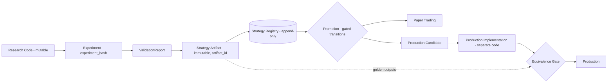

# ADR-0005: Research / Production Boundary（D-03）

| 字段 | 值 |
|---|---|
| 状态 | **Proposed**（等待 Raphael 批准） |
| 日期 | 2026-09-21 |
| 决策者 | Raphael（待定） |
| 起草者 | Claude Code |
| 相关 Phase | Phase 0（契约）、Phase 5+（首次使用） |
| 影响范围 | Contract / Lifecycle / Plane 边界 / 目录结构 |
| 是否破坏兼容 | 否（细化 ADR-0002 与 01-system.md §3） |

## 背景

原则 P16 / H5 规定"研究代码 ≠ 生产代码"。Raphael 的决定：边界**不能**理解为把 `research/` 复制到 `strategies/`，而必须是一条可验证的链：

```
Research Code → Experiment → Validation → Strategy Artifact → Strategy Registry
→ Paper Trading → Production Candidate → Production
```

本 ADR 定义链上每个概念，以及如何证明"生产策略对应一个经过验证的研究结果"。

> ⚠️ **ARCHITECTURE_DECISION_REQUIRED（C-1）**：上面这条链中 **Paper Trading 在 Production Candidate 之前**，而 D-05 的生命周期（ADR-0006）中 **PRODUCTION_CANDIDATE 在 PAPER 之前**。两者是 Raphael 给出的两份规格，本 ADR **不选择**顺序，下文用"晋升顺序（待 C-1 决定）"表示。

## 提议的决策

### 1. 核心概念



| 概念 | 定义 | 关键性质 |
|---|---|---|
| **Research Code** | `research/` 中的探索性实现 | 可自由修改；**永不被生产运行时加载** |
| **Experiment** | ExperimentSpec + Run（06-experiment.md） | 由 `experiment_hash` 唯一标识 |
| **ValidationReport** | 按 Constitution + Validation Profile 的判定结果 | 绑定 `experiment_hash`、Constitution 版本、Profile 版本 |
| **Strategy Artifact** | 一个策略"研究结论"的**不可变**打包 | 由 `artifact_id` 内容寻址；只能从通过验证的实验生成 |
| **Strategy Registry** | Control Plane 中登记 Artifact 及其生命周期的追加式注册表 | 唯一的"什么策略可以被运行"的来源 |
| **Promotion** | Registry 中一次受门控的状态转移 | 需要证据引用 + 规则检查 + 人工批准（指定转移） |
| **Revalidation** | 对已登记 Artifact 的重新验证 | 产生新 ValidationReport，不修改旧报告 |
| **Production Implementation** | 生产运行时中的策略执行代码 | 与研究代码分离；必须通过 Equivalence Gate |

### 2. Strategy Artifact 内容（manifest 草案）

| 字段 | 说明 |
|---|---|
| `artifact_id` | manifest 规范化 JSON 的 SHA-256 |
| `strategy_spec` | 声明式规格：信号引用、**固定参数**、仓位规则 |
| `dependencies` | 所有 Feature / State / Event / Risk / Cost Model 的 `name@version` + `content_hash` |
| `research_code_ref` | 研究实现的 `git commit` + 相关路径的 **tree hash** |
| `experiment_hashes` | 支撑该结论的实验（IS、walk-forward、OOS） |
| `validation_reports` | 报告 ID，含 Constitution / Profile 版本 |
| `golden_outputs` | 在固定数据快照上的**参考信号与仓位序列**（Parquet，含哈希） |
| `applicability` | 标的、周期、适用状态 |
| `created_at` | UTC |

Artifact 一经生成不可修改。任何参数、依赖或代码变化 = 新 Artifact = 需重新验证。

### 3. 哈希定义

| 哈希 | 计算方式 |
|---|---|
| `code_hash` | `git commit` + 相关目录的 git tree hash（要求工作区干净）；每个插件另有 `content_hash` |
| `experiment_hash` | 复现元组（06-experiment.md §2）规范化 JSON 的 SHA-256 |
| `artifact_id` | Artifact manifest 规范化 JSON 的 SHA-256 |
| `deployment_id` | 生产部署记录（`artifact_id` + 生产实现 `code_hash` + 配置哈希） |

### 4. 可追溯链（不变量）

```
deployment_id → artifact_id → validation_reports → experiment_hash
             → dataset snapshot_ids + research code_hash + plugin versions
```

- 生产运行时**拒绝加载**不满足以下全部条件的策略：`artifact_id` 存在于 Registry；当前生命周期状态允许运行；Equivalence Gate 对当前生产实现 `code_hash` 已通过。
- 任一环节缺失 = 不可部署。

### 5. Production：重新实现 vs Adapter

| 方案 | 做法 | 优点 | 缺点 |
|---|---|---|---|
| **A. 完全重新实现** | 每个策略在生产包中重写 | 生产代码质量可控 | 成本高；存在翻译错误风险 |
| **B. 声明式 Adapter** | 生产运行时解释 `strategy_spec`，使用生产级 Provider | 不重复代码；研究与生产语义一致 | 需要足够表达力的规格语言 |
| **C. 混合（推荐）** | 能用声明式规格表达的走 B；需要自定义逻辑的部分在生产包中重新实现（A） | 兼顾两者 | 需维护两条路径 |

无论哪种方案，都必须通过 **Equivalence Gate**：在 Artifact 的固定数据快照上，生产实现输出的信号 / 仓位与 `golden_outputs` 一致（确定性部分按位一致或在声明容差内）。

**推荐 C**，由 Raphael 决定。

### 6. Revalidation 触发条件

- 生命周期进入 DEGRADED（见 ADR-0006）
- 依赖的 Feature / State / Provider 版本变化
- 数据源或数据质量规则变化
- 生产实现变化（重跑 Equivalence Gate）
- 周期性复核（周期由 Validation Profile 定义）

Revalidation 使用**登记时的** Profile 版本；是否同时报告新版本 Profile 结果由 Raphael 决定（Q-3）。新 Profile 不能用来"挽救"已失败的对象。

### 7. 目录映射（建议）

| 目录 | 内容 |
|---|---|
| `research/` | 研究代码（可变，永不被生产加载） |
| `strategies/` | 生产实现（方案 A/C 的重新实现部分）与声明式规格的生产解释器 |
| `risk/` | 生产级风控实现 |
| `plugins/` | 生产级 Provider（被研究与生产共同使用的，需版本化 + 一致性测试） |
| Registry / Artifact 存储 | Control Plane（PostgreSQL）+ 对象存储，**不在 Git 中** |

## 需要 Raphael 决定

| ID | 问题 |
|---|---|
| **C-1** | Paper Trading 与 Production Candidate 的先后顺序（与 ADR-0006 冲突） |
| Q-1 | 生产实现方案 A / B / C |
| Q-2 | 研究与生产是否可以共用同一个"生产级 Provider"（例如同一个 Feature 实现），还是生产必须拥有独立副本 |
| Q-3 | Revalidation 是否需要同时报告新 Profile 的结果（仅供参考，不影响判定） |

## 后果

- 正面：生产中的每个策略都能追溯到数据快照、代码和验证报告。
- 负面：需要额外实现 Artifact 打包、Registry 与 Equivalence Gate（归入 Phase 0 契约 + Phase 5 实现）。
- 对 ADR-0002：细化，不推翻。
