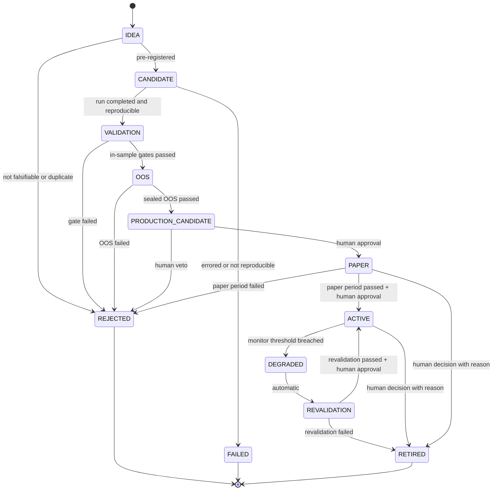

# ADR-0006: Strategy Lifecycle v2（D-05）

| 字段 | 值 |
|---|---|
| 状态 | **Proposed**（等待 Raphael 批准） |
| 日期 | 2026-09-21 |
| 决策者 | Raphael（待定） |
| 起草者 | Claude Code |
| 相关 Phase | Phase 0（状态机契约） |
| 影响范围 | Lifecycle / Contract |
| 是否破坏兼容 | 是：Accepted 后取代 07-validation.md §3 草案（ADR-0002 第 5 条） |

## 背景

Raphael 给出的生命周期原则：

```
IDEA → CANDIDATE → VALIDATION → OOS → PRODUCTION_CANDIDATE → PAPER → ACTIVE
→ DEGRADED → REVALIDATION → ACTIVE / RETIRED
```

规则：
1. DEGRADED 不得直接恢复 ACTIVE。
2. 必须经过 REVALIDATION。
3. RETIRED ≠ FAILED。
4. 必须保留完整生命周期历史。
5. Phase 13 之前，ACTIVE 只表示 Paper / Simulated Trading。
6. Phase 13 才允许真实生产交易。
7. 实盘必须有独立 Risk Gate 和授权机制。

> ⚠️ **ARCHITECTURE_DECISION_REQUIRED（C-1）**：本顺序为 PRODUCTION_CANDIDATE → PAPER，而 ADR-0005 的边界链为 Paper Trading → Production Candidate。本 ADR 按 D-05 原文绘制，**不代表已选择**。
>
> ⚠️ **ARCHITECTURE_DECISION_REQUIRED（C-2）**：规则 5 使 Phase 13 之前的 ACTIVE 也是模拟交易，与 PAPER 状态的区别不明确。见 §3 的解释选项。

## 提议的状态机



## 1. 状态定义

| 状态 | 含义 |
|---|---|
| IDEA | 未登记的想法 |
| CANDIDATE | 已预登记为 ExperimentSpec |
| VALIDATION | 正在经过样本内验证门 |
| OOS | 正在经过封存样本外检验 |
| PRODUCTION_CANDIDATE | 研究结论成立，已生成 Strategy Artifact（ADR-0005） |
| PAPER | 前向模拟交易观察期（真正未见过的数据） |
| ACTIVE | 运行中（执行模式见 §3） |
| DEGRADED | 监控阈值被突破；**停止分配新风险**，等待重新验证 |
| REVALIDATION | 正在重新验证（ADR-0005 §6） |
| RETIRED | 正常退役：曾经有效，现在不再使用 |
| REJECTED | 验证未通过或被否决（Failure Registry） |
| FAILED | 技术失败：运行错误 / 不可复现（Failure Registry） |

## 2. 规则

1. **只允许图中列出的转移**；DEGRADED 不存在直接到 ACTIVE 的边。
2. **RETIRED ≠ FAILED**：RETIRED 记入生命周期历史与"退役记录"，**不进入 Failure Registry**；若退役原因是劣化，退役记录引用相关 Revalidation 报告，供 Research Memory 检索。
3. REJECTED / FAILED / RETIRED 是终态。重试 = 新版本的新 CANDIDATE，旧记录保留并计入 trial count。
4. **完整历史**：每次转移追加一条记录（from、to、时间、触发者、证据引用、批准人），永不修改或删除。
5. 人工批准的转移：PRODUCTION_CANDIDATE → PAPER、PAPER → ACTIVE、REVALIDATION → ACTIVE、任何 → RETIRED。
6. **实盘（Phase 13+）**：进入实盘执行需额外通过**独立 Risk Gate**（与 RiskProvider 分离的硬性限额检查）并留下**授权记录**（授权人、时间、风险预算上限、有效期）。

## 3. PAPER 与 ACTIVE 的区别（C-2，待 Raphael 选择）

| 选项 | 说明 |
|---|---|
| **X. 执行模式属性（推荐）** | PAPER = 单策略的观察期；ACTIVE = 进入组合 / Router 运行。ACTIVE 带属性 `execution_mode ∈ {SIMULATED, LIVE}`；Phase 13 前只能是 SIMULATED；切到 LIVE 需通过 Risk Gate + 授权记录，并记录为一次独立的审计事件 |
| Y. 新增状态 | 增加 `LIVE` 状态：ACTIVE（模拟）→ LIVE（实盘），Phase 13 前不可达 |
| Z. 合并 | Phase 13 前取消 PAPER，ACTIVE 即模拟 |

## 需要 Raphael 决定

| ID | 问题 |
|---|---|
| **C-1** | PRODUCTION_CANDIDATE 与 PAPER 的先后顺序（与 ADR-0005 冲突） |
| **C-2** | PAPER 与 ACTIVE 的区别：选项 X / Y / Z |
| Q-4 | PAPER → ACTIVE、REVALIDATION → ACTIVE 是否都需要人工批准（当前草案：需要） |
| Q-5 | ACTIVE → RETIRED 是否允许人工直接执行（当前草案：允许，需记录原因） |
| Q-6 | 劣化监控阈值与 PAPER 观察期长度：放入 Validation Profile（见 D-09 提案）还是单独定义 |

## 后果

- Accepted 后需同步更新 `docs/architecture/07-validation.md` §3，并在 ADR-0002 标注第 5 条被取代。
