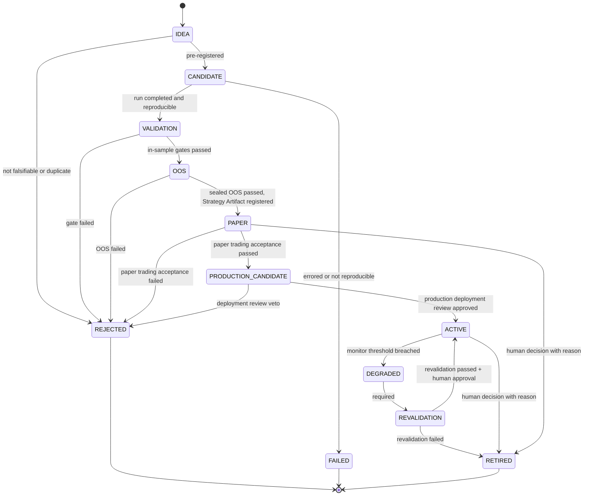

# ADR-0006: Strategy Lifecycle v2（D-05）

| 字段 | 值 |
|---|---|
| 状态 | **Accepted**（2026-09-23，Raphael 批准 D-05）；取代 ADR-0002 第 5 条 |
| 日期 | 起草 2026-09-21；批准 2026-09-23 |
| 决策者 | Raphael |
| 起草者 | Claude Code |
| 相关 Phase | Phase 0（状态机契约） |
| 影响范围 | Lifecycle / Contract |
| 是否破坏兼容 | 是：取代 07-validation.md §3 的旧草案（ADR-0002 第 5 条） |

## 背景

Raphael 给出的生命周期原则（C-1 决定后）：

```
IDEA → CANDIDATE → VALIDATION → OOS → PAPER → PRODUCTION_CANDIDATE → ACTIVE
→ DEGRADED → REVALIDATION → ACTIVE / RETIRED
```

规则：
1. DEGRADED 永远不能直接转为 ACTIVE。
2. 必须走 DEGRADED → REVALIDATION → ACTIVE。
3. RETIRED ≠ FAILED。
4. 每次生命周期转移只能追加，并可审计。
5. Phase 13 之前禁止真实生产交易。
6. 实盘必须有独立 Risk Gate 和明确的授权记录。

## 已决定的冲突

| ID | 决定（Raphael，2026-09-21） |
|---|---|
| **C-1** | 选 **B**：PAPER 在 PRODUCTION_CANDIDATE **之前**。PRODUCTION_CANDIDATE = 已通过研究验证**且**已成功完成要求的 Paper Trading，可以进入生产部署审查，但尚未进入生产。**不得**解释为"纸面交易的候选"。 |
| **C-2** | 选 **A（原选项 X）**：PAPER = 单策略的独立观察与模拟验证；ACTIVE = 被策略组合 / Router 正式启用，并带 `execution_mode = SIMULATED \| LIVE`。**不设独立的 LIVE 生命周期状态。** |

## 状态机



## 1. 状态定义

| 状态 | 含义 |
|---|---|
| IDEA | 未登记的想法 |
| CANDIDATE | 已预登记为 ExperimentSpec |
| VALIDATION | 正在经过样本内验证门 |
| OOS | 正在经过封存样本外检验 |
| PAPER | 单策略的独立观察与模拟验证：对已登记、不可变的 Strategy Artifact 做前向模拟，尚未进入组合 / Router |
| PRODUCTION_CANDIDATE | 已通过研究验证**且**已通过 Paper Trading 验收；可以进入生产部署审查，**但尚未进入生产** |
| ACTIVE | 被策略组合 / Router 正式启用；带 `execution_mode` |
| DEGRADED | 监控阈值被突破；等待重新验证 |
| REVALIDATION | 正在重新验证（ADR-0005 §6） |
| RETIRED | 正常退役：曾经有效，现在不再使用（进入退役记录，**不进入 Failure Registry**） |
| REJECTED | 验证未通过或被否决（Failure Registry） |
| FAILED | 技术失败：运行错误 / 不可复现（Failure Registry） |

## 2. execution_mode（ACTIVE 的属性，不是状态）

| 值 | 条件 |
|---|---|
| `SIMULATED` | Phase 13 之前 ACTIVE **唯一允许**的值 |
| `LIVE` | 仅限 Phase 13 起；必须先通过**独立 Risk Gate**（与 RiskProvider 分离的硬性限额检查），并有**明确的授权记录**（授权人、时间、风险预算上限、有效期） |

`execution_mode` 的每一次变更都作为独立的审计事件追加记录。

## 3. 规则

1. **只允许图中列出的转移。** DEGRADED 没有到 ACTIVE 的边，必须经过 REVALIDATION。
2. **RETIRED ≠ FAILED**：RETIRED 记入生命周期历史与"退役记录"，**不进入 Failure Registry**；若因劣化而退役，退役记录引用相关的 Revalidation 报告，供 Research Memory 检索。
3. REJECTED、FAILED、RETIRED 是终态。重试 = 新版本的新 CANDIDATE；旧记录保留，并计入尝试次数。
4. **只追加、可审计**：每次转移追加一条记录（from、to、时间、触发者、证据引用、批准人），永不修改或删除。
5. **Phase 13 之前禁止真实生产交易**：此前 ACTIVE 只能是 `execution_mode = SIMULATED`。
6. 需要人工批准的转移（本次批准生效；具体调整见 Q-4）：进入 PAPER、PRODUCTION_CANDIDATE → ACTIVE（生产部署审查）、REVALIDATION → ACTIVE、任何状态 → RETIRED。

## 仍未决定的细节（不在本次批准范围内）

| ID | 问题 |
|---|---|
| Q-4 | §3 第 6 条的人工批准点是否合适（特别是 OOS → PAPER 是否需要人工批准） |
| Q-5 | ACTIVE → RETIRED、PAPER → RETIRED 是否允许人工直接执行（草案：允许，需记录原因） |
| Q-6 | 劣化监控阈值、Paper Trading 验收标准与观察期长度：放入 Validation Profile（见 D-09 提案），还是单独定义 |

## 后果

- 已于批准时同步：`docs/architecture/07-validation.md` §3 / §4、`docs/research/failure-registry.md`（RETIRED 不进入 Failure Registry），并在 ADR-0002 标注第 5 条被取代。
