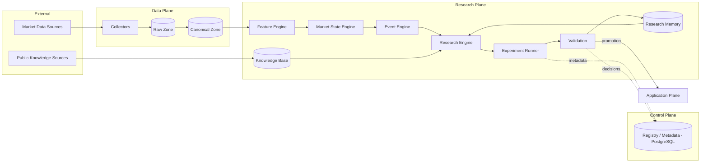
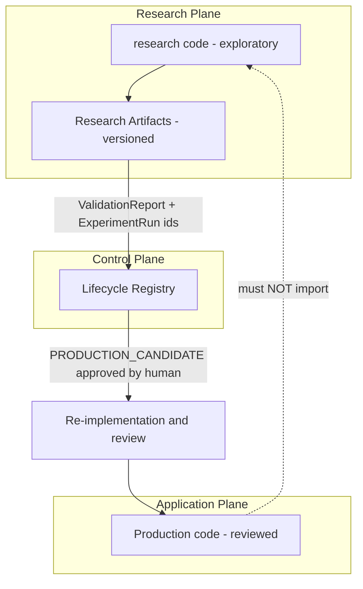
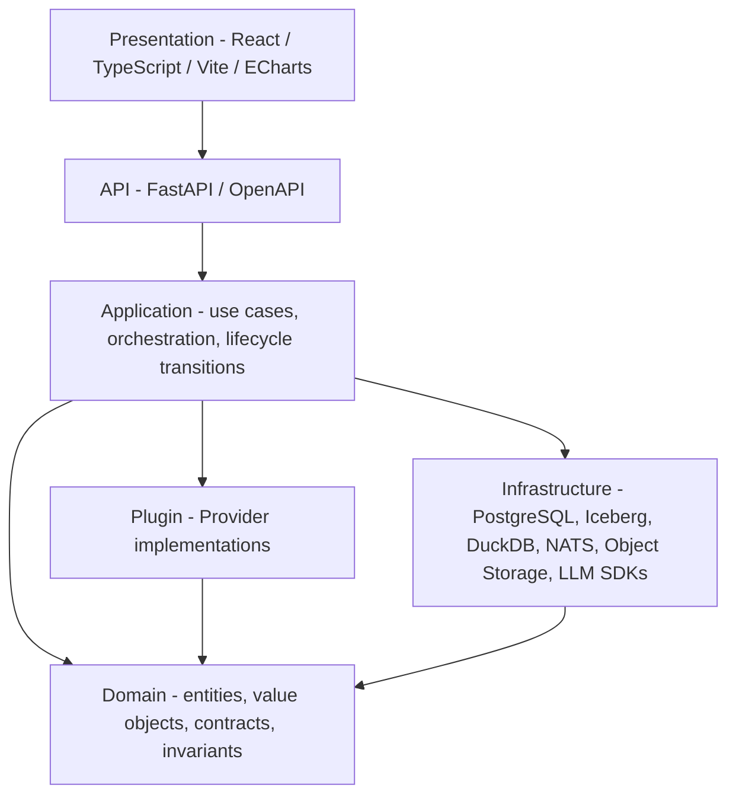

# 01 — System Architecture

## 1. 系统上下文

外部世界：交易所行情与链上数据源（只读）、公开研究知识（论文/博客/开源代码）、LLM 服务（Provider）、人类研究者（审批者）、未来的执行场所（仅 Phase 13+）。

## 2. System Overview（D1）

## 3. Plane 划分（D7）

| Plane | 职责 | 存储 | 典型代码位置 |
|---|---|---|---|
| **Data Plane** | 采集、原始落地、规范化、快照 | Iceberg / Parquet on Object Storage | `plugins/`（collector）、`infrastructure/` |
| **Research Plane** | Feature/State/Event/Outcome 计算、假设、实验、验证 | 读 Data Plane；写实验产物到 Object Storage | `research/` |
| **Control Plane** | 注册表、版本、实验元数据、生命周期状态、审批、审计 | PostgreSQL | `apps/api`、`core/lifecycle` |
| **Application Plane** | API、Worker、Web UI；未来的策略路由与执行 | 读 Control Plane；读已晋升产物 | `apps/`、`strategies/`、`risk/` |

**边界规则**

1. `apps/` 在运行时不得 import `research/`。
2. Research Plane 不写 Application Plane 状态；只通过 Control Plane 提交结果。
3. 从研究到生产只有一条路径：Lifecycle 状态机 + 人工审批 + 重新实现审查（H5）。
4. 所有跨 Plane 数据交换使用 `core/contracts` 中的版本化契约。

## 4. Software Architecture（D3）

**依赖规则**：箭头表示"依赖于"。Domain 不依赖任何层（纯 Python + Pydantic）。Plugin 与 Infrastructure 实现 Domain 定义的接口（依赖倒置）。Application 通过 Registry 选择 Plugin，不硬编码具体实现。

| 层 | 允许依赖 | 禁止 |
|---|---|---|
| Presentation | API（OpenAPI 生成的客户端） | 直接访问数据库 |
| API | Application | 业务逻辑 |
| Application | Domain、Plugin 接口、Infrastructure 接口 | 具体 LLM/引擎类名 |
| Domain | 标准库、Pydantic | I/O、网络、数据库、DataFrame 引擎 |
| Plugin | Domain、计算库 | 修改 Domain 状态机 |
| Infrastructure | Domain | 业务规则 |

## 5. 进程视图（目标形态）

| 进程 | 职责 |
|---|---|
| `api` | FastAPI；Registry / Experiment / Lifecycle 的读写入口 |
| `worker` | 消费 NATS 任务：采集、计算、实验运行、验证 |
| `web` | 研究控制台：数据、状态、实验、验证报告可视化 |

通信：同步查询走 HTTP/OpenAPI；异步任务与事件走 NATS JetStream（08-deployment.md）。
