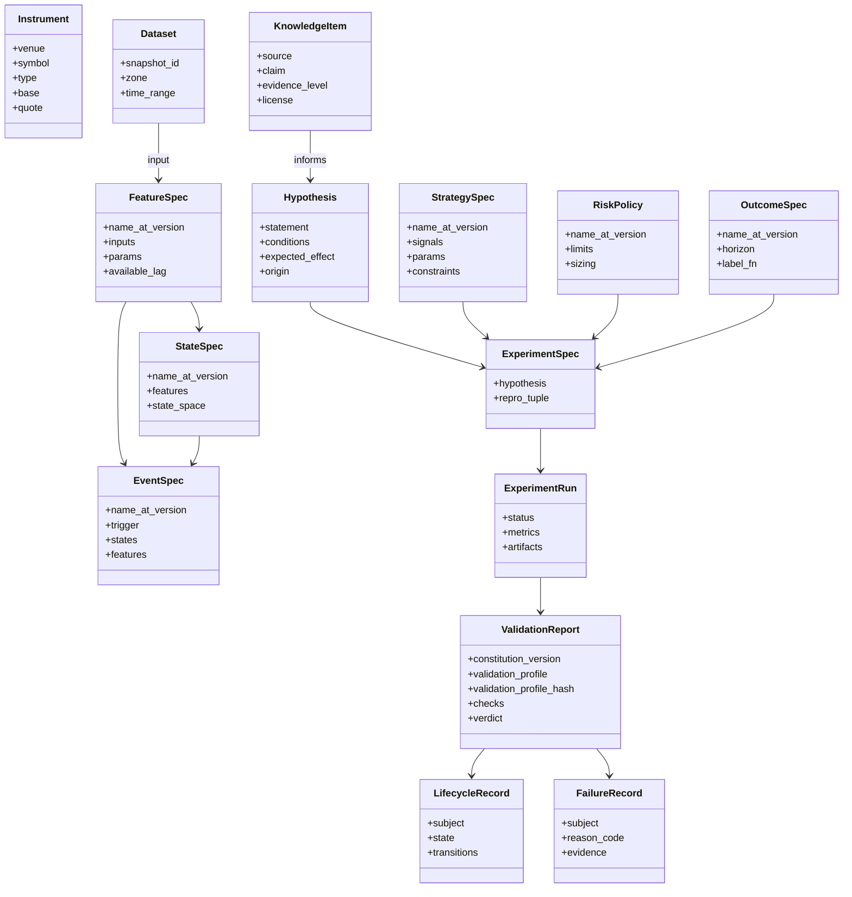

# 02 — Domain Model

> 本文件定义**冻结的领域契约**。实现位于 `core/domain/`、`core/contracts/` 与 `core/compat/`。修改需 ADR。
> 当前契约版本：`CONTRACT_SCHEMA_VERSION = 2.0.0`（ADR-0008 + ADR-0009 共同定义；
> ADR-0011 ~ 0016 与 ADR-0018 在同一个**尚未发布**的版本内继续收紧，不升 major，理由见各 ADR 的版本小节）。

## 1. 统一标识与版本化

每个可版本化对象（Versioned Artifact）具有：

| 字段 | 说明 |
|---|---|
| `kind` | 对象类型（`feature`、`state`、`event`、`outcome`、`strategy`、`risk`、`dataset`、`experiment`…） |
| `name` | 稳定的人类可读名，`snake_case` |
| `version` | SemVer；**语义变化 = major**，参数默认值变化 = minor，非语义修复 = patch |
| `content_hash` | 规格（spec）的规范化 JSON 的 SHA-256；同 hash = 同语义 |
| `schema_version` | 该对象所遵循的契约版本 |
| `created_at` | UTC |
| `lineage` | 上游对象引用列表 |

引用格式：`{kind}:{name}@{version}`，例如 `feature:realized_vol_1h@1.2.0`。
**已发布版本不可变**（immutable）；修改 = 新版本。

### 1.1 载荷的只读表示（ADR-0008）

契约中的映射字段对外只暴露 `collections.abc.Mapping` 语义：没有 `__setitem__` / `__delitem__`，
也没有 `update` / `pop` / `popitem` / `clear` / `setdefault` / `|=`。构造时复制输入并递归冻结内层
（嵌套映射 → 只读视图，嵌套序列 → `tuple`），因此与调用方保留的原引用不共享状态；
默认值与显式传值走同一条校验路径。JSON wire shape 与 JSON Schema 仍为 `object`。

**诚实边界**：这是**契约使用层面**的只读性，用于阻止误用与意外修改，**不**承诺抵御同进程内
直接操作内部属性的恶意 Python；深拷贝也不等于不可变。Python 的 `hash()` 与本项目的
`content_hash` 是两件不同的事，不得混用。

## 2. 核心实体

| 实体 | 定义 | 关键不变量 |
|---|---|---|
| **Instrument** | 可交易标的（交易所 + 符号 + 合约类型） | 跨 venue 符号必须规范化映射 |
| **Dataset** | 某一 Zone 的数据快照 | 必须有不可变 `snapshot_id` |
| **Representation** | 原始数据到研究可用形式的变换（bar、tick 聚合、订单簿快照、成交量钟…） | 声明其时间语义 |
| **FeatureSpec** | 从 Representation 计算的时间序列量 | 必须声明 `available_lag`；禁止使用未来数据 |
| **StateSpec** | 市场状态的定义（离散或连续状态空间） | 状态在 `t` 时只依赖 `≤ t` 的信息 |
| **EventSpec** | 状态/特征上的离散事件（突破、状态切换、交互） | 事件时间 = 可被观测的时间 |
| **OutcomeSpec** | 事件/信号之后的结果标签（前向收益、回撤、触达） | Outcome 只能作为标签，**永不**作为输入 |
| **KnowledgeItem** | 从公开来源提取的主张 + 出处 | 必须有出处、许可、证据等级 |
| **Hypothesis** | 可证伪的陈述：在条件 C 下，X 导致 Y | 必须可映射为 ExperimentSpec |
| **StrategySpec** | 信号 → 仓位的规则 | 参数空间必须声明（用于多重检验计数） |
| **RiskPolicy** | 仓位、止损、敞口、杠杆限制 | 独立于策略版本化 |
| **ExperimentSpec / Run** | 见 06-experiment.md | 可复现；策略 / 风控 / Outcome 只存放在复现元组内，Spec 上只有派生只读引用（ADR-0009） |
| **ValidationReport** | 按 Constitution + Validation Profile 执行的检查结果 | 绑定 Constitution 版本**与 Profile**（ADR-0007；Profile 绑定 = `Ref(kind=profile)` + 内容哈希，ADR-0015）；同时绑定 `run_id` **与** `experiment_hash`（ADR-0009） |
| **LifecycleRecord** | 研究对象的晋升状态 | 只能按状态机转移 |
| **FailureRecord** | 失败/拒绝的记录 | 永不删除 |
| **ResearchMemory** | 以上所有记录的可检索集合 | 追加式（append-only） |

### 2.1 信息流白名单与判别字段（ADR-0012）

冻结的方向是 Canonical → Feature → State / Event → Research Dataset；Outcome 由 Canonical 计算，
**永不回流**为 Feature / State / Event / Strategy 的输入（Constitution C-L2、03-data.md §2）。
契约层把这条方向落成**声明层面**的可执行反例：

| 字段 | 允许的 `Ref.kind` | 允许的 `DatasetRef.zone` | 数量 |
|---|---|---|---|
| `RepresentationSpec.inputs` | 不接受 `Ref` | 不限（本轮不收紧） | 至少 1 |
| `FeatureSpec.inputs` | `representation`、`feature` | `canonical`、`feature`、`research_dataset` | 至少 1 |
| `StateSpec.features` | `feature` | 不接受 | 至少 1 |
| `EventSpec.features` | `feature` | 不接受 | features 与 states 至少其一非空 |
| `EventSpec.states` | `state` | 不接受 | 同上 |
| `StrategySpec.signals` | `feature`、`state`、`event` | 不接受 | 至少 1 |
| `StrategySpec.risk_policy` | `risk` | 不接受 | 可选 |

直接推论：**Outcome 的 `Ref` 与 `zone = outcome` 的 `DatasetRef` 都不得成为 Feature / State /
Event / Strategy 的直接输入。**

**判别字段不可覆盖**：13 个具体规格（`RepresentationSpec`、`FeatureSpec`、`StateSpec`、
`EventSpec`、`OutcomeSpec`、`StrategySpec`、`RiskPolicy`、`KnowledgeItem`、`Hypothesis`、
`ExperimentSpec`、`StrategyArtifact`、`ValidationProfile`、`ProfileSelectionRule`）的 `kind`
是**字面量**：只接受自身那一个取值，默认构造仍自动取得它，传别的取值被**拒绝**而不是被静默接受。
导出的 JSON Schema 中这些 `kind` 因此是单值（`const`）。`Ref.kind` 与 `VersionedSpec` 基类的
`kind` 保持完整 `Kind` 枚举——引用必须能指向各种类型。判别字段不能被伪造，所有按 `kind` 做的
既有校验（ADR-0009 的引用 kind 检查等）才无法被绕过。

**局部不变量**：`EventSpec.observable_lag >= 0`（零可接受）；`StateSpec.training_window` 若提供
必须为正（`None` 表示不适用）；`StateSpec.state_space` 的标签必须唯一。

**`lineage` 不在此列**：它是**溯源**（"这个对象从哪里来"），不是计算输入，因此仍可引用 Outcome。

**诚实边界**：以上只校验**声明层面的直接引用**，是必要条件，**不**等于泄漏已被防住。
下列仍是未实现的运行时义务：传递依赖闭包的方向性（上游是否间接依赖了某个 Outcome）、
被引用对象是否真的是该类型且内容匹配（Registry）、物化数据是否使用了 `available_time > t`
的行（Runner 与验证服务的泄漏门 G1）、`zone = research_dataset` 输入内部的 point-in-time 对齐
（Phase 1+ 数据层）。

### 2.2 双时间与 revision DAG 契约（ADR-0023，Phase 1 B1）

`core/contracts/revision.py` 把 [ADR-0023](../adr/0023-bitemporal-revision-data.md) 中契约层可表达的部分落成 8 个模型
（语义见 03-data.md §4、§7.5）。不升 `CONTRACT_SCHEMA_VERSION`，不新增 `Kind`，已发布模型与 Schema 不变。

| 模型 | 作用 | 契约层不变量 |
|---|---|---|
| `PolicyBinding` | 规则绑定：`role` + `policy_id` + SemVer + `policy_hash` | `role` ∈ availability / precedence / point_in_time / parser；使用处要求确切 `role` |
| `ObservationTimes` | 两轴时间（ADR 六字段；区间型另给 `event_end_time`） | UTC；`declared_latency >= 0`；`knowledge_time >= ingest_time`；`available_time` 不早于事件（区间取结束端）与已给出的 `source_time` |
| `AvailabilityDecision` | 时间 + availability policy + 证据**或**证据缺口 | 两者恰好其一；`available_time < ingest_time` 必须有证据；缺口时 `available_time == ingest_time` |
| `RevisionRecord` | 不可变 revision | 身份非空；`payload_hash` 为 SHA-256；`arrival_seq` 为非负整数且**只**用于审计；`supersedes` 去重、禁止自指、按 ID 规范排序；不早于 `source_revision_time` |
| `PrecedenceEvidence` | 一条持久化 supersedes 边 | precedence policy；证据至少一项；新旧 revision 不同；带 `knowledge_time` |
| `RevisionGraph` | 聚合校验 | `revision_id`、`arrival_seq` 唯一；同键 `source_id + payload_hash` 不重复；record、`supersedes` 与 evidence 两端对 revision ID 的 key 归属必须一致（含 dangling ID）；拒绝跨 key 边与任何环；允许归属一致的 dangling predecessor；记录声明的每条边须有同键同端点、`knowledge_time` 不晚于该记录的证据 |
| `PointInTimeSpec` | PIT 查询输入（自身 `name` + SemVer） | simulation 单点或 UTC 半开区间二选一且 `start < end`；`knowledge_cutoff` 必填；snapshot / PIT / availability / precedence / parser 绑定非空、`role` 确切、字段内 `policy_id` 不重复 |
| `PointInTimeSelection` | 单个 `observation_key` 的结果形状 | `selected` 恰好一个且即唯一 head；`absent` 无 head；`conflict` 至少两个 head 且无 selected |

优先级只来自 `supersedes` 边与 precedence 证据；模块内**没有**以 `arrival_seq`、墙钟或 payload hash 排序或
打破冲突的代码（静态测试检查）。集合语义的序列按 ID 规范排序只为内容哈希唯一，不表示先后。

**诚实边界**：跨记录事实只在 `RevisionGraph` 证明；policy / parser 是否已登记且带证据、哈希是否等于真实内容、
证据是否真实、`revision_id` 是否按规则形成、`arrival_seq` 是否跨重启不复用、heads 是否真的互不排序，
属未来 Registry、存储层与 PIT 执行器（批次 C ~ F）。`PointInTimeSelection` 是输出契约，不是选择算法。
跨字段约束（点 / 区间形状、证据 / 缺口、结果形状、role）只在运行时校验，JSON Schema 弱于运行时（§3.7）。
universe 与 `ResearchDatasetManifest` 见 §2.3（批次 B2）。

### 2.3 历史可交易 universe 与 `ResearchDatasetManifest`（ADR-0024 / ADR-0023 §6，Phase 1 B2）

`core/contracts/universe.py` 把 [ADR-0024](../adr/0024-historical-tradable-universe.md) 与
[ADR-0023](../adr/0023-bitemporal-revision-data.md) §6 中契约层可表达的部分落成 13 个模型（语义见 03-data.md §3、§7.5）。
不升 `CONTRACT_SCHEMA_VERSION`，不新增 `Kind`；`Instrument`、`DatasetRef`、`ReproducibilityTuple` 等已发布模型与 Schema 不变。

| 模型 | 作用 | 契约层不变量 |
|---|---|---|
| `TradableInterval` | 一段可交易区间 `[tradable_from, tradable_until)` | UTC；非空；`tradable_until` 必须显式给出，`null` = 开放 |
| `StableEpisodeKey` | episode 身份：`(venue, instrument_type, venue_product_id)` | `basis` 显式为 `stable_product_id`；改名不改变身份；ID 字符串可以等于 symbol |
| `DegradedEpisodeKey` | 退化身份：`(venue, instrument_type, symbol, tradable_from)` | `basis` 显式为 `degraded_symbol_start`；与稳定路径字段不可混用、缺一不可 |
| `ListingRevision` | 一个 episode 的不可变 listing revision：B1 `RevisionRecord` + 静态 `Instrument` + 区间 + 状态 | `observation_key` = episode 键；venue / type 与键一致；退化键的 symbol 与起点与 revision 一致；区间至少一段、规范排序、不重叠不相邻、开放区间只在末尾；`listed` ⇔ 末段开放；来源状态原文可空不可伪造；`renamed_from` 只用于退化键改名（同 venue / type、不同 symbol、更早开始） |
| `ListingHistory` | listing revision 聚合 | 以内部 revision 与证据构造 B1 `RevisionGraph`，复用全部图约束（含跨 episode supersedes 拒绝）；同一 venue / type 下稳定键与退化键可共存；集合语义规范排序 |
| `UniverseFilter` | 过滤规则声明形状 | 指标 = FeatureSpec `name + SemVer + hash`（不用 `Ref`）；`metric_basis` 只能是 `point_in_time`；阈值只要求有限数，契约不选数值 |
| `UniverseSelectionSpec` | 独立版本化选择规格（首切片 `binance.spot.btc-eth@1.0.0`） | 名称为绑定标识符、严格 SemVer；`candidate_source` 只能是 PIT listing 历史；symbols 非空去重排序；`filters` 必须显式给出、`filter_id` 唯一；无 `kind` / `Ref` / `lineage` |
| `UniverseSpecBinding` | manifest 中的 spec 绑定 `name + SemVer + spec_hash` | 不是 `Ref`、无 `Kind`；`binds(spec)` 本地核对 |
| `UniverseMember` / `UniverseExclusion` | 成员 / 排除清单条目：episode + 决定性 listing revision（+ 原因） | 排除原因只有 `not_tradable` / `filtered`（后者必带 `filter_id`）；competing heads 不是排除原因，而是 fail closed；生效区间成对给出且非空 |
| `SelectedRevisionLineage` | 选中 revision 的 Canonical revision → Raw row → Raw source payload 链（`source_table` / `source_revision_id`；首切片归档路径中 source 即归档 revision，D3 REST 响应载荷同用此跳） | 表名为 `namespace.table`；canonical 跳在 canonical namespace，raw 与 source 跳在 raw namespace；具体 source 类型由未来 Collector / 表实现证明 |
| `AvailabilityEvidenceGap` | availability 证据缺口记录 | 指向表 + revision + 记录该缺口的质量报告 |
| `ResearchDatasetManifest` | Research Dataset 审计清单 | 全部字段必填、清单无默认值（可显式为空）；自身 `DatasetRef` 为 `research_dataset` 且表不在上游中；内嵌完整 B1 `PointInTimeSpec`，是上游 snapshot、simulation、`knowledge_cutoff` 与 PIT / availability / precedence / parser 绑定的唯一来源；上游必须含 `canonical.instrument_listings` 与 `quality.data_quality_reports`；成员 / 排除按 episode 去重互斥（区间 simulation 时按生效区间不重叠且落在窗口内）；lineage 与证据缺口按稳定身份去重，所涉表须有上游 snapshot，缺口引用的质量报告须在清单中；质量报告至少一项；每个 member / exclusion 的 `listing_revision_id` 只能属于一个 episode（同一 episode 的不重叠区间可重复使用），且必须在 lineage 中有 `canonical.instrument_listings` 来源链（其它 Canonical 表不能冒充）；无候选时成员、排除与 lineage 可同时为空 |

上游 snapshot 只用 `PointInTimeSpec.snapshot_bindings` 表达，不另设 `DatasetRef` 列表：`quality` 表没有对应 `Zone`，
平行列表也会带来漂移。模块不读取 `arrival_seq`，不以墙钟或 payload hash 排序或打破冲突（静态测试检查）。

**诚实边界**：契约层**不**证明被绑定的 snapshot / spec / policy 版本在 Registry 中存在或哈希等于真实内容、来源的稳定 ID
真实稳定、稳定键与退化键是否其实是同一产品、成员清单确实由 spec + snapshot + 两个截止按 maximal-head 重建、
逐行 PIT 正确、lineage 是完整闭包、`filter_id` 存在于被绑定的 spec 中。这些属 Collector / 质量检查、Registry、
批次 F 的 PIT / universe 执行器。未来 Runner 必须接收 manifest，并要求复现元组 `dataset_snapshots` 包含该 Research Dataset
自身的 `DatasetRef`——这是尚未实现的接口义务，契约未改动 `ReproducibilityTuple`。
ADR-0024 验收矩阵 #1、#5 ~ #7、#9、#14 ~ #16 的查询 / 选择结果与 #12 属批次 F 与 Phase 4 / 5，不由本批单元测试宣称完成。

### 2.4 Data Plane Adapter 的 Protocol 与 DTO（ADR-0017 / 0021 / 0022 / 0023 §7，Phase 1 B3）

`core/contracts/storage.py`、`catalog.py`、`collector.py` 交付三个基础设施 Adapter 的可执行 `typing.Protocol` 与 15 个 DTO
（语义见 03-data.md §1、§7.1、§7.2）。它们只依赖标准库、Pydantic 与已有核心契约；**没有任何实现**。不升 `CONTRACT_SCHEMA_VERSION`，
不新增 `Kind`，已发布模型与 Schema 不变。内容流、只读 handle 与实现专用 batch 是 Python 调用参数，不进入 DTO。

| Protocol | 方法 | DTO 与契约层不变量 | 首个实现 |
|---|---|---|---|
| `StorageAdapter` | `stage(StageRequest, Iterable[bytes]) → StagedObject`；`publish(StagedObject) → PublishResult`；`lookup(str) → ObjectRef \| None`；`open_read(ObjectRef) → BinaryIO` | 逻辑相对 key（ASCII 段、无 `.` / `..` / 空段 / 反斜杠 / scheme / `%` / NUL / 空白，≤ 1024；原始值先校验，不去空白）；`expected_sha256` 必填、`expected_size` 可选；`ObjectRef` = key + 带 scheme 的绝对 URI（authority 无凭据、路径无 `.` / `..`、无查询 / 片段）+ SHA-256 + 字节数；`PublishResult.outcome` ∈ `created` / `already_present` | C1 |
| `CatalogAdapter[BatchT]` | `load_table(str) → TableInfo \| None`；`create_table(TableDefinition) → TableInfo`；`get_snapshot(str, str) → SnapshotInfo`；`commit_batch(CommitRequest, BatchT) → CommitResult` | 表身份 `namespace.table`（与 snapshot 绑定键同格式）；表定义只是实现侧定义文档的 `id + SemVer + hash` 绑定；`SnapshotInfo` 绑定所属表，父 snapshot 显式可空且不等于自身，batch ID 与指纹成对，`added_rows ≤ total_rows`；`CommitRequest.row_count ≥ 1`、期望父 snapshot 显式可空；`CommitResult` 的 snapshot 必须属于请求的表并携带其 batch ID、指纹与行数，`committed` 时父 snapshot 等于期望；无 `arrival_seq` | C2 / C3 |
| `CollectorAdapter` | `descriptor → CollectorDescriptor`（只读属性）；`collect(CollectionRequest) → CollectionResult` | 版本化 `SourceBinding`；请求 = 稳定 `request_id` + source + 数据类型 + 非空 symbol 集合（规范排序、区分大小写）+ UTC 半开覆盖区间；结果回显完整请求与 collector 身份，对象只携带 `ObjectRef`，按 symbol 以对象与显式缺口**恰好覆盖**请求区间；来源校验和给出时须等于对象 SHA-256；来源 URI / 元数据中凭据形状的名称被拒绝；只有 descriptor 可声明 HTTPS origin | D0 |

**调用语义**（staging 不可见、校验失败与流中断不留可见半成品、同内容幂等、异内容 fail closed、不信任自报 `StagedObject`、
只读 handle；batch 按 `(table, batch_id)` 幂等、指纹冲突与过期父 snapshot 显式失败、重启后重放得到同一 snapshot、
历史 snapshot 元数据不变；collector 结果对象已发布且与引用一致、重放身份稳定、网络来源在声明内、未声明 source 被拒绝）
写在各模块文档中，由 `tests/contract_suites/` 的 provider-agnostic suite 对具体实现检查；未来实现继承 `*AdapterContract`
并提供 subject fixture 即可复用。B3 用两个刻意不同的内存 / 临时文件替身证明 suite 接受合规实现，并用只带一处故障的变体
证明它能杀死路径逃逸、校验和错误、非原子可见、覆盖不同内容、重复 batch 新提交、错误 snapshot、未发布 / 不匹配对象等行为。
替身不是 Adapter 实现，不计入验收 #7 / #8 / #10。

**诚实边界与延期**：DTO 不证明对象 / 表 / snapshot 的存在、字节与哈希一致、发布原子性、网络声明的真实性（声明不是安全
控制）。`file://` 布局与私有 staging 区隔离（C1）；PyIceberg SQL Catalog、PostgreSQL 集成、并发与重启的真实证据（C2）；
八张表的列级 Schema、partition spec 与演进、`batch_fingerprint` 是否由内容重算（C3）；按 snapshot 读取数据的 scan 接口
（随 F 的 PIT 执行器以增量方法交付）；归档下载、端点限制与校验（D0）；解析与 revision 语义（D1 / D2）都不在 B3。

## 3. 契约规则

1. 契约以 **Pydantic 模型**为源，导出 **JSON Schema**；API 通过 **OpenAPI** 暴露。
2. 每个契约包含 `schema_version`。
3. **兼容性**：minor 只能添加可选字段；删除/重命名/语义变化 = major + ADR + 迁移脚本。
4. 契约不引用任何具体技术类型（DataFrame、SQLAlchemy 模型、LLM SDK 对象）。数据集合在契约中以 `DatasetRef` / Arrow Schema 描述。
5. `core/errors/` 定义领域错误分类（数据缺失、契约违反、泄漏检测、复现失败…），供 Failure Registry 使用 `reason_code`。

### 3.1 内容哈希的载荷定义（ADR-0008）

`content_hash` = **规范化 JSON 的 SHA-256**，规范化约定如下（固定测试向量在 `tests/vectors/`）：

| 项 | 约定 |
|---|---|
| 键排序 | `sort_keys=True` —— 映射的插入顺序不影响哈希 |
| 分隔符 | `(",", ":")`，无多余空白 |
| 非 ASCII | `ensure_ascii=False`，原样保留 |
| 非法数值 | `allow_nan=False` —— NaN / ±Infinity 直接报错，**不得**先转成 null 再参与哈希 |
| 未知类型 | 直接抛 `TypeError`，**没有**静默 `str()` 兜底 |
| 模型输入 | 先经明确的 JSON 适配（`model_dump(mode="json")`），再规范化 |

这是 v2 明确的 Python/JSON 规范，**不**宣称跨语言浮点规范化保证；未来非 Python 实现必须通过
上述固定向量与数值一致性评估。

#### 非法浮点数的两道关口（ADR-0013 D-20.1）

上表的 `allow_nan=False` 是**序列化 / 哈希**阶段的关口。**校验**阶段还有更靠前的一道：
`Contract` 基类的 `model_config` 设 `allow_inf_nan=False`，作用于全部契约的全部浮点校验器——
标量字段、序列元素、映射的键与值、`Annotated` 别名、嵌套契约，以及 Python 与
`model_validate_json` 两条入口。因此 NaN / ±Infinity 在**构造时**即被拒绝，
而不是等到有人计算内容哈希时才暴露。

两道关口是同一条规则，不是互相替代；任何一处都**不得**把非法数值转成 `null`。
覆盖面不靠逐字段声明维持，而是由对全部注册契约 core schema 的审计测试保证。

哈希载荷采用**逐模型显式排除表**，基类默认只排除 `created_at`：

| 模型 | 排除字段 | 说明 |
|---|---|---|
| `Contract`（默认） | `created_at` | —— |
| `ValidationProfile` | `created_at`、`status` | `status` 是操作状态；`provenance` **保留**在哈希内 |
| 其余模型 | 沿用默认 | —— |

**不存在**全局的 `*_id` / `recorded_at` / `occurred_at` 排除规则：`run_id`、`subject`、授权与
审计时间都可能是语义。`ReproducibilityTuple.validation_profile_hash` 即"按上述载荷计算的
`ValidationProfile` 内容哈希"，因此内容相同的 `draft` 与 `frozen` 版本哈希相等。

### 3.2 身份键的书面格式（ADR-0009）

| 位置 | 键格式 | 值 |
|---|---|---|
| `ReproducibilityTuple.dependency_hashes` | `kind:name@semver`（`Ref` 的规范串） | 64 位小写十六进制 SHA-256 |
| `StrategyArtifact.dependencies` | `kind:name@semver` | 同上 |
| `ReproducibilityTuple.plugin_versions` | `name@semver` | 同上 |

依赖键带 `kind`，因此 `feature:x@1.0.0` 与 `strategy:x@1.0.0` 不会互相冒充。
`dependency_hashes` 必须覆盖 `hypothesis_ref` / `strategy_ref` / `risk_policy_ref` /
`outcome_ref` / `cost_model_ref` 中所有**非空**引用；`StrategyArtifact.dependencies` 必须
覆盖其直接的 `strategy_spec`。这只是**必要条件**，传递依赖闭包由 Runner / Registry 负责
（06-experiment.md §7）。

### 3.2.1 顶层身份字段的类型（ADR-0015）

审计链上的身份槽位分成**四类**，它们不共用一个类型，也不按字段名里有 `id` / `hash` 就套用：

| 类型 | 格式 | 含义 | 出现位置 |
|---|---|---|---|
| `ContentHash` | 64 位小写十六进制（`^[0-9a-f]{64}$`） | 本项目**规范化 JSON / 内容**的 SHA-256 | `ReproducibilityTuple.validation_profile_hash`；`ValidationReport.experiment_hash`、`validation_profile_hash`；`ExperimentMetadata.experiment_hash`、`validation_profile_hash`；`StrategyArtifact.experiment_hashes` 的每一项；`GoldenOutputs.signals_hash`、`positions_hash`；`EquivalenceCheck.artifact_id`；`DeploymentRecord.artifact_id`、`config_hash` |
| `GitOid` | 40（SHA-1）或 64（SHA-256）位**小写**十六进制 | **Git** 对象 ID。与 `ContentHash` 是两套命名空间，短 SHA 与大写都被拒绝 | `ReproducibilityTuple.code_commit`；`StrategyArtifact.research_code_commit`、`research_code_tree_hash` |
| `GitCodeRevision` | 值对象 `{commit_oid: GitOid, tree_oid: GitOid}` | 一份代码的完整 Git 身份（ADR-0005 §3 的"commit + tree hash"）。相等性是**结构化**比较 | `EquivalenceCheck.production_code_hash`、`DeploymentRecord.production_code_hash`（**线字段名沿用**，值已是该值对象） |
| `ContentBlobRef` | 值对象 `{uri: 非空串, sha256: ContentHash, media_type?: 非空串, byte_size?: >= 0}` | 一份内容的**取回引用 + 内容哈希**（ADR-0016 §D-18.1）。`uri` 方案**刻意不冻结**（存储选择 D-01 / D-02 未决）；`uri` 与 `media_type` 的纯空白按空串拒绝 | `LlmCall.prompt`、`input`、`output`（三项**必填**） |
| 不透明标识 / 复合描述 | 只要求非空 | 生成算法或格式**未冻结**，不得伪装成内容身份 | `run_id`、`report_id`、`deployment_id`、`trace_id`、`DatasetRef.snapshot_id`、`GoldenOutputs.signals_uri / positions_uri`、`StrategyArtifact.validation_reports`（即 `report_id` 列表）、`ReproducibilityTuple.environment_lock` |

`artifact_id` 属于第一类：ADR-0005 §3 把它定义为 Artifact manifest 规范化 JSON 的 SHA-256，
因此它是内容身份，不是不透明 ID。

**版本与 Profile 的绑定**（ADR-0015 §D-22）：

| 字段 | 类型 | 说明 |
|---|---|---|
| `constitution_version` | 唯一的 ASCII SemVer 2.0.0（§3.5 的同一个 pattern） | 出现在 `ReproducibilityTuple`、`ValidationReport`、`ExperimentMetadata` |
| `validation_profile` | `Ref`，`kind` 必须是 `profile`；规范串 `profile:{name}@{semver}` | 同上三处；与 `validation_profile_hash: ContentHash` **成对**构成绑定 |
| `profile_selection` | `ProfileSelection` 值对象（规则 `Ref` + 规则内容哈希 + 选择输入） | 复现元组与 `ExperimentMetadata` 用**同一个**值对象；`SelectionEntry` 的版本只从 `profile.version` 读取 |

**诚实边界**：以上都是**格式与结构**约束。哈希是否真的等于被引用对象的内容、Git 对象是否
存在、工作区是否干净、`validation_profile` 指向的版本是否已登记或已 frozen、三处绑定是否
彼此一致，契约层都**没有**校验——分别属 Registry、Runner / 打包器与 Control Plane
（ADR-0015「运行时延期义务」）。`environment_lock` 的结构化表达**后续另定**，本轮未定义。
`ContentBlobRef` 同理：契约层**不打开 `uri`**，因此内容是否可取回、取回结果是否真的哈希成
`sha256`、`media_type` / `byte_size` 是否与实际内容相符，全部属存储层 / Registry
（ADR-0016「运行时延期义务」）。这些槽位上**没有**、也不得引入自报"已验证"的布尔标志。

### 3.3 契约版本与旧 major 的读取（ADR-0008 §6、ADR-0009 §7）

当前 `CONTRACT_SCHEMA_VERSION = 2.0.0`。模型校验**只接受同 major**（`2.x`），
其他 major 一律拒绝。历史 major 的载荷走 `core/compat/` 的**只读**入口：

| 资产 | 位置 |
|---|---|
| 当前 Schema（74 份） | `schemas/*.schema.json` |
| v1 Schema 快照（35 份，只读） | `schemas/v1/` |
| v1 固定载荷与旧哈希向量 | `tests/vectors/v1/` |
| v1 可执行只读入口 | `core/compat/v1.py`（`read_v1`） |

读取 v1 返回的是 `LegacyV1Record`，**不是** `Contract` 子类：它不能作为 v2 模型使用，
不会被补造缺失的绑定，也不因此取得 v2 的登记 / 晋升资格。v1 与 v2 的 `content_hash` /
`experiment_hash` **不可比较**。

v1 只读入口在计算哈希前会先过**顶层 shape gate**（ADR-0010 §D-15）：用已提交的
`schemas/v1/<Model>.schema.json` 检查 `required` 齐全、未知顶层字段被拒，快照缺失时
**fail closed**。这**不是完整的 JSON Schema 递归校验**，不校验嵌套结构与取值。

**"同 major 更高 minor 可读取"的准确含义**（ADR-0010 §D-14）：`2.1.0` 这样的版本号
**可被识别**，但这不是前向兼容承诺——载荷里出现当前实现未知字段仍然 fail closed
（`extra="forbid"`）。不得声称任意未来 minor 都能读。

### 3.4 受支持的构造路径（ADR-0010 §D-13）

| 入口 | 是否校验 |
|---|---|
| 构造函数、`model_validate` / `model_validate_json` | ✅ 完整校验 |
| `model_copy(update=...)` | ✅ 重新走完整校验，返回同一具体模型类型 |
| `model_copy()` / `model_copy(deep=True)` | ✅ 输入本身已是校验过的实例 |
| `model_construct()` | ❌ **不校验**。这是 Pydantic 面向可信数据的低层逃生口；它不是受支持的外部载荷入口，本项目不为它提供任何安全承诺 |

### 3.5 规范版本语法（ADR-0010 §D-14）

全项目唯一：**ASCII 的完整 SemVer 2.0.0**。只用 `[0-9]`（禁止会匹配 Unicode 数字的 `\d`）；
`major.minor.patch` 与 prerelease 的数字标识符禁止前导零；支持 build metadata；
标识符不得为空。`schema_version`、`Ref.version`、`VersionedSpec.version`、
`plugin_versions` 的键与依赖键共用同一套组件；major 从已验证的正则分组读取。

### 3.6 契约值对象的语义身份（ADR-0018）

每个契约都带 Contract 信封 `schema_version`，它参与 Pydantic 结构相等（`==`）与内容哈希。
需要判断"同一业务键 / 同一目标 / 同一份代码"的地方**不**使用结构相等，而是调用显式的语义身份：

| 语义身份 | API（返回固定形状元组） | 定义 | 使用位置 |
|---|---|---|---|
| Profile 选择键 | `ProfileSelectionKey.selection_identity()` | `(venue, symbol, timeframe, research_class)` | `ProfileSelectionRule` 的判重与 `select()`（同源） |
| `Ref` 目标 | `Ref.target_identity()` | `(kind, name, version)` | `LifecycleHistory` 构造与 `append` 的 subject 比较；`ExecutionModeChange` 切 LIVE 时 Risk Gate / 授权的 subject 比较 |
| Git 代码修订 | `GitCodeRevision.code_identity()` | `(commit_oid, tree_oid)` | `DeploymentRecord` 与其 `EquivalenceCheck` 的生产代码修订比较 |

三者都**排除**各自的信封 `schema_version`。`venue` / `symbol` / `timeframe` 是区分大小写的精确不透明值，
不做大小写折叠或 Unicode 规范化；`research_class` 与 `ProfileScope.research_class` 共用常量
`RESEARCH_CLASS_PATTERN`（`^[a-z][a-z0-9_]*$`）。按规范串 `str(ref)` 做的依赖覆盖检查本就等价于目标身份。

**全局规则不变**：`Contract.__eq__` 与 `content_hash()` 仍包含信封版本——仅信封不同的两个对象
结构不相等、内容哈希不同，这是有意的最终设计。

### 3.7 字符串校验的运行时与 JSON Schema 边界

`Contract` 开启了 `str_strip_whitespace=True`：运行时 Pydantic 会**先去除首尾空白，再**检查 `min_length`、
`pattern` 等约束。导出的 JSON Schema 只能表达序列化后字段本身的约束，无法表达"先去空白"这一步。
因此只读 Schema 的消费者对**带首尾空白的原始输入**可能与运行时判断不同——例如纯空白串能满足 Schema 的
`minLength: 1` 却被运行时拒绝；`" swing "` 不满足 Schema 的 pattern 却会被运行时去空白后接受。
运行时序列化输出已去空白，二者对规范化后的值一致。**系统权威的输入校验必须经过运行时模型**
（构造函数、`model_validate` / `model_validate_json`，见 §3.4），JSON Schema 只是面向外部消费者的描述。
同类的"Schema 可见性弱于运行时"边界还有：时长符号与 `cost_model.kind`（07-validation.md §5.4）、
以及只由跨字段相等关系约束的 `ExperimentMetadata.declared_research_class`（ADR-0018 §D-26.3）。

## 4. 目录映射

| 路径 | 内容 |
|---|---|
| `core/domain/` | 实体、值对象、不变量 |
| `core/contracts/` | 跨 Plane DTO、JSON Schema 导出；Provider 接口按 [ADR-0017](../adr/0017-provider-delivery-schedule.md) 的节奏交付（Phase 0 只冻结语义；当前只有 B3 的 `StorageAdapter` / `CatalogAdapter` / `CollectorAdapter` 三个 Data Plane Adapter Protocol，研究 Provider Protocol 仍为 0） |
| `core/lifecycle/` | 状态机定义与转移规则（07-validation.md） |
| `core/errors/` | 错误分类 |
| `core/compat/` | 历史契约 major 的**只读**读取入口（不是迁移服务） |
