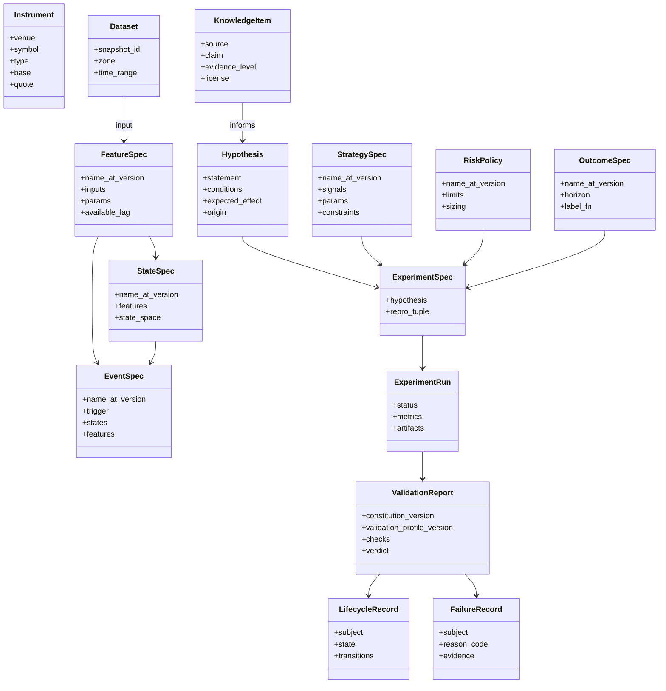

# 02 — Domain Model

> 本文件定义**冻结的领域契约**。实现位于 `core/domain/`、`core/contracts/` 与 `core/compat/`。修改需 ADR。
> 当前契约版本：`CONTRACT_SCHEMA_VERSION = 2.0.0`（ADR-0008 + ADR-0009 共同定义）。

## 1. 统一标识与版本化

每个可版本化对象（Versioned Artifact）具有：

| 字段 | 说明 |
|---|---|
| `kind` | 对象类型（`feature`、`state`、`event`、`outcome`、`strategy`、`risk`、`dataset`、`experiment`…） |
| `name` | 稳定的人类可读名，`snake_case` |
| `version` | SemVer；**语义变化 = major**，参数默认值变化 = minor，非语义修复 = patch |
| `content_hash` | 规格（spec）的规范化 JSON 的 SHA-256；同 hash = 同语义 |
| `schema_version` | 该对象所遵循的契约版本 |
| `created_at` | UTC |
| `lineage` | 上游对象引用列表 |

引用格式：`{kind}:{name}@{version}`，例如 `feature:realized_vol_1h@1.2.0`。
**已发布版本不可变**（immutable）；修改 = 新版本。

### 1.1 载荷的只读表示（ADR-0008）

契约中的映射字段对外只暴露 `collections.abc.Mapping` 语义：没有 `__setitem__` / `__delitem__`，
也没有 `update` / `pop` / `popitem` / `clear` / `setdefault` / `|=`。构造时复制输入并递归冻结内层
（嵌套映射 → 只读视图，嵌套序列 → `tuple`），因此与调用方保留的原引用不共享状态；
默认值与显式传值走同一条校验路径。JSON wire shape 与 JSON Schema 仍为 `object`。

**诚实边界**：这是**契约使用层面**的只读性，用于阻止误用与意外修改，**不**承诺抵御同进程内
直接操作内部属性的恶意 Python；深拷贝也不等于不可变。Python 的 `hash()` 与本项目的
`content_hash` 是两件不同的事，不得混用。

## 2. 核心实体

| 实体 | 定义 | 关键不变量 |
|---|---|---|
| **Instrument** | 可交易标的（交易所 + 符号 + 合约类型） | 跨 venue 符号必须规范化映射 |
| **Dataset** | 某一 Zone 的数据快照 | 必须有不可变 `snapshot_id` |
| **Representation** | 原始数据到研究可用形式的变换（bar、tick 聚合、订单簿快照、成交量钟…） | 声明其时间语义 |
| **FeatureSpec** | 从 Representation 计算的时间序列量 | 必须声明 `available_lag`；禁止使用未来数据 |
| **StateSpec** | 市场状态的定义（离散或连续状态空间） | 状态在 `t` 时只依赖 `≤ t` 的信息 |
| **EventSpec** | 状态/特征上的离散事件（突破、状态切换、交互） | 事件时间 = 可被观测的时间 |
| **OutcomeSpec** | 事件/信号之后的结果标签（前向收益、回撤、触达） | Outcome 只能作为标签，**永不**作为输入 |
| **KnowledgeItem** | 从公开来源提取的主张 + 出处 | 必须有出处、许可、证据等级 |
| **Hypothesis** | 可证伪的陈述：在条件 C 下，X 导致 Y | 必须可映射为 ExperimentSpec |
| **StrategySpec** | 信号 → 仓位的规则 | 参数空间必须声明（用于多重检验计数） |
| **RiskPolicy** | 仓位、止损、敞口、杠杆限制 | 独立于策略版本化 |
| **ExperimentSpec / Run** | 见 06-experiment.md | 可复现；策略 / 风控 / Outcome 只存放在复现元组内，Spec 上只有派生只读引用（ADR-0009） |
| **ValidationReport** | 按 Constitution + Validation Profile 执行的检查结果 | 绑定 Constitution 版本**与 Profile 版本**（ADR-0007）；同时绑定 `run_id` **与** `experiment_hash`（ADR-0009） |
| **LifecycleRecord** | 研究对象的晋升状态 | 只能按状态机转移 |
| **FailureRecord** | 失败/拒绝的记录 | 永不删除 |
| **ResearchMemory** | 以上所有记录的可检索集合 | 追加式（append-only） |

## 3. 契约规则

1. 契约以 **Pydantic 模型**为源，导出 **JSON Schema**；API 通过 **OpenAPI** 暴露。
2. 每个契约包含 `schema_version`。
3. **兼容性**：minor 只能添加可选字段；删除/重命名/语义变化 = major + ADR + 迁移脚本。
4. 契约不引用任何具体技术类型（DataFrame、SQLAlchemy 模型、LLM SDK 对象）。数据集合在契约中以 `DatasetRef` / Arrow Schema 描述。
5. `core/errors/` 定义领域错误分类（数据缺失、契约违反、泄漏检测、复现失败…），供 Failure Registry 使用 `reason_code`。

### 3.1 内容哈希的载荷定义（ADR-0008）

`content_hash` = **规范化 JSON 的 SHA-256**，规范化约定如下（固定测试向量在 `tests/vectors/`）：

| 项 | 约定 |
|---|---|
| 键排序 | `sort_keys=True` —— 映射的插入顺序不影响哈希 |
| 分隔符 | `(",", ":")`，无多余空白 |
| 非 ASCII | `ensure_ascii=False`，原样保留 |
| 非法数值 | `allow_nan=False` —— NaN / ±Infinity 直接报错，**不得**先转成 null 再参与哈希 |
| 未知类型 | 直接抛 `TypeError`，**没有**静默 `str()` 兜底 |
| 模型输入 | 先经明确的 JSON 适配（`model_dump(mode="json")`），再规范化 |

这是 v2 明确的 Python/JSON 规范，**不**宣称跨语言浮点规范化保证；未来非 Python 实现必须通过
上述固定向量与数值一致性评估。

哈希载荷采用**逐模型显式排除表**，基类默认只排除 `created_at`：

| 模型 | 排除字段 | 说明 |
|---|---|---|
| `Contract`（默认） | `created_at` | —— |
| `ValidationProfile` | `created_at`、`status` | `status` 是操作状态；`provenance` **保留**在哈希内 |
| 其余模型 | 沿用默认 | —— |

**不存在**全局的 `*_id` / `recorded_at` / `occurred_at` 排除规则：`run_id`、`subject`、授权与
审计时间都可能是语义。`ReproducibilityTuple.validation_profile_hash` 即"按上述载荷计算的
`ValidationProfile` 内容哈希"，因此内容相同的 `draft` 与 `frozen` 版本哈希相等。

### 3.2 身份键的书面格式（ADR-0009）

| 位置 | 键格式 | 值 |
|---|---|---|
| `ReproducibilityTuple.dependency_hashes` | `kind:name@semver`（`Ref` 的规范串） | 64 位小写十六进制 SHA-256 |
| `StrategyArtifact.dependencies` | `kind:name@semver` | 同上 |
| `ReproducibilityTuple.plugin_versions` | `name@semver` | 同上 |

依赖键带 `kind`，因此 `feature:x@1.0.0` 与 `strategy:x@1.0.0` 不会互相冒充。
`dependency_hashes` 必须覆盖 `hypothesis_ref` / `strategy_ref` / `risk_policy_ref` /
`outcome_ref` / `cost_model_ref` 中所有**非空**引用；`StrategyArtifact.dependencies` 必须
覆盖其直接的 `strategy_spec`。这只是**必要条件**，传递依赖闭包由 Runner / Registry 负责
（06-experiment.md §7）。

### 3.3 契约版本与旧 major 的读取（ADR-0008 §6、ADR-0009 §7）

当前 `CONTRACT_SCHEMA_VERSION = 2.0.0`。模型校验**只接受同 major**（`2.x`，更高 minor 可读取），
其他 major 一律拒绝。历史 major 的载荷走 `core/compat/` 的**只读**入口：

| 资产 | 位置 |
|---|---|
| 当前 Schema（36 份） | `schemas/*.schema.json` |
| v1 Schema 快照（35 份，只读） | `schemas/v1/` |
| v1 固定载荷与旧哈希向量 | `tests/vectors/v1/` |
| v1 可执行只读入口 | `core/compat/v1.py`（`read_v1`） |

读取 v1 返回的是 `LegacyV1Record`，**不是** `Contract` 子类：它不能作为 v2 模型使用，
不会被补造缺失的绑定，也不因此取得 v2 的登记 / 晋升资格。v1 与 v2 的 `content_hash` /
`experiment_hash` **不可比较**。

## 4. 目录映射

| 路径 | 内容 |
|---|---|
| `core/domain/` | 实体、值对象、不变量 |
| `core/contracts/` | Provider 接口、跨 Plane DTO、JSON Schema 导出 |
| `core/lifecycle/` | 状态机定义与转移规则（07-validation.md） |
| `core/errors/` | 错误分类 |
| `core/compat/` | 历史契约 major 的**只读**读取入口（不是迁移服务） |
