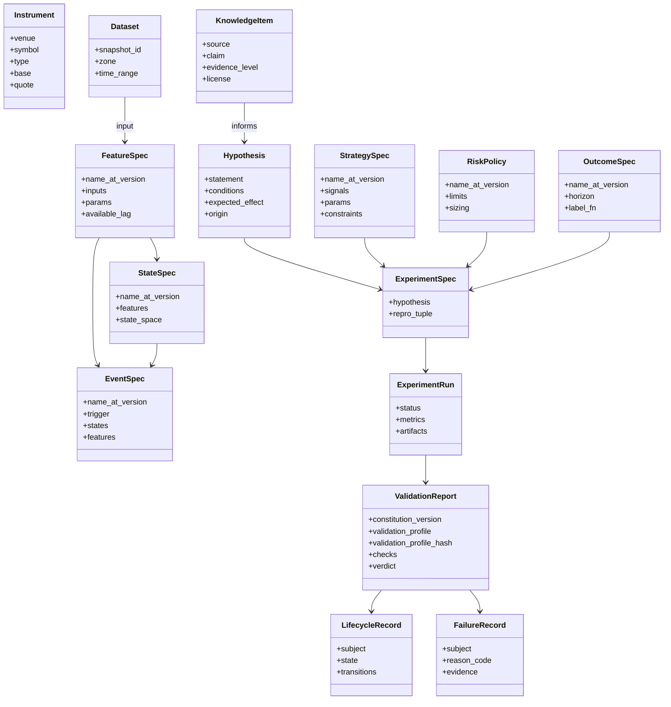

# 02 — Domain Model

> 本文件定义**冻结的领域契约**。实现位于 `core/domain/`、`core/contracts/` 与 `core/compat/`。修改需 ADR。
> 当前契约版本：`CONTRACT_SCHEMA_VERSION = 2.0.0`（ADR-0008 + ADR-0009 共同定义；
> ADR-0011 ~ 0015 在同一个**尚未发布**的版本内继续收紧，不升 major，理由见各 ADR 的版本小节）。

## 1. 统一标识与版本化

每个可版本化对象（Versioned Artifact）具有：

| 字段 | 说明 |
|---|---|
| `kind` | 对象类型（`feature`、`state`、`event`、`outcome`、`strategy`、`risk`、`dataset`、`experiment`…） |
| `name` | 稳定的人类可读名，`snake_case` |
| `version` | SemVer；**语义变化 = major**，参数默认值变化 = minor，非语义修复 = patch |
| `content_hash` | 规格（spec）的规范化 JSON 的 SHA-256；同 hash = 同语义 |
| `schema_version` | 该对象所遵循的契约版本 |
| `created_at` | UTC |
| `lineage` | 上游对象引用列表 |

引用格式：`{kind}:{name}@{version}`，例如 `feature:realized_vol_1h@1.2.0`。
**已发布版本不可变**（immutable）；修改 = 新版本。

### 1.1 载荷的只读表示（ADR-0008）

契约中的映射字段对外只暴露 `collections.abc.Mapping` 语义：没有 `__setitem__` / `__delitem__`，
也没有 `update` / `pop` / `popitem` / `clear` / `setdefault` / `|=`。构造时复制输入并递归冻结内层
（嵌套映射 → 只读视图，嵌套序列 → `tuple`），因此与调用方保留的原引用不共享状态；
默认值与显式传值走同一条校验路径。JSON wire shape 与 JSON Schema 仍为 `object`。

**诚实边界**：这是**契约使用层面**的只读性，用于阻止误用与意外修改，**不**承诺抵御同进程内
直接操作内部属性的恶意 Python；深拷贝也不等于不可变。Python 的 `hash()` 与本项目的
`content_hash` 是两件不同的事，不得混用。

## 2. 核心实体

| 实体 | 定义 | 关键不变量 |
|---|---|---|
| **Instrument** | 可交易标的（交易所 + 符号 + 合约类型） | 跨 venue 符号必须规范化映射 |
| **Dataset** | 某一 Zone 的数据快照 | 必须有不可变 `snapshot_id` |
| **Representation** | 原始数据到研究可用形式的变换（bar、tick 聚合、订单簿快照、成交量钟…） | 声明其时间语义 |
| **FeatureSpec** | 从 Representation 计算的时间序列量 | 必须声明 `available_lag`；禁止使用未来数据 |
| **StateSpec** | 市场状态的定义（离散或连续状态空间） | 状态在 `t` 时只依赖 `≤ t` 的信息 |
| **EventSpec** | 状态/特征上的离散事件（突破、状态切换、交互） | 事件时间 = 可被观测的时间 |
| **OutcomeSpec** | 事件/信号之后的结果标签（前向收益、回撤、触达） | Outcome 只能作为标签，**永不**作为输入 |
| **KnowledgeItem** | 从公开来源提取的主张 + 出处 | 必须有出处、许可、证据等级 |
| **Hypothesis** | 可证伪的陈述：在条件 C 下，X 导致 Y | 必须可映射为 ExperimentSpec |
| **StrategySpec** | 信号 → 仓位的规则 | 参数空间必须声明（用于多重检验计数） |
| **RiskPolicy** | 仓位、止损、敞口、杠杆限制 | 独立于策略版本化 |
| **ExperimentSpec / Run** | 见 06-experiment.md | 可复现；策略 / 风控 / Outcome 只存放在复现元组内，Spec 上只有派生只读引用（ADR-0009） |
| **ValidationReport** | 按 Constitution + Validation Profile 执行的检查结果 | 绑定 Constitution 版本**与 Profile**（ADR-0007；Profile 绑定 = `Ref(kind=profile)` + 内容哈希，ADR-0015）；同时绑定 `run_id` **与** `experiment_hash`（ADR-0009） |
| **LifecycleRecord** | 研究对象的晋升状态 | 只能按状态机转移 |
| **FailureRecord** | 失败/拒绝的记录 | 永不删除 |
| **ResearchMemory** | 以上所有记录的可检索集合 | 追加式（append-only） |

### 2.1 信息流白名单与判别字段（ADR-0012）

冻结的方向是 Canonical → Feature → State / Event → Research Dataset；Outcome 由 Canonical 计算，
**永不回流**为 Feature / State / Event / Strategy 的输入（Constitution C-L2、03-data.md §2）。
契约层把这条方向落成**声明层面**的可执行反例：

| 字段 | 允许的 `Ref.kind` | 允许的 `DatasetRef.zone` | 数量 |
|---|---|---|---|
| `RepresentationSpec.inputs` | 不接受 `Ref` | 不限（本轮不收紧） | 至少 1 |
| `FeatureSpec.inputs` | `representation`、`feature` | `canonical`、`feature`、`research_dataset` | 至少 1 |
| `StateSpec.features` | `feature` | 不接受 | 至少 1 |
| `EventSpec.features` | `feature` | 不接受 | features 与 states 至少其一非空 |
| `EventSpec.states` | `state` | 不接受 | 同上 |
| `StrategySpec.signals` | `feature`、`state`、`event` | 不接受 | 至少 1 |
| `StrategySpec.risk_policy` | `risk` | 不接受 | 可选 |

直接推论：**Outcome 的 `Ref` 与 `zone = outcome` 的 `DatasetRef` 都不得成为 Feature / State /
Event / Strategy 的直接输入。**

**判别字段不可覆盖**：13 个具体规格（`RepresentationSpec`、`FeatureSpec`、`StateSpec`、
`EventSpec`、`OutcomeSpec`、`StrategySpec`、`RiskPolicy`、`KnowledgeItem`、`Hypothesis`、
`ExperimentSpec`、`StrategyArtifact`、`ValidationProfile`、`ProfileSelectionRule`）的 `kind`
是**字面量**：只接受自身那一个取值，默认构造仍自动取得它，传别的取值被**拒绝**而不是被静默接受。
导出的 JSON Schema 中这些 `kind` 因此是单值（`const`）。`Ref.kind` 与 `VersionedSpec` 基类的
`kind` 保持完整 `Kind` 枚举——引用必须能指向各种类型。判别字段不能被伪造，所有按 `kind` 做的
既有校验（ADR-0009 的引用 kind 检查等）才无法被绕过。

**局部不变量**：`EventSpec.observable_lag >= 0`（零可接受）；`StateSpec.training_window` 若提供
必须为正（`None` 表示不适用）；`StateSpec.state_space` 的标签必须唯一。

**`lineage` 不在此列**：它是**溯源**（"这个对象从哪里来"），不是计算输入，因此仍可引用 Outcome。

**诚实边界**：以上只校验**声明层面的直接引用**，是必要条件，**不**等于泄漏已被防住。
下列仍是未实现的运行时义务：传递依赖闭包的方向性（上游是否间接依赖了某个 Outcome）、
被引用对象是否真的是该类型且内容匹配（Registry）、物化数据是否使用了 `available_time > t`
的行（Runner 与验证服务的泄漏门 G1）、`zone = research_dataset` 输入内部的 point-in-time 对齐
（Phase 1+ 数据层）。

## 3. 契约规则

1. 契约以 **Pydantic 模型**为源，导出 **JSON Schema**；API 通过 **OpenAPI** 暴露。
2. 每个契约包含 `schema_version`。
3. **兼容性**：minor 只能添加可选字段；删除/重命名/语义变化 = major + ADR + 迁移脚本。
4. 契约不引用任何具体技术类型（DataFrame、SQLAlchemy 模型、LLM SDK 对象）。数据集合在契约中以 `DatasetRef` / Arrow Schema 描述。
5. `core/errors/` 定义领域错误分类（数据缺失、契约违反、泄漏检测、复现失败…），供 Failure Registry 使用 `reason_code`。

### 3.1 内容哈希的载荷定义（ADR-0008）

`content_hash` = **规范化 JSON 的 SHA-256**，规范化约定如下（固定测试向量在 `tests/vectors/`）：

| 项 | 约定 |
|---|---|
| 键排序 | `sort_keys=True` —— 映射的插入顺序不影响哈希 |
| 分隔符 | `(",", ":")`，无多余空白 |
| 非 ASCII | `ensure_ascii=False`，原样保留 |
| 非法数值 | `allow_nan=False` —— NaN / ±Infinity 直接报错，**不得**先转成 null 再参与哈希 |
| 未知类型 | 直接抛 `TypeError`，**没有**静默 `str()` 兜底 |
| 模型输入 | 先经明确的 JSON 适配（`model_dump(mode="json")`），再规范化 |

这是 v2 明确的 Python/JSON 规范，**不**宣称跨语言浮点规范化保证；未来非 Python 实现必须通过
上述固定向量与数值一致性评估。

#### 非法浮点数的两道关口（ADR-0013 D-20.1）

上表的 `allow_nan=False` 是**序列化 / 哈希**阶段的关口。**校验**阶段还有更靠前的一道：
`Contract` 基类的 `model_config` 设 `allow_inf_nan=False`，作用于全部契约的全部浮点校验器——
标量字段、序列元素、映射的键与值、`Annotated` 别名、嵌套契约，以及 Python 与
`model_validate_json` 两条入口。因此 NaN / ±Infinity 在**构造时**即被拒绝，
而不是等到有人计算内容哈希时才暴露。

两道关口是同一条规则，不是互相替代；任何一处都**不得**把非法数值转成 `null`。
覆盖面不靠逐字段声明维持，而是由对全部注册契约 core schema 的审计测试保证。

哈希载荷采用**逐模型显式排除表**，基类默认只排除 `created_at`：

| 模型 | 排除字段 | 说明 |
|---|---|---|
| `Contract`（默认） | `created_at` | —— |
| `ValidationProfile` | `created_at`、`status` | `status` 是操作状态；`provenance` **保留**在哈希内 |
| 其余模型 | 沿用默认 | —— |

**不存在**全局的 `*_id` / `recorded_at` / `occurred_at` 排除规则：`run_id`、`subject`、授权与
审计时间都可能是语义。`ReproducibilityTuple.validation_profile_hash` 即"按上述载荷计算的
`ValidationProfile` 内容哈希"，因此内容相同的 `draft` 与 `frozen` 版本哈希相等。

### 3.2 身份键的书面格式（ADR-0009）

| 位置 | 键格式 | 值 |
|---|---|---|
| `ReproducibilityTuple.dependency_hashes` | `kind:name@semver`（`Ref` 的规范串） | 64 位小写十六进制 SHA-256 |
| `StrategyArtifact.dependencies` | `kind:name@semver` | 同上 |
| `ReproducibilityTuple.plugin_versions` | `name@semver` | 同上 |

依赖键带 `kind`，因此 `feature:x@1.0.0` 与 `strategy:x@1.0.0` 不会互相冒充。
`dependency_hashes` 必须覆盖 `hypothesis_ref` / `strategy_ref` / `risk_policy_ref` /
`outcome_ref` / `cost_model_ref` 中所有**非空**引用；`StrategyArtifact.dependencies` 必须
覆盖其直接的 `strategy_spec`。这只是**必要条件**，传递依赖闭包由 Runner / Registry 负责
（06-experiment.md §7）。

### 3.2.1 顶层身份字段的类型（ADR-0015）

审计链上的身份槽位分成**四类**，它们不共用一个类型，也不按字段名里有 `id` / `hash` 就套用：

| 类型 | 格式 | 含义 | 出现位置 |
|---|---|---|---|
| `ContentHash` | 64 位小写十六进制（`^[0-9a-f]{64}$`） | 本项目**规范化 JSON / 内容**的 SHA-256 | `ReproducibilityTuple.validation_profile_hash`；`ValidationReport.experiment_hash`、`validation_profile_hash`；`ExperimentMetadata.experiment_hash`、`validation_profile_hash`；`StrategyArtifact.experiment_hashes` 的每一项；`GoldenOutputs.signals_hash`、`positions_hash`；`EquivalenceCheck.artifact_id`；`DeploymentRecord.artifact_id`、`config_hash` |
| `GitOid` | 40（SHA-1）或 64（SHA-256）位**小写**十六进制 | **Git** 对象 ID。与 `ContentHash` 是两套命名空间，短 SHA 与大写都被拒绝 | `ReproducibilityTuple.code_commit`；`StrategyArtifact.research_code_commit`、`research_code_tree_hash` |
| `GitCodeRevision` | 值对象 `{commit_oid: GitOid, tree_oid: GitOid}` | 一份代码的完整 Git 身份（ADR-0005 §3 的"commit + tree hash"）。相等性是**结构化**比较 | `EquivalenceCheck.production_code_hash`、`DeploymentRecord.production_code_hash`（**线字段名沿用**，值已是该值对象） |
| `ContentBlobRef` | 值对象 `{uri: 非空串, sha256: ContentHash, media_type?: 非空串, byte_size?: >= 0}` | 一份内容的**取回引用 + 内容哈希**（ADR-0016 §D-18.1）。`uri` 方案**刻意不冻结**（存储选择 D-01 / D-02 未决）；`uri` 与 `media_type` 的纯空白按空串拒绝 | `LlmCall.prompt`、`input`、`output`（三项**必填**） |
| 不透明标识 / 复合描述 | 只要求非空 | 生成算法或格式**未冻结**，不得伪装成内容身份 | `run_id`、`report_id`、`deployment_id`、`trace_id`、`DatasetRef.snapshot_id`、`GoldenOutputs.signals_uri / positions_uri`、`StrategyArtifact.validation_reports`（即 `report_id` 列表）、`ReproducibilityTuple.environment_lock` |

`artifact_id` 属于第一类：ADR-0005 §3 把它定义为 Artifact manifest 规范化 JSON 的 SHA-256，
因此它是内容身份，不是不透明 ID。

**版本与 Profile 的绑定**（ADR-0015 §D-22）：

| 字段 | 类型 | 说明 |
|---|---|---|
| `constitution_version` | 唯一的 ASCII SemVer 2.0.0（§3.5 的同一个 pattern） | 出现在 `ReproducibilityTuple`、`ValidationReport`、`ExperimentMetadata` |
| `validation_profile` | `Ref`，`kind` 必须是 `profile`；规范串 `profile:{name}@{semver}` | 同上三处；与 `validation_profile_hash: ContentHash` **成对**构成绑定 |
| `profile_selection` | `ProfileSelection` 值对象（规则 `Ref` + 规则内容哈希 + 选择输入） | 复现元组与 `ExperimentMetadata` 用**同一个**值对象；`SelectionEntry` 的版本只从 `profile.version` 读取 |

**诚实边界**：以上都是**格式与结构**约束。哈希是否真的等于被引用对象的内容、Git 对象是否
存在、工作区是否干净、`validation_profile` 指向的版本是否已登记或已 frozen、三处绑定是否
彼此一致，契约层都**没有**校验——分别属 Registry、Runner / 打包器与 Control Plane
（ADR-0015「运行时延期义务」）。`environment_lock` 的结构化表达**后续另定**，本轮未定义。
`ContentBlobRef` 同理：契约层**不打开 `uri`**，因此内容是否可取回、取回结果是否真的哈希成
`sha256`、`media_type` / `byte_size` 是否与实际内容相符，全部属存储层 / Registry
（ADR-0016「运行时延期义务」）。这些槽位上**没有**、也不得引入自报"已验证"的布尔标志。

### 3.3 契约版本与旧 major 的读取（ADR-0008 §6、ADR-0009 §7）

当前 `CONTRACT_SCHEMA_VERSION = 2.0.0`。模型校验**只接受同 major**（`2.x`），
其他 major 一律拒绝。历史 major 的载荷走 `core/compat/` 的**只读**入口：

| 资产 | 位置 |
|---|---|
| 当前 Schema（38 份） | `schemas/*.schema.json` |
| v1 Schema 快照（35 份，只读） | `schemas/v1/` |
| v1 固定载荷与旧哈希向量 | `tests/vectors/v1/` |
| v1 可执行只读入口 | `core/compat/v1.py`（`read_v1`） |

读取 v1 返回的是 `LegacyV1Record`，**不是** `Contract` 子类：它不能作为 v2 模型使用，
不会被补造缺失的绑定，也不因此取得 v2 的登记 / 晋升资格。v1 与 v2 的 `content_hash` /
`experiment_hash` **不可比较**。

v1 只读入口在计算哈希前会先过**顶层 shape gate**（ADR-0010 §D-15）：用已提交的
`schemas/v1/<Model>.schema.json` 检查 `required` 齐全、未知顶层字段被拒，快照缺失时
**fail closed**。这**不是完整的 JSON Schema 递归校验**，不校验嵌套结构与取值。

**"同 major 更高 minor 可读取"的准确含义**（ADR-0010 §D-14）：`2.1.0` 这样的版本号
**可被识别**，但这不是前向兼容承诺——载荷里出现当前实现未知字段仍然 fail closed
（`extra="forbid"`）。不得声称任意未来 minor 都能读。

### 3.4 受支持的构造路径（ADR-0010 §D-13）

| 入口 | 是否校验 |
|---|---|
| 构造函数、`model_validate` / `model_validate_json` | ✅ 完整校验 |
| `model_copy(update=...)` | ✅ 重新走完整校验，返回同一具体模型类型 |
| `model_copy()` / `model_copy(deep=True)` | ✅ 输入本身已是校验过的实例 |
| `model_construct()` | ❌ **不校验**。这是 Pydantic 面向可信数据的低层逃生口；它不是受支持的外部载荷入口，本项目不为它提供任何安全承诺 |

### 3.5 规范版本语法（ADR-0010 §D-14）

全项目唯一：**ASCII 的完整 SemVer 2.0.0**。只用 `[0-9]`（禁止会匹配 Unicode 数字的 `\d`）；
`major.minor.patch` 与 prerelease 的数字标识符禁止前导零；支持 build metadata；
标识符不得为空。`schema_version`、`Ref.version`、`VersionedSpec.version`、
`plugin_versions` 的键与依赖键共用同一套组件；major 从已验证的正则分组读取。

## 4. 目录映射

| 路径 | 内容 |
|---|---|
| `core/domain/` | 实体、值对象、不变量 |
| `core/contracts/` | 跨 Plane DTO、JSON Schema 导出；Provider 接口按 [ADR-0017](../adr/0017-provider-delivery-schedule.md) 的节奏交付（Phase 0 只冻结语义，当前尚无 Provider Protocol） |
| `core/lifecycle/` | 状态机定义与转移规则（07-validation.md） |
| `core/errors/` | 错误分类 |
| `core/compat/` | 历史契约 major 的**只读**读取入口（不是迁移服务） |
