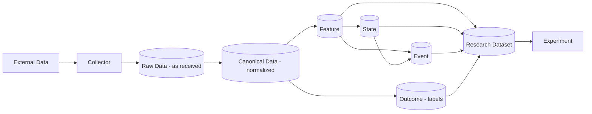

# 03 — Data Architecture

## 1. 存储职责

| 存储 | 角色 | 存什么 | 不存什么 |
|---|---|---|---|
| **Object Storage** | 物理介质 | Parquet 文件、Raw 归档字节、实验产物 | — |
| **Apache Iceberg** | 表格式 / Source of Truth | Raw、Canonical、Feature、State、Event、Outcome、Research Dataset | — |
| **PostgreSQL（Iceberg Catalog 库）** | Data Plane 元数据 | 仅 Iceberg 元数据指针（PyIceberg SQL Catalog） | 任何行情行、归档字节、Control Plane 数据 |
| **PostgreSQL（Control Plane 库）** | Control Plane | 注册表、版本、实验元数据、生命周期、审计 | 大型历史行情；Iceberg Catalog 内部表 |
| **DuckDB** | 研究计算引擎 | 临时计算、查询 | 任何需要持久化的真相 |
| **Polars / NumPy** | 内存计算 | — | — |

Phase 1 起的具体选择（[ADR-0021](../adr/0021-phase1-local-data-infrastructure.md)）：

- **Catalog**：PostgreSQL-backed PyIceberg SQL Catalog，使用独立 database、role 与凭据，与未来 Control Plane 库**物理隔离**；
  禁止跨库 join，Control Plane 不直接读写 catalog 内部表。Iceberg 元数据 commit **只**经由 PyIceberg；
  DuckDB / Polars 不拥有 catalog。`core/` 与 application 层只依赖 `CatalogAdapter`。
- **Warehouse**：WSL ext4 上的本地文件系统，URI 为 `file://`，只经 `StorageAdapter` / PyIceberg FileIO 访问；
  业务代码不拼接绝对路径；不装 Docker / MinIO。迁往 S3 / REST Catalog 须经 Adapter 与迁移验收（snapshot、content hash、PIT 结果不变）。
- **事件总线**：Phase 1 ~ 6 **不运行 NATS**；Collector 核心 API 可直接调用，不依赖消息总线。

接口落点（B3，02-domain.md §2.4）：`StorageAdapter`（staging → 校验 → 原子发布；逻辑相对 key，不给本机路径；同内容幂等、
异内容 fail closed；无覆盖 / 删除 API）、`CatalogAdapter`（`namespace.table` 身份、表定义绑定、snapshot 元数据、按
`(table, batch_id)` 幂等的 append 与乐观并发冲突，每次提交与重放前由 adapter 从实际 batch 独立重算指纹并核对行数；只隔离 Iceberg catalog 能力，不是 Control Plane Registry）与
`CollectorAdapter`（有界、可重放的获取，结果只引用已发布对象并以显式缺口覆盖请求区间）的 Protocol、DTO 与
provider-agnostic contract suite 已先于任何实现交付；实现分别属 C1、C2 / C3 与 D0。

## 2. Data Architecture（D4）

注：Outcome 直接由 Canonical 计算（前向价格路径），并在 Research Dataset 中以 point-in-time 方式与输入对齐。**Outcome 永不回流为 Feature/State/Event 的输入。**

这条方向在契约层有**声明层面**的执行点（ADR-0012）：`FeatureSpec.inputs` / `StateSpec.features` /
`EventSpec.features` / `EventSpec.states` / `StrategySpec.signals` 按白名单限制被引用对象的 `kind`
与数据集的 `zone`，因此 Outcome 的 `Ref` 与 `zone = outcome` 的 `DatasetRef` 会被直接拒绝
（白名单全表见 02-domain.md §2.1）。

**这不等于泄漏已被防住**：契约层只看得见直接引用**声明的**类型。传递依赖闭包的方向性、
被引用对象是否真的是该类型、物化数据是否使用了 `available_time > t` 的行、
`research_dataset` 内部的 point-in-time 对齐，分别是 Registry、Runner 与验证服务泄漏门（G1）
的未实现义务。

## 3. 数据分层（Zones，冻结）

| Zone | 内容 | 规则 |
|---|---|---|
| **Raw** | 原样落地（交易所归档文件、JSON/CSV、WebSocket 消息） | **append-only revision**，不覆盖；保留原始字段与来源元数据；记录 §4 的时间字段与 revision 字段；归档字节存于 warehouse 对象 |
| **Canonical** | 统一 Schema：trades、bars、order book、funding、open interest、liquidations… | 统一时区（UTC）、统一符号、幂等去重、缺口显式标记；**append-only revision / changelog**，每个 revision 绑定 Raw source lineage；latest view 可存在但不是审计真相 |
| **Feature** | FeatureSpec 的物化结果 | 分区含 `feature_name/version` |
| **State** | StateSpec 的物化结果 | 同上 |
| **Event** | EventSpec 的物化结果 | 同上 |
| **Outcome** | OutcomeSpec 的物化结果 | 同上；标记 horizon |
| **Research Dataset** | 为某实验组装的 point-in-time 数据集 | 必须绑定 `ResearchDatasetManifest`（见下）；无 manifest 不得进入实验 |

每次写入产生 Iceberg snapshot；实验通过 `snapshot_id` 引用数据，实现时间旅行与复现。

只有 `snapshot_id` 不足以证明逐行 point-in-time 正确。Research Dataset 必须绑定 `ResearchDatasetManifest`
（[ADR-0023](../adr/0023-bitemporal-revision-data.md) §6，新增契约，不改已发布 v2 字段）：自身与全部上游 `snapshot_id`、
PIT spec（版本 + 内容哈希）、`simulation_time` 或区间、`knowledge_cutoff`、availability / precedence policy 版本、
parser 版本，以及 universe 绑定。universe 按 [ADR-0024](../adr/0024-historical-tradable-universe.md) 绑定：
`UniverseSelectionSpec` 以 `name + SemVer + content hash` 绑定（不用 `Ref`、不新增 `Kind`），并绑定 listing 历史表 snapshot
与成员清单、排除原因清单。未来 Runner 接口必须接收 manifest，复现元组的 `dataset_snapshots` 必须包含该 Research Dataset 自身的 `DatasetRef`。
首批切片的 PIT 输入输出见 §7.5。

契约落点（B2，02-domain.md §2.3）：`core/contracts/universe.py` 的 `ResearchDatasetManifest` 内嵌完整 `PointInTimeSpec`，
由它唯一给出上游 `snapshot_id`（`snapshot_bindings`，含无 `Zone` 的 `quality` 表）、simulation、`knowledge_cutoff` 与
policy / parser 绑定；universe 以 `UniverseSpecBinding` 绑定，listing 历史由 `ListingRevision` / `ListingHistory` 表达。
成员 / 排除引用的每个 listing revision 只能属于一个 episode，且必须在 manifest 的 lineage 中有 `canonical.instrument_listings`
来源链；lineage 第三跳是通用的 Raw source payload（首切片为归档 revision，REST 补尾为 Raw 响应载荷）。
契约只校验结构；snapshot 与版本是否存在、哈希是否对应真实内容、成员清单能否按位重建，属 Registry 与批次 F。

## 4. 时间语义（冻结；2026-09-24 按 ADR-0023 修订）

完整语义、算法与验收矩阵见 [ADR-0023](../adr/0023-bitemporal-revision-data.md)；本节是冻结摘要。
原先的"三个时间 + `available_time = event_time + declared_latency` 单一公式"**已废止**。

### 4.1 两条时间轴、六个字段（全部 UTC，naive 时间拒绝）

| 字段 | 轴 | 含义 |
|---|---|---|
| `event_time` | 历史 | 市场事件或区间实际发生的时间；区间型数据同时记录起止 |
| `source_time` | 历史 | 数据源**明确声明**的发布 / 更新时间；没有就为空，不得伪造 |
| `available_time` | 历史 | 该观察在**历史策略时钟**上可被使用的最早时间；由版本化 availability policy 计算，可早于 `ingest_time` |
| `ingest_time` | 知识 | 本机第一次收到该具体 payload 的时间 |
| `knowledge_time` | 知识 | 本机完成最小校验、该 revision 可被数据集构建选用的时间；`>= ingest_time` |
| `declared_latency` | 历史 | 非负的历史可用延迟；只参与 `available_time` 的保守计算，不代替任何知识轴时间 |

### 4.2 有证据的 availability policy

- `available_time` 不得早于观察本身可被观察的时刻（区间型取区间结束），也不得早于适用的 `source_time`。
- 早于 `ingest_time` 的 `available_time` 必须有 policy 记录的来源证据（例如公共行情在成交时实时发布）；**不得**仅凭 `event_time` 回填。
- 来源修订不得早于其实际公开：来源给出修订发布时间则不早于它；给不出且 policy 无法证明时**保守取 `ingest_time`** 并记录证据缺口。
- policy 按来源版本化；变化即新版本，旧版本保留以复现旧实验。

### 4.3 派生值分别传播两条轴

    derived.available_time = max(派生规格自身的可用约束, max(input.available_time) + declared_latency)
    derived.knowledge_time = max(actual_ready_time, max(input.knowledge_time), 更严格的校验完成时间（若有）)

今天重算历史数据时，墙钟完成时间**只**进入 `knowledge_time`，不得把历史 `available_time` 推到今天。

### 4.4 Append-only revision：追加顺序 ≠ 修订优先级

- 同一业务观察由 `observation_key` 标识；每个新 payload 追加为不可变 revision。
- `arrival_seq` 只表示本机追加顺序（唯一、稳定、跨重启不复用、允许间隙），**只**用于审计、幂等与恢复。
- 语义优先级只来自稳定的 `revision_id`、持久化的 `supersedes` DAG（拒绝环、自指、跨 key 边；允许记录 dangling predecessor）
  与 ingest 时持久化的来源 precedence 证据；normalizer 重跑不得重新发明优先级。
- 来源身份 + payload hash 相同 = 重复：幂等去重，不产生新 revision、不分配新 `arrival_seq`。

### 4.5 Point-in-time 规则：双截止 + maximal head

在 `simulation_time` 计算的任何 Feature / State / Event / 信号只能使用 `available_time ≤ simulation_time` 的数据（Constitution C-L1，`t` 即 `simulation_time`），
且只能使用 `knowledge_time ≤ knowledge_cutoff` 的 revision。违反即为泄漏。逐 `observation_key`：

1. 候选 = 同时满足两个截止的 revision；
2. 用 `knowledge_time ≤ knowledge_cutoff` 的 `supersedes` 边与 precedence 证据构成 DAG，淘汰被直接或传递 supersede 的候选；
3. 唯一 maximal head → 选中；无候选 → 该 key 不存在；**多个互不排序的 head → conflict，fail closed**，写质量事件；
   禁止用 `arrival_seq`、墙钟或 payload hash 打破冲突；
4. 相同 snapshot、PIT spec、`simulation_time`（或区间）、`knowledge_cutoff` 与 policy 版本的结果按位一致，与到达顺序无关。

前向运行（paper / live）时 `knowledge_cutoff` 取当前时刻。universe 使用同一算法（ADR-0024 §4）。

## 5. 数据质量

Canonical 层每个分区产生质量报告：缺口、重复、异常值、时钟漂移、交易所维护窗口，以及 checksum 失败、时间单位 / 范围校验失败、competing heads 与证据缺口等质量事件。质量报告与 snapshot 一起版本化（首批表 `quality.data_quality_reports`）；Research Dataset manifest 引用其使用的质量报告；实验可声明最低质量要求。

## 6. 本地开发

- `data/` 目录仅为本地挂载点，**不入 Git**；warehouse 默认位于 `data/warehouse`。
- 对象存储与 Catalog 已由 ADR-0021 决定（§1）；warehouse 与 staging **不得**位于 `/mnt/*` 或其它跨文件系统路径。
- 现有外部数据（如 `~/BTC` 链接目标）**不得**被本项目修改；如需导入，Phase 1 以只读方式经 Collector 进入 Raw Zone。

### 6.1 最小直接依赖（A2 冻结，A3a 锁定）

按包身份冻结；精确版本由 A3a 解析并写入 `uv.lock`。

| 包 | 为什么是直接依赖 |
|---|---|
| `pyiceberg[pyarrow,pyiceberg-core,sql-postgres]` | Iceberg 表、SQL Catalog（PostgreSQL）与 PyArrow FileIO；官方 extra `pyiceberg-core` 是写入 §7.1 `day(...)` 分区的必需实现（ADR-0026，D-32） |
| `pyarrow` | 项目代码直接 import（microbatch `pyarrow.Table`） |
| `pydantic-settings` | 类型化设置（§6.2） |
| `httpx` | 归档与 market-data REST 下载 |

- `pyiceberg-core` 只作为 PyIceberg 的官方 extra 引入，版本由 PyIceberg 自身约束解析进 `uv.lock`，不是独立顶层依赖（ADR-0026）。
- **不**加入 Polars、DuckDB、NATS、boto3、Docker 或重试库。
- SQLAlchemy 与 PostgreSQL 驱动保持**传递依赖**；只有项目代码直接 import，或解析器证明必须显式声明时才可成为直接依赖，
  且须先报告 Codex，获准后再加。

### 6.2 类型化设置字段（A2 冻结，A3b 实现）

| 环境变量 | 默认 | 约束 |
|---|---|---|
| `HLENS_WAREHOUSE_URI` | 仓库内 `data/warehouse` 的 `file://` URI | Phase 1 只接受 `file://`；拒绝 `/mnt/*` 与其它 scheme |
| `HLENS_STAGING_URI` | warehouse 之下的 staging 目录 | 必须与 warehouse 位于同一文件系统（原子发布） |
| `HLENS_CATALOG_URI` | 无（必填） | secret-valued DSN，不得出现在日志 / repr；**只接受 PostgreSQL DSN**，运行时设置拒绝 SQLite 与其它 scheme |
| `HLENS_CATALOG_NAME` | `hlens` | 非空 |
| `HLENS_HTTP_CONNECT_TIMEOUT_SECONDS` | `10` | 正数 |
| `HLENS_HTTP_READ_TIMEOUT_SECONDS` | `60` | 正数 |
| `HLENS_HTTP_MAX_RETRIES` | `5` | 非负 |
| `HLENS_HTTP_USER_AGENT` | `hlens-autoresearch/0.0.0` | 非空 |
| `HLENS_BINANCE_ARCHIVE_BASE_URL` | `https://data.binance.vision` | 公共归档站点 |
| `HLENS_BINANCE_MARKET_DATA_BASE_URL` | `https://data-api.binance.vision` | market-data-only REST base（ADR-0022） |
| `HLENS_BINANCE_REST_MAX_PAGES_PER_COLLECT` | `200` | int，`1 ≤ n ≤ 5000`；单次 `collect` 最多**新取**的页数（checkpoint 重放不计）；用尽 → `CollectionFailed`，逻辑尝试保持可续（ADR-0027 §12） |
| `HLENS_BINANCE_REST_MIN_REQUEST_INTERVAL_MS` | `250` | int，`50 ≤ n ≤ 60000`；相邻两次 REST 请求（含重试）的最小间隔 |
| `HLENS_BINANCE_REST_MAX_RETRY_AFTER_SECONDS` | `60` | int，`1 ≤ n ≤ 3600`；429 的 `Retry-After`（秒）超过即 fail closed、不等待；缺失或非法视同超过；418 一律立即终止 |
| `HLENS_BINANCE_REST_MAX_RESPONSE_BYTES` | `8388608` | int，`65536 ≤ n ≤ 67108864`；去除 content coding 后的 REST 正文上限（边解码边计数）；超过 → 失败、不发布 |

ADR-0021 允许的 SQLite 单元测试不经过运行时设置：测试通过仅供测试的 adapter / factory fixture 直接注入内存 SQLite catalog，
设置代码中**不存在**"是否在 pytest 中"之类的隐藏分支。

REST 采集（ADR-0027 §12）**复用**而不另设：`HLENS_HTTP_CONNECT_TIMEOUT_SECONDS` / `HLENS_HTTP_READ_TIMEOUT_SECONDS`（与 D0 相同的
httpx 超时语义）、`HLENS_HTTP_MAX_RETRIES`（每页对 5xx / 传输失败 / 429 的尝试上限为 `1 + n`）、`HLENS_HTTP_USER_AGENT`、
`HLENS_BINANCE_MARKET_DATA_BASE_URL`（必须是精确 `https://host[:port]` origin，拒绝路径 / query / 凭据，不静默改写）。
四项 `HLENS_BINANCE_REST_*` 是运维安全参数，不是 Constitution / Validation Profile 阈值；页大小 `limit = 1000` 是页身份规则常量，不是设置。

后续的 `.env.example` 只包含变量名与占位符，**不含任何凭据**；A2 不创建它。

## 7. Phase 1 第一纵向切片（冻结，2026-09-24，A2）

范围见 [ADR-0022](../adr/0022-phase1-market-and-execution-scope.md)：Binance 公共 spot、`BTCUSDT` / `ETHUSDT`、归档 aggTrades 与 1m klines。
本节冻结首批逻辑名、分区与标识符；列级 Schema、`observation_key` 与 `revision_id` 规则由契约 / 表批次提出并随表版本化。
2026-09-25 按 [ADR-0027](../adr/0027-rest-raw-source-and-element-revisions.md)（Accepted）additive 扩充 REST 补尾：新增四张 Raw 表与六个标识符，原八张表与原标识符不变。

### 7.1 逻辑 Iceberg 表

| 表 | 内容 | 初始分区 |
|---|---|---|
| `raw.binance_spot_archives` | 每个下载归档文件的一条 revision 元数据：来源 URI、文件日期、数据类型、symbol、`.CHECKSUM` 与计算出的哈希、下载 / HTTP 元数据、时间与 revision 字段、**归档对象的 warehouse URI** | 不分区 |
| `raw.binance_spot_agg_trades` | 从归档解析出的原始 aggTrades 行，绑定所属归档 revision | identity `symbol` + `day(event_time)` |
| `raw.binance_spot_klines_1m` | 从归档解析出的原始 1m klines 行，绑定所属归档 revision | identity `symbol` + `day(interval_start)` |
| `canonical.trades` | Canonical trade revision，绑定 Raw lineage | identity `symbol` + `day(event_time)` |
| `canonical.bars_1m` | Canonical 1m bar revision，绑定 Raw lineage | identity `symbol` + `day(interval_start)` |
| `canonical.instrument_listings` | listing episode revision（ADR-0024 §1 / §2） | 不分区 |
| `quality.data_quality_reports` | 质量报告与质量事件 | 不分区 |
| `research.dataset_manifests` | `ResearchDatasetManifest` 记录 | 不分区 |
| `raw.binance_spot_rest_responses` | 一个 REST 响应页的 Raw source payload revision：规范页身份、响应字节对象引用、HTTP 元数据、页面解码摘要、revision 与两轴时间字段；空页、被 decoder 拒绝的完整页也是 revision（ADR-0027 §2） | 不分区 |
| `raw.binance_spot_rest_agg_trades` | 从 REST 响应页解码的 aggTrade 元素 revision，绑定首个交付它的响应 revision | identity `symbol` + `day(event_time)` |
| `raw.binance_spot_rest_klines_1m` | 从 REST 响应页解码的已结束 1m kline 元素 revision，绑定首个交付它的响应 revision | identity `symbol` + `day(interval_start)` |
| `raw.binance_spot_precedence_evidence` | 独立、append-only 的完整 `PrecedenceEvidence`：稳定 `edge_id`（不含时间）、`observation_key`、两端 revision 与所在表、policy 绑定、证据、边的 `knowledge_time`、比较时固定的两侧 snapshot、投影哈希（ADR-0027 §1 / §4） | 不分区 |
| `raw.binance_spot_exchange_info` | 每次成功 `GET /api/v3/exchangeInfo` 快照的 Raw source revision：请求身份、响应字节对象引用、HTTP 元数据、`serverTime` 与请求 symbol 的原生字段（ADR-0029 §1） | 不分区 |
| `quality.availability_evidence_gaps` | 质量报告引用的 `AvailabilityEvidenceGap` 逐条记录（`quality_report_id` + `table` + `revision_id` + `gap`），按时段分批只追加写入；报告行是唯一引用（ADR-0031） | identity `subject_symbol` + `day(subject_start)` |

- **归档字节**以不可变对象存于 warehouse（经 `StorageAdapter`：staging → checksum 校验 → 同文件系统原子发布），
  由 `raw.binance_spot_archives` 引用；**不存入 PostgreSQL**，也不覆盖：同路径新 checksum = 新对象 + 新 revision。
  maintenance 不得删除任何被归档 revision 引用的对象。
- 共 14 张 Phase 1 表：前 8 张为 A2 首切片（定义与哈希不因 ADR-0027 / ADR-0029 / ADR-0031 改变），中 4 张为
  ADR-0027 的 REST additive 扩充，第 13 张为 ADR-0029 的 exchangeInfo 快照表（E2），第 14 张为 ADR-0031 的
  质量证据缺口表（QG-1）。REST 响应字节同样以不可变对象存于 warehouse（内容寻址 key），由
  `raw.binance_spot_rest_responses` 引用。
- Iceberg namespace 是存储命名，不改变契约的 `Zone` 枚举；`quality` 与 manifest 表是审计 / 元数据表，由 manifest 契约引用。
  物化 Research Dataset 表的命名随 PIT 实施批次提出，不在本清单内。
- **分区演进**需要该表新的 partition-spec 版本与新旧 spec 查询结果的等价测试，**不是**契约变化。

### 7.2 PyIceberg 写入约束

有界 `pyarrow.Table` microbatch + 稳定 batch id + 可从 Raw / staging 重建；不向 partitioned 表交付不可重放的 `RecordBatchReader`；
每表 / 分区单 writer；commit 冲突按 batch id 幂等重试；orphan 只由显式 maintenance 清理（ADR-0023 §7）。

### 7.3 来源与 policy 标识符

| 类别 | 标识符 | 冻结内容 |
|---|---|---|
| Source | `binance.public.spot.archive@1.0.0` | `data.binance.vision` 公共 spot 日 / 月归档（aggTrades、1m klines）+ 同目录 `.CHECKSUM` |
| Parser | `binance.spot.archive.parser@1.0.0` | 时间单位按**文件覆盖日期**（UTC）决定：早于 2025-01-01 为毫秒，自 2025-01-01 起为微秒；禁止逐值猜测数量级。每个文件声明覆盖 UTC 半开区间 `[coverage_start, coverage_end)`（日归档为该日，月归档为该月）；所有解析出的 aggTrades 事件时间与 kline 开盘时间必须落在区间内（零容差），任一例外即整个文件拒绝、不进 Canonical、写质量事件。单位或容差变化 = 新 parser 版本 |
| Availability policy | `binance.spot.publication@1.0.0` | Binance spot 首发与归档替换的历史可用时间规则（ADR-0023 §2） |
| Precedence policy | `binance.spot.archive-revision@1.0.0` | 同一归档路径不同 checksum 的 revision 之间能否证明先后；无法证明 = competing heads |
| Source | `binance.public.spot.rest@1.0.0` | market-data-only base 的 `GET /api/v3/aggTrades` 与 `GET /api/v3/klines`（`1m`），security type NONE（ADR-0027） |
| Decoder（parser role） | `binance.spot.rest.decoder@1.0.0` | ADR-0027 §6 的 page envelope（零容差）、声明单位（毫秒）、未结束 K 线规则、正文上限；变化 = 新版本 |
| Availability policy | `binance.spot.rest-publication@1.0.0` | REST 全部主体 `available_time = ingest_time` + 证据缺口 |
| Precedence policy | `binance.spot.rest-revision@1.0.0` | REST 通道内部：同内容幂等；不同内容无证据 → competing heads；从不产生边 |
| Precedence policy | `binance.spot.delivery-channel@1.0.0` | D-33 方案 A：版本化规范内容投影逐字段相等 → evidence-only 边"归档 revision 取代 REST revision"，写入证据表；否则无边。项目政策，不是来源声明的先后 |
| 身份规则 | `hlens.binance.spot.rest-revision-identity@1.0.0` | REST 页身份、键与 payload hash、`edge_id`、`arrival_seq` 区间（REST 自 `2**62` 起）；与归档身份规则物理隔离 |
| 身份规则 | `hlens.canonical.revision-identity@1.0.0` | Canonical revision 身份（`crev1-`）：`{rule, observation_key, source_id, payload_hash}`；source identity 内嵌 normalizer 版本与 Raw lineage（ADR-0028 §1）；与归档 / REST 规则物理隔离 |
| Normalizer（parser role） | `hlens.canonical.binance-spot.normalizer@1.0.0` | Raw 元素 revision → Canonical trades / bars_1m 一一对应；payload 文档 `hlens.canonical.trade/1` / `hlens.canonical.bar_1m/1`；行内边只映像 Raw 行内边（1.0.0 为空）；独立 `arrival_seq` 块（ADR-0028 §2 / §3.1 / §5 / §6） |
| Availability policy | `hlens.canonical.availability@1.0.0` | 派生：`available = max(规格约束, raw.available + 0)`，`knowledge = max(normalizer ready, raw.knowledge)`；证据 / 缺口二选一继承（ADR-0028 §4） |
| Precedence policy | `hlens.canonical.precedence-map@1.0.0` | PIT 把绑定的 Raw 证据 snapshot 中已复核的边按 lineage 一对一映射到 Canonical 端点，`knowledge_time = max(K_E, 两端 Canonical knowledge)`；不物化、不读墙钟（ADR-0028 §3.2） |
| PIT rule | `hlens.pit.maximal-head@1.0.0` | 在规格绑定的 snapshot 上证明 Canonical 行（重新规范化其 Raw 单元，只证明读到的批次、单元级事实全部核对）与 Raw 边（重新推导），映射边，按 `available_time ≤ simulation_time`、`knowledge_time ≤ knowledge_cutoff` 双截止取 maximal head；多于一个 = 冲突（数据集 fail closed）；窗口为任意 UTC 区间，同一键相距一天以内的全部 revision 一起参与选择，键只属于其最早事件所在的窗口（读取方可选"触及"语义自行去重）（Phase 1 F1、G3-S2、G3-S3-R1 / R2） |
| Quality rule | `hlens.quality.canonical-partition@1.0.0` | 每个 Canonical 分区（表 × 标的 × UTC 日）一行报告：输入快照、竞争 head、1m 缺口、aggTrade ID 跳号、K 线不变式违例与全部证据缺口；无数值阈值（Phase 1 E3；证据缺口格式待 D-QGAP） |
| Representation | `hlens.canonical.resample@1.0.0` | 只从 PIT 选中的 `canonical.bars_1m` 派生整除一天的分钟周期，UTC 对齐，缺分钟标为不完整、绝不补齐，`available_time ≥ 区间结束`，精确十进制运算（Phase 1 E4） |
| Source | `binance.public.spot.exchange-info@1.0.0` | market-data-only base 的 `GET /api/v3/exchangeInfo`，唯一参数 `symbols=["BTCUSDT","ETHUSDT"]`，security type NONE；每个成功 200 响应一条 Raw source revision，存 `raw.binance_spot_exchange_info`（ADR-0029 §1） |
| Collector | `binance.spot.public-exchange-info@1.0.0` | 联网前按结构化白名单拒绝其它 source / symbol / 参数；复用 D3D wire；内容寻址响应对象 + 不可变快照 checkpoint，重放不联网（ADR-0029 §1） |
| Decoder（parser role） | `binance.spot.exchange-info.decoder@1.0.0` | 严格 JSON；只读 `serverTime`（原样、不解释单位）与请求 symbol 的 `symbol` / `status` / `baseAsset` / `quoteAsset`；未请求或重复 symbol 拒绝整份快照，拒绝不产生 Raw revision；变化 = 新版本 |
| 身份规则 | `hlens.binance.spot.exchange-info-identity@1.0.0` | 请求身份 `{method, origin, path, query, rule}`、`binance:spot:exchange-info:<sha256>` 键、响应字节 payload hash、`rev1-` id、`arrival_seq` = 已提交最大值 + 1；与归档 / REST 规则物理隔离 |
| Availability policy | `binance.spot.exchange-info-publication@1.0.0` | 快照与由其推导的 listing revision 一律 `available_time = ingest_time` + 证据缺口（listing 缺口写明 observed-from 下界）（ADR-0029 §1 / §2） |
| Listing 推导（parser role） | `binance.spot.listing-status@1.0.0` | `TRADING` → listed；`HALT` / `BREAK` / `END_OF_DAY` / `CANCEL_ONLY` → suspended（观察时刻关闭区间）；其它状态、缺失 symbol、base / quote 不符 → 不推断、universe fail closed；永不产生 `delisted`；`tradable_from` = 首次观察到 `TRADING` 的 `retrieved_at`；只在映射状态变化时追加 revision；lineage 两跳均为观察快照（ADR-0029 §2） |
| Precedence policy | `binance.spot.listing-observation@1.0.0` | 同一来源、同一 episode：推导链中后一条 supersede 前一条，观察时刻（`retrieved_at`）严格递增，证据为两次快照的 `retrieved_at` 与 revision id；同一时刻两份快照不可排序（fail closed）；不用 `arrival_seq`（ADR-0029 §2） |
| Universe spec | `binance.spot.btc-eth@1.0.0` + content hash | 首切片 `UniverseSelectionSpec`：`BTCUSDT`、`ETHUSDT` spot 的 listing episode；按 ADR-0024 绑定 |

**标识符冻结 ≠ 数据可信**：availability 与 precedence policy 的来源证据仍须由实施批次产出、审阅并有测试。
在此之前：早于 `ingest_time` 的 `available_time` 不得被视为可信（按 §4.2 保守取 `ingest_time` 并记录证据缺口）；
同一 `observation_key` 的多个无证据 revision 一律作为 competing heads fail closed。

### 7.4 首切片的 revision 语义

- 同一 payload（来源身份 + payload hash）重放：幂等，不产生新 revision。
- 同一归档路径的新 checksum：追加新 source revision，旧文件、旧 checksum 与旧解析结果保留；先后只由 `binance.spot.archive-revision@1.0.0` 的已持久化证据决定。
- 更高周期 bar 只从 `canonical.bars_1m` / `canonical.trades` 确定性派生，重跑按位一致。

### 7.5 PIT 输入 / 输出（文档级冻结）

**输入**（全部必填）：

- `simulation_time` 或 simulation 区间；`knowledge_cutoff`；
- 读取的每一张相关 Iceberg 表的 `snapshot_id`（至少 `canonical.trades` / `canonical.bars_1m` 中实际使用者、`canonical.instrument_listings`、
  `quality.data_quality_reports`，以及 lineage 校验所需的 Raw 表）；
- PIT spec 版本与内容哈希；availability policy 与 precedence policy 的 ID + 版本；parser 版本；
- universe spec `name + SemVer + content hash`。

**输出**：

- 一份**无冲突**的 Research Dataset（每个 key 至多一个选中 revision），以及 `research.dataset_manifests` 中的一条 manifest；
- manifest 记录全部输入绑定、选中 revision 的 lineage（Canonical `revision_id` → Raw revision → Raw source revision；首切片即归档 revision）、
  universe 成员清单与排除原因清单、引用的质量报告，以及该 Research Dataset 自身的 `DatasetRef`（含其 `snapshot_id`）。

**fail closed**（不产生可进入实验的数据集）：任一 competing head（观察或 listing）；请求绑定的 policy / parser / universe spec 无法解析到
已登记且带证据的版本，或 `supersedes` 边引用的 precedence 证据缺失；所需时间范围内缺少 universe listing 历史；manifest 任一绑定项缺失。
单行 availability 证据缺口不在此列：该行按 §4.2 保守计算并记入 manifest（契约为 `AvailabilityEvidenceGap`，须引用 manifest 所列质量报告）。
competing head 不是 universe 排除原因：它使构建 fail closed，不产生 manifest。

### 7.6 REST 补尾设计摘要（[ADR-0027](../adr/0027-rest-raw-source-and-element-revisions.md)，Accepted 2026-09-25）

表与标识符见 §7.1 / §7.3，设置见 §6.2；全文与验收矩阵见 ADR-0027。要点：

- **三跳 lineage** 无需契约改动：`canonical.trades → raw.binance_spot_rest_agg_trades → raw.binance_spot_rest_responses`。
  REST 元素 `observation_key` 与归档逐字符相同；元素 source identity 是通道级，分页重叠与重取天然幂等。
- **两种身份**：`CollectionRequest.request_id` 是一次逻辑采集尝试，重放从不可变 checkpoint 返回首次已承诺的对象、不重新联网；
  规范页身份（method / origin / path / query / 声明单位 / 规则）可跨尝试相同。`CollectorAdapter` 必需协议不变。
- **目标窗口 ≠ 页面合法性**：`[t0, t1)` 只用于停止与覆盖账；page envelope 由实际查询、排序、字段形状、声明单位与
  `retrieved_at` 上界决定，零容差。越出目标窗口的合法元素照常入 Raw。
- **缺口诚实**：页数预算、限流、5xx、传输失败、截断、无效 JSON、envelope 违约都是 `CollectionFailed`；`SOURCE_ABSENT`
  只用于短页 / 空页之后、陈述确切查询在 `retrieved_at` 的回答。
- **D-33 方案 A（已生效）**：规范内容投影逐字段相等时，在 `raw.binance_spot_precedence_evidence` 追加 evidence-only 边；
  不等 / 不可比较 → 无边、fail closed。边的 `knowledge_time` 是首次比较并提交的本机时刻，此前两 head 都可见即冲突。
  REST 毫秒与 2025 年起归档微秒之间，带亚毫秒位的 aggTrade 无法证明相等，一律 fail closed（ADR-0027 §4.8）。
- **`arrival_seq`**：REST 自 `2**62` 起分配；只要求同一被聚合 graph 内唯一；归档分配与 `IDENTITY_HASH` 不变。
- **PIT 绑定**：使用 REST 数据的 PIT 读取必须同时绑定所读 REST 表与 `raw.binance_spot_precedence_evidence` 的 snapshot（ADR-0027 §13）。

官方事实与其边界见 [证据文件](evidence/binance-spot-rest-market-data.md)（2026-09-25 检索）。

### 7.7 双 Raw → Canonical 设计摘要（[ADR-0028](../adr/0028-dual-raw-canonical-lineage.md)，Accepted 2026-09-25）

- 每条 Raw 元素 revision 在一个 normalizer 版本下恰好对应一条 Canonical revision；`observation_key` 与 Raw 相同，
  source identity 内嵌 Raw 表与 revision id，因此归档与 REST 交付的同一内容是两条可追溯的 Canonical revision。
- 行内 `supersedes` / `precedence_evidence` 只映像 Raw 行内边；跨通道边不物化到 Canonical，由 PIT 从绑定的
  `raw.binance_spot_precedence_evidence` snapshot 一对一映射。Canonical payload 相等永远不是 precedence 证据。
- 时间按 ADR-0023 §3 传播，normalizer 每个单元读一次注入时钟、重跑复用；`arrival_seq` 每张 Canonical 表独立分块，
  不复制 Raw。使用 Canonical 的 PIT 必须绑定 Canonical、所涉 Raw 元素与 source 表以及 Raw 证据表的 snapshot。
