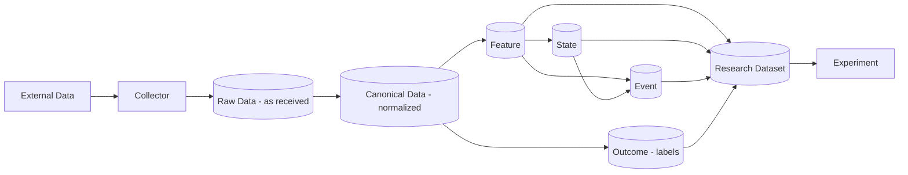

# 03 — Data Architecture

## 1. 存储职责

| 存储 | 角色 | 存什么 | 不存什么 |
|---|---|---|---|
| **Object Storage（S3 兼容）** | 物理介质 | Parquet 文件、实验产物 | — |
| **Apache Iceberg** | 表格式 / Source of Truth | Raw、Canonical、Feature、State、Event、Outcome、Research Dataset | — |
| **PostgreSQL** | Control Plane | 注册表、版本、实验元数据、生命周期、审计、（可选）Iceberg Catalog | 大型历史行情 |
| **DuckDB** | 研究计算引擎 | 临时计算、查询 | 任何需要持久化的真相 |
| **Polars / NumPy** | 内存计算 | — | — |

## 2. Data Architecture（D4）

注：Outcome 直接由 Canonical 计算（前向价格路径），并在 Research Dataset 中以 point-in-time 方式与输入对齐。**Outcome 永不回流为 Feature/State/Event 的输入。**

## 3. 数据分层（Zones，冻结）

| Zone | 内容 | 规则 |
|---|---|---|
| **Raw** | 原样落地（交易所 JSON/CSV、WebSocket 消息） | 追加式；保留原始字段；记录 `ingest_time` 与来源 |
| **Canonical** | 统一 Schema：trades、bars、order book、funding、open interest、liquidations… | 统一时区（UTC）、统一符号、去重、缺口显式标记 |
| **Feature** | FeatureSpec 的物化结果 | 分区含 `feature_name/version` |
| **State** | StateSpec 的物化结果 | 同上 |
| **Event** | EventSpec 的物化结果 | 同上 |
| **Outcome** | OutcomeSpec 的物化结果 | 同上；标记 horizon |
| **Research Dataset** | 为某实验组装的 point-in-time 数据集 | 绑定上游全部 snapshot_id |

每次写入产生 Iceberg snapshot；实验通过 `snapshot_id` 引用数据，实现时间旅行与复现。

## 4. 时间语义（冻结）

| 时间 | 含义 |
|---|---|
| `event_time` | 市场上事件发生的时间 |
| `ingest_time` | 系统接收到的时间 |
| `available_time` | 研究中该数据被视为"可用"的时间 = `event_time + declared_latency` |

**Point-in-time 规则**：在时刻 `t` 计算的任何 Feature / State / Event / 信号只能使用 `available_time ≤ t` 的数据。违反即为泄漏（Constitution C-L 系列）。

## 5. 数据质量

Canonical 层每个分区产生质量报告：缺口、重复、异常值、时钟漂移、交易所维护窗口。质量报告与 snapshot 一起版本化；实验可声明最低质量要求。

## 6. 本地开发

- `data/` 目录仅为本地挂载点，**不入 Git**。
- 早期阶段对象存储可以是本地文件系统路径（见 ARCHITECTURE_DECISION_REQUIRED：待决事项 D-01、D-02）。
- 现有外部数据（如 `~/BTC` 链接目标）**不得**被本项目修改；如需导入，Phase 1 以只读方式经 Collector 进入 Raw Zone。
