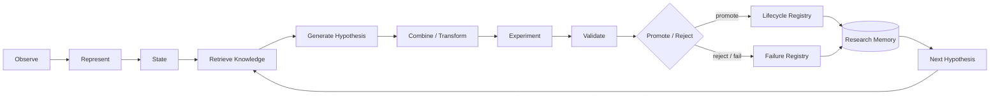

# 04 — Research Loop

## 1. 目的

研究闭环把"观察 → 假设 → 实验 → 裁决 → 记忆"变成可重复、可审计、可自动化的过程。自动化程度随 Phase 提升，但**裁决永远由确定性的 Validation 完成**。

## 2. Research Closed Loop（D2）

## 3. 各步骤

| 步骤 | 输入 | 输出 | 实现者 |
|---|---|---|---|
| Observe | 外部数据 | Raw/Canonical snapshot | Collector Plugin |
| Represent | Canonical | Representation / Feature | FeatureProvider |
| State | Feature | State 序列 | StateProvider |
| Retrieve Knowledge | 当前 State、Event、问题 | 相关 KnowledgeItem、历史实验、失败记录 | KnowledgeProvider |
| Generate Hypothesis | 知识 + 记忆 | `Hypothesis` | 人工 / 模板 / LLMProvider |
| Combine / Transform | 已有 Feature/Strategy/State | 新组合的 Spec | 组合器（确定性算子） |
| Experiment | ExperimentSpec | ExperimentRun | Experiment Runner + BacktestProvider |
| Validate | ExperimentRun | ValidationReport | Validation Pipeline（非 LLM） |
| Promote / Reject | ValidationReport | Lifecycle 转移 / FailureRecord | Lifecycle + 人工审批 |
| Research Memory | 所有记录 | 可检索记忆 | Control Plane + 索引 |

## 4. 组合与变换算子（Combination / Transformation）

研究新颖性的主要来源，而非 LLM 自由生成：

| 算子 | 例子 |
|---|---|
| Conditioning（条件化） | 策略 S 仅在 State = 高波动 下启用 |
| Interaction（交互） | Feature A × Feature B |
| Temporal（时序关系） | Event X 之后 N 根 bar 内的 Event Y |
| Transformation | 标准化、排序、分位、差分、平滑 |
| Ensemble | 多信号投票/加权 |
| Negation / Inversion | 反向策略作为对照 |

**每一次组合都计入多重检验的试验次数（trial count）**，这是防止组合爆炸式过拟合的核心约束（constitution.md）。

## 5. 假设规则

- 必须可证伪，且在运行前写明预期效应方向与最小有意义效应量。
- 必须在运行实验**之前**登记（pre-registration），登记后不可修改；修改 = 新假设。
- 来源（`origin`）必须记录：人工、KnowledgeItem 引用、组合算子、LLM（附 provider/model/prompt 哈希）。

## 6. Research Memory 的作用

- 去重：相同 `content_hash` 的实验不重复运行（除非显式复现检查）。
- 负面知识：Failure Registry 中的失败模式用于过滤新假设。
- 试验计数：同一假设族的所有尝试累计，用于多重检验校正。
