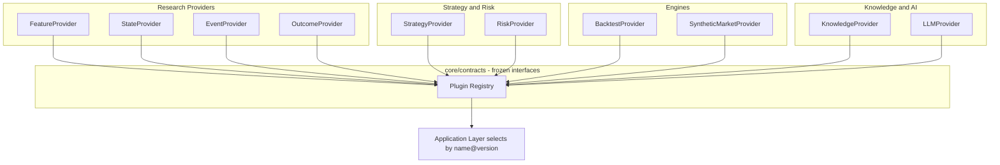

# 05 — Plugin Architecture

## 1. 原则

- 新能力优先实现为 Provider；Domain 只认识接口。
- 插件是**版本化**的；插件版本进入实验复现元组。
- 插件必须声明是否确定性（`deterministic: bool`）。非确定性插件（如 LLM）必须记录全部输入输出。

## 2. Plugin Architecture（D5）



## 3. Provider 接口语义（Phase 0 冻结语义；可执行签名按 ADR-0017 的节奏交付）

Phase 0 冻结的是本节的**概念层内容**：每类 Provider 的职责、概念输入输出、确定性语义，
以及 §1 / §4 / §6 的版本与审计语义。**Phase 0 不定义十类 Provider 的可执行 Protocol。**
每一类 Provider 的可执行 Protocol、输入输出 DTO（带 `schema_version` 并导出 JSON Schema）
与 provider-agnostic contract tests，在**首次消费它的 Phase 开始实现之前**交付，
并计入该 Phase 的验收（[ADR-0017](../adr/0017-provider-delivery-schedule.md)）。


| Provider | 职责 | 输入 → 输出（概念） | 确定性 |
|---|---|---|---|
| **FeatureProvider** | 计算特征 | Canonical/Representation + params → Feature series | 必须 |
| **StateProvider** | 识别市场状态 | Features → State series | 必须（训练型需固定种子与训练窗口） |
| **EventProvider** | 识别事件/交互 | Features + States → Events | 必须 |
| **OutcomeProvider** | 计算结果标签 | Canonical + event times + horizon → Outcomes | 必须 |
| **StrategyProvider** | 信号到目标仓位 | Features/States/Events → target positions | 必须 |
| **RiskProvider** | 仓位约束与调整 | target positions + portfolio state → constrained positions | 必须 |
| **BacktestProvider** | 模拟执行 | positions + prices + cost model → fills, PnL | 必须 |
| **KnowledgeProvider** | 检索知识 | query → KnowledgeItem[]（带出处） | 可不确定（需记录） |
| **LLMProvider** | 文本生成/结构化提取 | prompt + schema → structured output | 不确定（需记录） |
| **SyntheticMarketProvider** | 生成合成市场 | generator spec + seed → synthetic Canonical data | 必须（给定种子） |

`FeatureProvider` 的可执行 Protocol、DTO 与 contract suite 已于 Phase 1 F4 交付（[ADR-0030](../adr/0030-feature-provider-contract.md)，
02-domain.md §2.5）：执行器 `infrastructure/feature/runner.py` 对每个评估时刻只把 `available_time + available_lag <= t`、
`knowledge_time <= knowledge_cutoff` 的输入交给 Provider；首批实现（bar 对数收益、滚动已实现波动率、滚动成交量和）在
`plugins/features/`，窗口等参数属于各自 `FeatureSpec`，由 descriptor 中的 spec hash 绑定。

另有基础设施 Adapter（不属于研究插件）：`CollectorAdapter`、`StorageAdapter`、`CatalogAdapter`、`ComputeEngineAdapter`、`EventBusAdapter`。
其中 `CollectorAdapter`、`StorageAdapter`、`CatalogAdapter` 的可执行 Protocol、DTO 与 provider-agnostic contract suite
已于 Phase 1 B3 交付（02-domain.md §2.4、`tests/contract_suites/`），尚无实现；`ComputeEngineAdapter`、`EventBusAdapter`
在首次消费时按同一节奏交付。三者中只有 Collector 可以联网，并在其 descriptor 中声明 HTTPS origin（§6）；该声明只用于
审计与一致性核对，不是安全控制。

## 4. 插件清单（Manifest）

每个插件附带机器可读清单（字段草案）：

```yaml
name: realized_vol
kind: feature            # feature|state|event|outcome|strategy|risk|backtest|knowledge|llm|synthetic
version: 1.0.0
contract_version: 1.0.0  # 实现的 Provider 接口版本
deterministic: true
params_schema: {...}     # JSON Schema
inputs: [...]            # 依赖的 DatasetRef / Spec 引用
outputs: [...]           # Arrow schema
available_lag: PT0S      # 仅 feature/state/event
```

## 5. 发现与加载

- 默认机制：Python entry points（`hlens.plugins.<kind>`）。
- Registry 校验：`contract_version` 兼容、manifest 合法、`params_schema` 合法。
- Application 通过 `name@version` 选择插件，不 import 具体类。

## 6. 隔离

- 插件不得访问网络（KnowledgeProvider、LLMProvider、Collector 除外，且需声明）。
- 插件不得写 Control Plane；只返回结果，由 Application 持久化。
- 第三方/LLM 生成的插件代码在 Phase 7+ 需沙箱运行（09-security.md）。

## 7. 代码位置

| 类型 | 位置 |
|---|---|
| 接口 | `core/contracts/` |
| 研究插件（探索期） | `research/<kind>/` |
| 通用/基础设施插件 | `plugins/` |
| 已晋升策略与风控 | `strategies/`、`risk/` |

> 研究代码与生产代码的位置划分已由 [ADR-0005](../adr/0005-research-production-boundary.md)（D-03）决定：
> `research/` 中的研究实现永不被生产运行时加载，生产使用的策略、风控与 Provider 须经
> Artifact + Registry + Promotion + Equivalence Gate 进入 `strategies/`、`risk/`、`plugins/`（ADR-0005 §7）。
> 研究与生产是否共用同一个生产级 Provider 实现仍是开放问题 Q-2。
