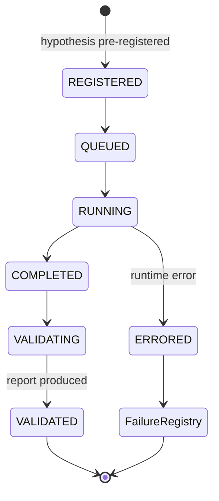

# 06 — Experiment

## 1. 定义

**ExperimentSpec**：对一个 Hypothesis 的完整、可执行、可复现的检验规格。
**ExperimentRun**：ExperimentSpec 的一次执行。

> 2026-09-23 [ADR-0009](../adr/0009-experiment-identity-binding.md) §2 修订本节原先的
> "一个 Spec 可以有多次 Run（复现检查、不同随机种子）"：
>
> * 实际 `seeds` 保留在复现元组内，参与 `experiment_hash`。
> * **相同完整规格（含相同 seeds）可以有多次 Run**——这正是复现检查。
> * **不同实际 seeds = 新的不可变规格变体 = 新的 `experiment_hash`**，不是"同一 Spec 的另一次 Run"。
>   族内关联由 `hypothesis_family_id` 与 `trial_index / family_trial_count` 承担。
> * 不引入 `seed_policy` 或任何种子派生 DSL。

## 2. 复现元组（Reproducibility Tuple，冻结）

> 2026-09-23：按 [ADR-0007](../adr/0007-validation-architecture-three-layers.md) 增加 `validation_profile_version` 与 `profile_selection`。
> 2026-09-23：按 [ADR-0009](../adr/0009-experiment-identity-binding.md) §1、§5 增加
> `strategy_ref` / `risk_policy_ref` / `outcome_ref` / `dependency_hashes`，并把 `profile_selection`
> 改为结构化必填字段。**v1 与 v2 的 `experiment_hash` 覆盖面不同，不可比较。**

每个 ExperimentRun 必须记录以下全部字段，缺任一项则 Run 不得进入 Validation：

| 字段 | 说明 |
|---|---|
| `hypothesis_ref` | 预登记的假设 ID |
| `dataset_snapshots` | 所有输入表的 Iceberg `snapshot_id` |
| `code_commit` | Git commit SHA（工作区必须干净） |
| `strategy_ref` | 被检验的策略 `strategy:name@semver`；**必须显式提供**，不适用时明确填 `null` |
| `risk_policy_ref` | 风控策略 `risk:name@semver`；同上 |
| `outcome_ref` | 结果标签 `outcome:name@semver`；同上 |
| `plugin_versions` | 所有插件：键严格为 `name@semver`，值为 SHA-256 `content_hash` |
| `dependency_hashes` | 直接依赖的内容绑定：键为 `Ref` 的规范串 `kind:name@semver`，值为 64 位小写十六进制 SHA-256。`hypothesis_ref`、`strategy_ref`、`risk_policy_ref`、`outcome_ref`、`cost_model_ref` 中**所有非空引用必须出现**，缺一即拒绝 |
| `params` | 全部参数（含默认值展开） |
| `param_search_space` | 若有参数搜索：完整搜索空间与尝试次数 |
| `seeds` | 全部随机种子 |
| `environment_lock` | 依赖锁文件哈希 + Python 版本 + 平台 |
| `constitution_version` | 执行时的 Validation Constitution 版本 |
| `validation_profile_version` | 执行时绑定的 Validation Profile：`vp:{scope_id}@{semver}` + `content_hash`。运行前绑定，运行后不可更换 |
| `profile_selection` | 选择该 Profile 的依据（必填，无空默认值）：**唯一的选择规则引用**（kind 必须是 `profile_selection_rule`）、**该规则的内容哈希**、以及 `ProfileSelectionKey`（`venue` / `symbol` / `timeframe` / 预登记的 `research_class`） |
| `split_spec` | 训练 / 验证 / OOS 时间区间（引用 Constitution 规则） |
| `cost_model_ref` | 成本/滑点模型 `name@version` |
| `llm_calls` | 若有 LLM 参与：provider、model、prompt 哈希、完整输入输出 |

> **LlmCall 的登记缺口（未关闭）**：本表要求"完整输入输出"，但当前 `LlmCall` 契约只存
> `prompt_hash` / `input_hash` / `output_hash` 三个哈希。ADR-0009 §5 记录了这一义务，
> **完整内容或可取回引用的实现要等存储层就位后才能完成**，本轮未改字段。
> 不得把"仅存哈希"描述为已满足本表的要求。

**复现判定**：同一元组重跑，确定性指标必须按位一致（或在声明的浮点容差内）。

**规则可重建性（Constitution C-P4）**：`constitution_version` 与 `validation_profile_version` 都指向**不可变**的版本化定义，可随时按版本取回。因此任何实验在任何时点都能重建"当时适用的验证规则"，无需依赖当前文档的最新状态。

## 3. Experiment Metadata（概念契约）

> 冻结于 ADR-0007 第三层。Phase 0 落成代码契约；追加式，不可修改。

| 字段 | 说明 |
|---|---|
| `experiment_hash` | 复现元组规范化 JSON 的 SHA-256（定义文字不变；v2 起覆盖面包含策略 / 风控 / Outcome 引用与直接依赖内容绑定，故与 v1 的同名值不可比较） |
| `constitution_version` / `validation_profile_version` | 执行时适用的规则版本（见 §2） |
| `profile_selection` | 选择规则的输入与版本（见 §2） |
| `hypothesis_family_id` | 所属假设族 |
| `trial_index` / `family_trial_count` | 本次尝试序号与族内累计尝试次数（含失败） |
| `declared_research_class` | 预登记的研究类别（持仓周期类别） |
| `realized_holding_stats` | 实际持仓分布，用于核对是否偏离预登记类别 |
| `gate_results` | 每个门的计算值、所用阈值及其 Profile 字段、判定 |
| `oos_unsealing` | 若开封封存区：时间、批准人、族内开封计数 |
| `llm_calls` | 若有 LLM 参与（见 §2） |
| `trace_id` | 可观测性链路 ID |

Experiment Metadata 与 ValidationReport 一起构成审计证据：报告给出判定，元数据给出"依据哪一版规则、第几次尝试"。

## 4. 产物

| 产物 | 存储 |
|---|---|
| Spec、Run 元数据、状态 | PostgreSQL（Control Plane） |
| 仓位、成交、PnL 序列、诊断数据 | Parquet / Iceberg（Object Storage） |
| 图表、报告 | Object Storage，元数据登记于 Control Plane |

## 5. Experiment Run 状态机（D8）

Run 的状态机（执行层面）与研究对象的 Lifecycle 状态机（晋升层面，07-validation.md）是**两个不同的状态机**。

## 6. 规则

1. 预登记：Run 之前 Hypothesis 与 `split_spec` 必须已登记且不可变。
2. OOS 封存：OOS 区间数据在 Validation 阶段之前不可被实验读取（访问受 Runner 控制并记录）。
3. 试验计数：每个 Run 计入其假设族的 trial count，无论结果好坏；计数写入 Experiment Metadata。
4. 不可删除：任何 Run（包括 ERRORED）永不删除。
5. BacktestProvider 可替换，但必须通过一组基准一致性测试（同输入下与参考实现结果一致）。
6. `run_id` 是**每次尝试唯一的不透明标识**，由 Runner 生成。契约层不冻结其生成算法，
   也不把它定义为内容哈希。`ValidationReport` 同时记录 `run_id` 与 `experiment_hash`，
   形成 spec ↔ run ↔ report 的可核验链；`report_id` 是外部赋予的标识，**不是**结果内容身份
   （结果内容身份留待未来内容寻址的结果 manifest，见 ADR-0009 §4）。

## 7. Runner / Registry 的义务（契约层**未**实现）

契约只能校验"直接引用是否有内容绑定"，这是**必要条件**，不等于依赖图已验证完整。
以下全部属于未来 Runner / Registry 的义务，本轮**没有实现**，也**没有**引入任何自报布尔标志
（[ADR-0009](../adr/0009-experiment-identity-binding.md) §6）：

| 义务 | 说明 |
|---|---|
| **传递依赖闭包** | Feature / State / Event 等间接依赖的解析、闭包完整性与内容校验。`dependency_hashes` 只覆盖直接引用 |
| `params` 默认值展开 | §2 要求"全部参数（含默认值展开）"，契约无法判断是否真的展开完整 |
| `run.repro` ↔ Spec 一致性 | 契约层拿不到 Spec 实例，无法交叉校验 `run.repro.experiment_hash` |
| **trial 计数** | `trial_index` / `family_trial_count` 目前是自报值；权威账本尚未实现，不得描述为已强制防护（R11） |
| **Registry 存在性与唯一性** | 引用对象是否已登记、同 `name@version` 不同内容的拒绝（ADR-0008 决策 7） |
| Artifact 依赖闭包 | `StrategyArtifact.dependencies` 只强制绑定直接的 `strategy_spec`；完整闭包由打包器解析 |
