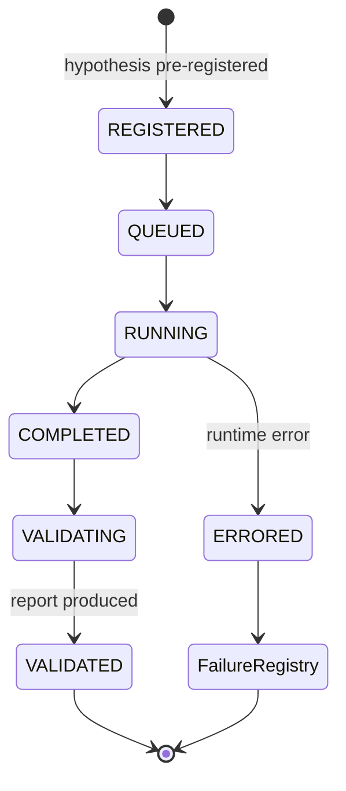

# 06 — Experiment

## 1. 定义

**ExperimentSpec**：对一个 Hypothesis 的完整、可执行、可复现的检验规格。
**ExperimentRun**：ExperimentSpec 的一次执行。一个 Spec 可以有多次 Run（复现检查、不同随机种子）。

## 2. 复现元组（Reproducibility Tuple，冻结）

每个 ExperimentRun 必须记录以下全部字段，缺任一项则 Run 不得进入 Validation：

| 字段 | 说明 |
|---|---|
| `hypothesis_ref` | 预登记的假设 ID |
| `dataset_snapshots` | 所有输入表的 Iceberg `snapshot_id` |
| `code_commit` | Git commit SHA（工作区必须干净） |
| `plugin_versions` | 所有插件 `name@version` + `content_hash` |
| `params` | 全部参数（含默认值展开） |
| `param_search_space` | 若有参数搜索：完整搜索空间与尝试次数 |
| `seeds` | 全部随机种子 |
| `environment_lock` | 依赖锁文件哈希 + Python 版本 + 平台 |
| `constitution_version` | 执行时的 Validation Constitution 版本 |
| `split_spec` | 训练 / 验证 / OOS 时间区间（引用 Constitution 规则） |
| `cost_model_ref` | 成本/滑点模型 `name@version` |
| `llm_calls` | 若有 LLM 参与：provider、model、prompt 哈希、完整输入输出 |

**复现判定**：同一元组重跑，确定性指标必须按位一致（或在声明的浮点容差内）。

## 3. 产物

| 产物 | 存储 |
|---|---|
| Spec、Run 元数据、状态 | PostgreSQL（Control Plane） |
| 仓位、成交、PnL 序列、诊断数据 | Parquet / Iceberg（Object Storage） |
| 图表、报告 | Object Storage，元数据登记于 Control Plane |

## 4. Experiment Run 状态机（D8）

Run 的状态机（执行层面）与研究对象的 Lifecycle 状态机（晋升层面，07-validation.md）是**两个不同的状态机**。

## 5. 规则

1. 预登记：Run 之前 Hypothesis 与 `split_spec` 必须已登记且不可变。
2. OOS 封存：OOS 区间数据在 Validation 阶段之前不可被实验读取（访问受 Runner 控制并记录）。
3. 试验计数：每个 Run 计入其假设族的 trial count，无论结果好坏。
4. 不可删除：任何 Run（包括 ERRORED）永不删除。
5. BacktestProvider 可替换，但必须通过一组基准一致性测试（同输入下与参考实现结果一致）。
