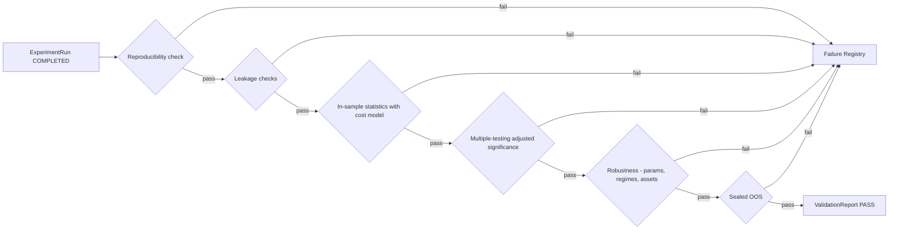
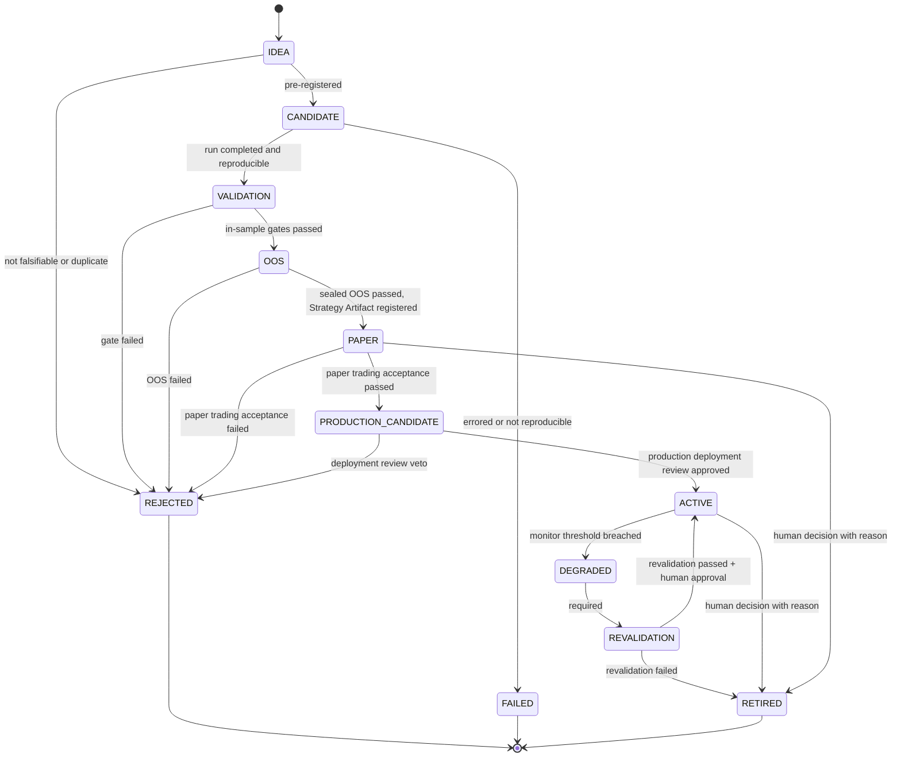

# 07 — Validation & Lifecycle

> 验证规则的**具体内容**由 [research/constitution.md](../research/constitution.md) 定义；本文件定义验证的**流程与状态机**。

## 1. 原则

- 验证是确定性程序，不是 LLM 判断，也不是人工目测。
- 验证规则分三层（[ADR-0007](../adr/0007-validation-architecture-three-layers.md)，Accepted）：**Constitution** = 不可变原则；**Validation Profile** = 版本化的阈值与参数；**Experiment Metadata** = 每个实验实际使用的 Profile 版本与配置。
- 报告绑定 Constitution 版本与 Profile 版本；实验永久保留它使用的 Profile 版本。
- 禁止为了提高回测结果而修改 Constitution（H3 / P14）。Constitution 的修改只能前向生效，不能用于重新评估已失败的对象使其通过。

## 2. Validation Pipeline（D9）



每个门（gate）输出结构化检查结果（`gate_id`、指标 `metric` 与计算值 `value`、**阈值 `threshold` 及其来源 Profile 字段 `threshold_source`**、判定 `verdict`），写入 ValidationReport。
**所有阈值来自实验绑定的 Validation Profile 版本（§5），不得写死在流水线代码中。**

### 2.1 整体判定是门结果的确定性函数（ADR-0013）

`ValidationReport.verdict` **精确等于**下列函数对 `gates` 的取值，契约层拒绝任何不相等的组合：

```
任一门 FAIL            -> FAIL
否则任一门 INCONCLUSIVE -> INCONCLUSIVE
否则全部门 PASS         -> PASS
```

这三种情形覆盖了所有可能的门结果集合，因此这是一个全函数（实现：`core.domain.research.derive_verdict`）。

**报告外因素必须物化为一个门。** 证据不足、数据质量不达标、样本量不够、人工保留意见、外部事件——
任何想让判定偏离上式的理由，都必须先成为报告内的一个 `GateResult`（有 `gate_id`、`metric`、`value`、`verdict`），
再由上式得出整体判定。**不得**通过直接设置 `verdict` 表达。这是"证据不足不得等同于 PASS"的可执行形式。

配套的结构不变量：

| 不变量 | 说明 |
|---|---|
| `gate_id` 唯一 | `ValidationReport.gates` 与 `ExperimentMetadata.gate_results` 内部不得重复；重复意味着同一检查有两个结果，判定函数不再良定义 |
| `threshold` ↔ `threshold_source` | 两者同时存在或同时缺失；空白来源不算来源。无阈值的纯报告项两者都留空 |
| 不写死门清单 | 一份报告必须包含哪些门由绑定的 Profile 决定并由验证服务检查；契约层不在 DTO 中写死任何 `gate_id` 清单 |

**契约层只做格式与结构检查**：`threshold_source` 是否真的指向所绑定 Profile 版本中的字段、
其值是否等于 `threshold`、报告是否包含 Profile 要求的全部门、`value` 是否真由声明的 `metric` 算出，
都由持有 Profile 实例的验证服务核验（尚未实现）。

### 2.2 实现说明：Phase 4 最小流水线（ADR-0037，FRAMEWORK_IMPLEMENTED / NOT_VALIDATED）

`research/validation/` 实现了上图的 G0、G1、G2、G3 与 G5（G4 稳健性属 Phase 8）。一个阶段出现 FAIL 即停止，
INCONCLUSIVE 不停止；整体判定只由 `derive_verdict` 给出。

| 阶段 | `gate_id` | 对应规则 | 阈值来源（Profile 字段） |
|---|---|---|---|
| G0 复现、数据与契约 | `G0.bindings`、`G0.run_state`、`G0.data_available`、`G0.reproducibility`、`G0.signal_determinism` | C-P1 ~ C-P3；Profile / 成本模型 / Outcome / 实验绑定一致 | 无（结构检查） |
| G1 泄漏 | `G1.outcome_not_input`、`G1.embargo_covers_horizon`、`G1.sealed_oos_excluded`、`G1.shuffle_control`、`G1.shift_control` | C-L2、C-L5、C-S2、C-L6 | 负对照：`significance.multiple_testing_threshold` |
| G2 含成本的样本内统计 | `G2.effective_sample_size`、`G2.breakeven_cost_multiple`、`G2.cost_stress.<i>`、`G2.cost_report.<i>`（纯报告项）、`G2.null_model_percentile` | C-T2、C-R4 / A6、C-T4 | `sample_size.min_effective_trades_in_sample`、`cost_stress.min_breakeven_cost_multiple`、`cost_stress.stress_multipliers[i]`、`benchmark.null_model_percentile` |
| G3 多重检验校正后的显著性 | `G3.adjusted_p_value` | C-T1、C-T3 | `significance.multiple_testing_threshold` |
| G5 Sealed OOS | `G5.unsealing_recorded`、`G5.oos_effective_sample_size`、`G5.oos_breakeven_cost_multiple` | C-S1 ~ C-S3 | `sample_size.min_effective_trades_out_of_sample`、`cost_stress.min_breakeven_cost_multiple` |

- **无默认阈值**：`threshold(profile, path)` 同时返回值与字段路径；比较方向写在 metric 末尾（`[>=]` / `[<=]`），
  持有 Profile 的核验方可以重算判定。`inconclusive_bands` 以 `gate_id` 为键，`|value − threshold| <= band` 判 INCONCLUSIVE。
- **证据不足**：有效独立样本不足、样本太少无法检验时判 INCONCLUSIVE，不判 PASS。
- **方法名**：Profile 中本流水线未实现的方法名（多重检验、空模型）一律拒绝，不回退。
- **成本**：所有净值都经 `CostModelSpec`（ADR-0037 §4）；零成本模型在契约层被拒绝。
- **负对照**：在打乱 / 循环平移后的标签上**重跑研究**，检验方向与结果的协方差；效应必须消失。
- **Sealed OOS**：窗口来自 Profile 的固定日期边界；开封前锁定；每个假设族只能开封一次，开封记录只追加（§3 规则）。
- 已知缺口（ADR-0037「后果」）：负对照为单次抽取、复用显著性阈值；过拟合概率、每状态样本量、walk-forward 窗口统计、
  延迟压力未实现；开封账本未持久化；Profile 数值仍全部 TBD，校准报告只是框架（`FRAMEWORK_ONLY_NOT_CALIBRATED`）。

## 3. Experiment / Validation Lifecycle（D6）

> 状态：**已冻结**，对应 [ADR-0006](../adr/0006-strategy-lifecycle.md)（Accepted，2026-09-23，取代 ADR-0002 第 5 条）。修改需新 ADR。

研究对象（Hypothesis、Strategy、Feature 组合等）的晋升状态机：



| 状态 | 含义 |
|---|---|
| IDEA | 未登记的想法 |
| CANDIDATE | 已预登记为 ExperimentSpec |
| VALIDATION | 正在经过样本内验证门 |
| OOS | 正在经过封存样本外检验 |
| PAPER | 单策略的独立观察与模拟验证，尚未进入组合 / Router |
| PRODUCTION_CANDIDATE | 已通过研究验证**且**已通过 Paper Trading 验收；可进入生产部署审查，尚未进入生产 |
| ACTIVE | 被策略组合 / Router 正式启用；带 `execution_mode = SIMULATED \| LIVE` |
| DEGRADED | 监控阈值被突破，等待重新验证 |
| REVALIDATION | 正在重新验证 |
| RETIRED | 正常退役（≠ FAILED） |
| REJECTED | 验证未通过或被否决 |
| FAILED | 技术失败：运行错误 / 不可复现 |

**规则**
- 只允许图中列出的转移；DEGRADED 永远不能直接转为 ACTIVE，必须经过 REVALIDATION。
- `LIVE` 不是生命周期状态，而是 ACTIVE 的 `execution_mode`。Phase 13 之前只允许 `SIMULATED`；`LIVE` 需要独立 Risk Gate + 明确的授权记录。
- 契约层校验的是**证据结构**（ADR-0011 D-17.3）：Risk Gate 与授权记录必须属于同一个 subject，授权必须覆盖变更时刻，Risk Gate 不得晚于它批准的变更，且变更事件必须真的改变模式。
- **执行点**："Phase 13 之前禁止真实生产交易"由未来 Control Plane 的可信配置与人类授权执行，**不**由载荷自证（ADR-0011 D-17.4 删除了自报的 `live_execution_enabled`）。
- REJECTED、FAILED、RETIRED 为终态；重试 = 新版本的新 CANDIDATE，旧记录保留并计入尝试次数。
- 每次转移与 `execution_mode` 变更都只追加、可审计。
- 每条转移都必须带**至少一项**非空证据引用（`LifecycleTransition.evidence`，ADR-0019），适用于全部合法转移。契约层只保证结构：证据是否存在、是否支持结论由未来 Registry / Control Plane 核验；**不**要求 `approved_by != triggered_by`（Q-5 未决，自报字符串无法证明职责分离）。
- OOS 数据对每个假设族只"开封"一次；开封记录不可撤销。

## 4. 终态记录：Failure Registry 与退役记录

终态分成两类，**不混用**（ADR-0006 §3 第 2 条）：

| 终态 | 记录位置 | 含义 |
|---|---|---|
| REJECTED / FAILED | Failure Registry | 从未成立：验证未通过、被否决，或技术失败 / 不可复现 |
| RETIRED | 退役记录（生命周期历史的一部分） | 曾经成立并被启用，现在停止使用 |

### 4.1 Failure Registry

记录所有 REJECTED / FAILED 对象：

| 字段 | 说明 |
|---|---|
| `subject_ref` | 对象引用 |
| `terminal_state` | REJECTED / FAILED |
| `reason_code` | 来自 `core/errors` 分类（如 `LEAKAGE_DETECTED`、`NOT_SIGNIFICANT_AFTER_MTC`、`OOS_DECAY`、`NOT_REPRODUCIBLE`、`COST_KILLED`） |
| `gate_id` | 失败的门 |
| `evidence` | ValidationReport / Run 引用 |
| `lessons` | 人工或自动总结（可检索，供 Research Memory 使用） |

### 4.2 退役记录（Retirement Record）

RETIRED 对象写入退役记录，**不写入 Failure Registry**：

| 字段 | 说明 |
|---|---|
| `subject_ref` | 对象引用 |
| `retirement_reason` | 退役原因（被替代、市场结构变化、劣化后重新验证未通过、人工决定…） |
| `evidence` | 相关 Revalidation 报告 / 监控证据引用 |
| `active_period` | 曾经 ACTIVE 的时间区间与 `execution_mode` |
| `lessons` | 可检索的总结 |
| `recorded_at` | UTC |

两类记录都是**追加式**的，都属于 Research Memory 的可检索内容（见 research/failure-registry.md）。

## 5. Validation Profile（概念契约）

> 状态：概念契约，冻结于 [ADR-0007](../adr/0007-validation-architecture-three-layers.md)。Phase 0 将其落成 `core/contracts/` 中的代码契约；**参数值**在 Phase 4 校准后冻结（两步冻结 Step 2）。

Profile 引用格式：`Ref` 的规范串 `profile:{name}@{semver}`，例如 `profile:btcusdt_1h_swing@1.0.0`
（[ADR-0015](../adr/0015-audit-identity-types-and-version-bindings.md) §D-22.2）。它与全项目
其它对象引用共用一套语法与校验；实验、报告与元数据三处都用这个引用 + 该版本的内容哈希
（64 位小写十六进制 SHA-256）**成对**绑定，不再把复合引用塞进一个自由字符串。

### 5.1 字段

| 字段组 | 字段 | 说明 |
|---|---|---|
| 标识 | `profile_id`、`version`、`content_hash`、`status` | `status ∈ {draft, frozen, superseded}`；`frozen` 后不可变 |
| 适用范围 | `instrument`、`venue`、`timeframe`、`research_class` | 与选择规则（§5.2）匹配 |
| 数据切分 | 研究窗口、封存 OOS 的**固定日期边界**与长度、embargo、walk-forward 配置 | 对应 Constitution 第四章 |
| 样本量 | IS / OOS / 每个状态分组的最小有效独立样本量；有效样本折算方法 | 对应 C-T2 |
| 显著性 | 多重检验校正方法与阈值、过拟合概率阈值、报告项 | 对应 C-T1；两个阈值是无量纲 unit interval 量，**结构范围** `[0, 1]`（ADR-0013 D-20.2） |
| 基准 | 空模型设定与分位阈值；按类别适用的市场基准 | 对应 C-T4 |
| 参数稳定性 | 邻域定义、邻域表现下限、时间对齐（bar 偏移）测试 | 对应 C-R1 |
| 成本 | 基准成本模型 `name@version`、压力倍数、延迟压力、盈亏平衡成本要求 | 对应 C-R4、A6 |
| 生命周期 | PAPER 观察期长度、PAPER 验收标准、劣化监控阈值 | 对应 C-G3（ADR-0006 Q-6 仍开放） |
| 溯源 | 校准报告引用、批准 ADR、前一版本 | Step 2 冻结依据 |

> 本文件与 Profile 契约都**不含具体数值**；数值在 Phase 4 校准后写入具体 Profile 版本。
> `[0, 1]` 这类范围是**结构上的合法取值区间**，不是校准值，也不构成对任何阈值的选择。
> 与数值无关的普适结构不变量（符号约束、`cost_model` 的 kind）见 §5.4。

### 5.2 选择规则（ProfileSelectionRule）

- 输入：`instrument`、`timeframe`、预登记的 `research_class`（按预登记的持仓周期类别）。
- 输出：唯一的 Profile 引用 `profile:{name}@{semver}`（版本只从该引用读取，不再有重复的版本字段）。
- 规则是确定性的、版本化的；研究者不能自选 Profile（Constitution C-A4）。
- 若实验的实际持仓分布偏离预登记类别超出声明范围，该实验按正确类别的 Profile 重新评估，**不得**因此换到更宽松的 Profile。

### 5.3 不可变性与可重建性

- `frozen` 的 Profile 版本永不修改；修正 = 新版本（Constitution C-A5）。
- 所有版本及其 `content_hash` 保存在 Control Plane，可按版本取回。
- 因此任何实验在任何时点都能重建"当时适用的验证规则" = Constitution 版本 + Profile 版本（Constitution C-P4）。

### 5.4 普适结构不变量（ADR-0014）

以下约束在**所有**可能的 Profile 中都必须成立，与具体数值选择无关，因此属于两步冻结的
Step 1（结构）并在 Phase 0 冻结。它们只约束**符号与判别字段**，不选择任何阈值：

| 字段 | 结构不变量 | 为什么它是结构而非校准 |
|---|---|---|
| `walk_forward.train_window` / `test_window` / `step` | `> 0` | 零或负的窗口不构成一次 walk-forward 推进 |
| `data_split.sealed_oos_length` | `> 0` | 零长度封存区不构成样本外检验 |
| `data_split.embargo` | `>= 0` | 零 = 不设隔离期，是合法配置；负数没有语义 |
| `data_split.sealed_oos_max_extension` | `>= 0` | 零 = 不允许延长，是合法配置 |
| `cost_stress.stress_multipliers` / `reported_only_multipliers` 的**每一项** | `> 0` | 零倍等于不施压，负倍没有语义 |
| `cost_stress.cost_model` | `kind` 必须是 `cost_model` | 指向别的对象类型不是"另一种成本模型" |
| `lifecycle.paper_period` | `> 0` | 观察期必须有长度 |

所有浮点字段（含序列与映射内的数值）拒绝 NaN 与 ±Infinity，由 `Contract` 基类的
`allow_inf_nan=False` 统一保证（ADR-0013 §D-20.1），本节不重复定义该规则。
既有校验（例如封存边界必须晚于研究窗口起点）行为不变。

**JSON Schema 的表达限制与运行时保证**（ADR-0014 的实现说明，不是新的 wire-format 决定）：

| 约束类型 | 导出的 JSON Schema | 运行时（Pydantic） |
|---|---|---|
| 时长字段的符号 | 保持 `type: string, format: duration`，**不含**任何数值 `minimum` / `exclusiveMinimum` | 强制执行 `> 0` / `>= 0`，Python 与 `model_validate_json` 两条入口都生效 |
| 倍数序列的逐元素下界 | `items.exclusiveMinimum: 0`（数值字段，可如实表达） | 同上，逐元素校验 |
| `cost_model.kind` | 仍是普通 `Ref` 引用，不表达该约束 | 模型校验器强制执行 |

原因：`timedelta` 的线格式是 ISO 8601 duration **字符串**，而 `minimum` / `exclusiveMinimum`
是数值关键字，无法表达字符串上的时长顺序。因此导出的 Schema 诚实保持字符串形状——
既不把数值下界伪装到字符串 Schema 上，也不为了让 Schema 可表达而把线格式改成秒数。
`cost_model.kind` 同理，是跨字段语义而非形状约束。**结论**：只读 JSON Schema 的消费者
看不到这三类约束，不得据此认为它们不存在；它们由契约层的运行时校验保证，
校验入口以 Pydantic 模型为准。
