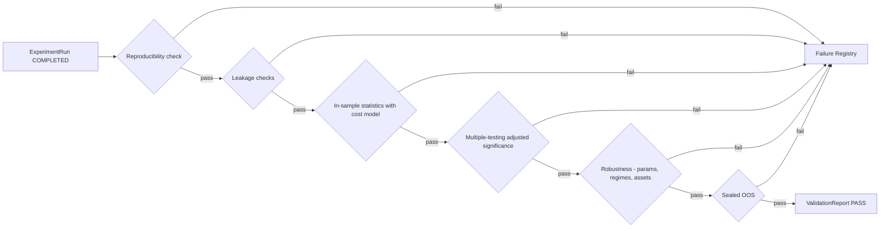
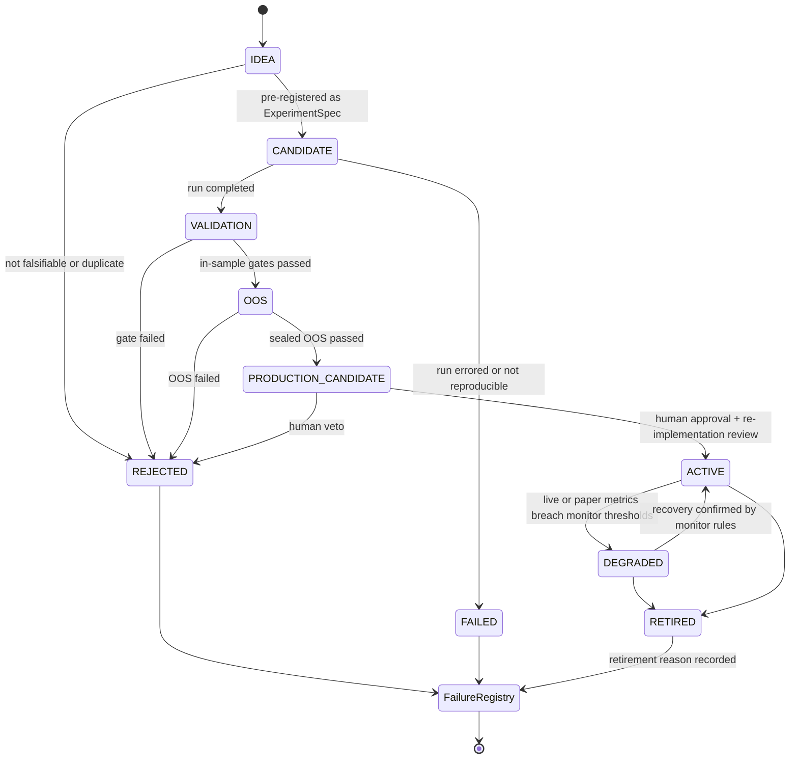

# 07 — Validation & Lifecycle

> 验证规则的**具体内容**由 [research/constitution.md](../research/constitution.md) 定义；本文件定义验证的**流程与状态机**。

## 1. 原则

- 验证是确定性程序，不是 LLM 判断，也不是人工目测。
- 验证规则由 Constitution 版本控制；报告绑定版本。
- 禁止为了提高回测结果而修改 Constitution（H3 / P14）。Constitution 的修改只能前向生效，不能用于重新评估已失败的对象使其通过。

## 2. Validation Pipeline（D9）

每个门（gate）输出结构化检查结果（check_id、指标、阈值、是否通过），写入 ValidationReport。

## 3. Experiment / Validation Lifecycle（D6，冻结草案）

研究对象（Hypothesis、Strategy、Feature 组合等）的晋升状态机：

| 状态 | 含义 | 进入条件 |
|---|---|---|
| IDEA | 未登记的想法 | 任意来源 |
| CANDIDATE | 已预登记为 ExperimentSpec | Hypothesis 可证伪 + Spec 完整 |
| VALIDATION | 正在经过样本内门 | Run COMPLETED 且可复现 |
| OOS | 进入封存样本外检验 | 样本内门全部通过 |
| PRODUCTION_CANDIDATE | 研究结论成立，等待生产化 | OOS 通过 |
| ACTIVE | 生产中（纸面或实盘，按 Phase） | 人工批准 + 重新实现审查 |
| DEGRADED | 表现劣化，监控中 | 监控阈值被突破 |
| RETIRED | 退役 | 人工或规则 |
| REJECTED | 验证未通过或被否决 | 任一门失败 / 人工否决 |
| FAILED | 技术失败 | 运行错误 / 不可复现 |

**规则**
- 只允许图中列出的转移。
- REJECTED / FAILED 为终态；想要重试 = 创建**新的** CANDIDATE（新版本），旧记录保留并计入 trial count。
- OOS 数据对每个假设族只"开封"一次；开封记录不可撤销。

> DEGRADED → ACTIVE 回转、RETIRED 是否进入 Failure Registry 等细节待确认，见待决事项 **D-05**。

## 4. Failure Registry

记录所有 REJECTED / FAILED / RETIRED 对象：

| 字段 | 说明 |
|---|---|
| `subject_ref` | 对象引用 |
| `terminal_state` | REJECTED / FAILED / RETIRED |
| `reason_code` | 来自 `core/errors` 分类（如 `LEAKAGE_DETECTED`、`NOT_SIGNIFICANT_AFTER_MTC`、`OOS_DECAY`、`NOT_REPRODUCIBLE`、`COST_KILLED`） |
| `gate_id` | 失败的门 |
| `evidence` | ValidationReport / Run 引用 |
| `lessons` | 人工或自动总结（可检索，供 Research Memory 使用） |

Failure Registry 是**追加式**的；它本身是研究资产（见 research/failure-registry.md）。
