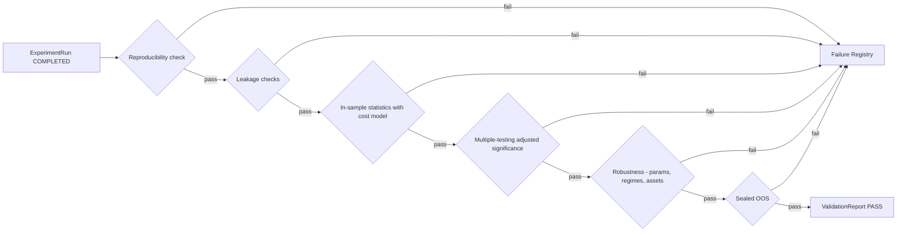
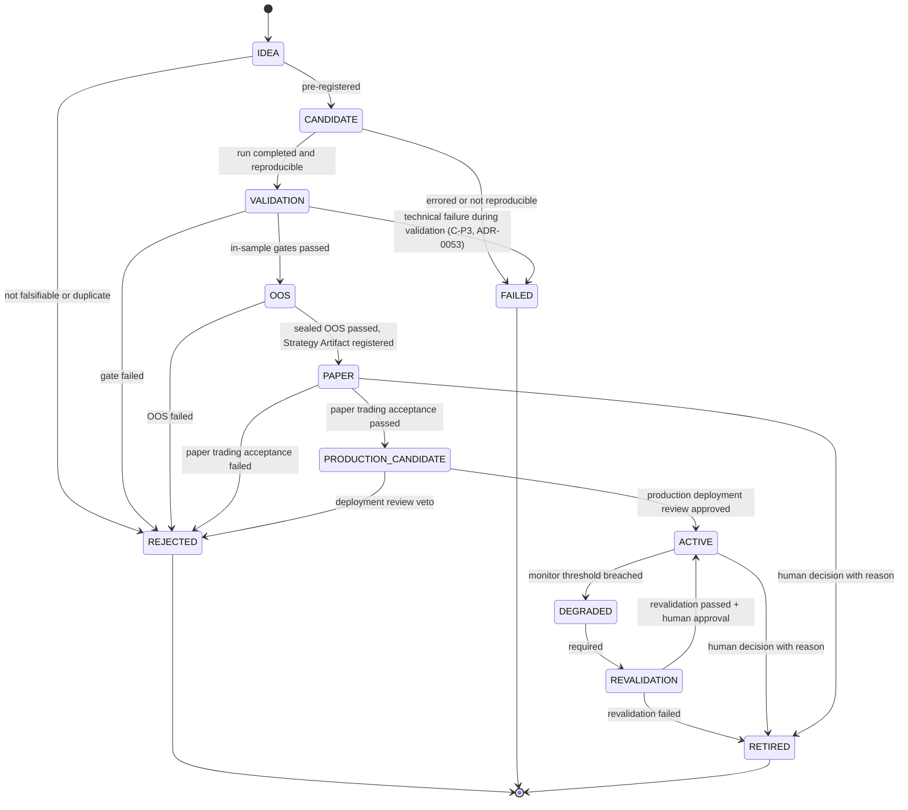

# 07 — Validation & Lifecycle

> 验证规则的**具体内容**由 [research/constitution.md](../research/constitution.md) 定义；本文件定义验证的**流程与状态机**。

## 1. 原则

- 验证是确定性程序，不是 LLM 判断，也不是人工目测。
- 验证规则分三层（[ADR-0007](../adr/0007-validation-architecture-three-layers.md)，Accepted）：**Constitution** = 不可变原则；**Validation Profile** = 版本化的阈值与参数；**Experiment Metadata** = 每个实验实际使用的 Profile 版本与配置。
- 报告绑定 Constitution 版本与 Profile 版本；实验永久保留它使用的 Profile 版本。
- 禁止为了提高回测结果而修改 Constitution（H3 / P14）。Constitution 的修改只能前向生效，不能用于重新评估已失败的对象使其通过。

## 2. Validation Pipeline（D9）



每个门（gate）输出结构化检查结果（`gate_id`、指标 `metric` 与计算值 `value`、**阈值 `threshold` 及其来源 Profile 字段 `threshold_source`**、判定 `verdict`），写入 ValidationReport。
**所有阈值来自实验绑定的 Validation Profile 版本（§5），不得写死在流水线代码中。**

### 2.1 整体判定是门结果的确定性函数（ADR-0013）

`ValidationReport.verdict` **精确等于**下列函数对 `gates` 的取值，契约层拒绝任何不相等的组合：

```
任一门 FAIL            -> FAIL
否则任一门 INCONCLUSIVE -> INCONCLUSIVE
否则全部门 PASS         -> PASS
```

这三种情形覆盖了所有可能的门结果集合，因此这是一个全函数（实现：`core.domain.research.derive_verdict`）。

**报告外因素必须物化为一个门。** 证据不足、数据质量不达标、样本量不够、人工保留意见、外部事件——
任何想让判定偏离上式的理由，都必须先成为报告内的一个 `GateResult`（有 `gate_id`、`metric`、`value`、`verdict`），
再由上式得出整体判定。**不得**通过直接设置 `verdict` 表达。这是"证据不足不得等同于 PASS"的可执行形式。

配套的结构不变量：

| 不变量 | 说明 |
|---|---|
| `gate_id` 唯一 | `ValidationReport.gates` 与 `ExperimentMetadata.gate_results` 内部不得重复；重复意味着同一检查有两个结果，判定函数不再良定义 |
| `threshold` ↔ `threshold_source` | 两者同时存在或同时缺失；空白来源不算来源。无阈值的纯报告项两者都留空 |
| 不写死门清单 | 一份报告必须包含哪些门由绑定的 Profile 决定并由验证服务检查；契约层不在 DTO 中写死任何 `gate_id` 清单 |

**契约层只做格式与结构检查**：`threshold_source` 是否真的指向所绑定 Profile 版本中的字段、
其值是否等于 `threshold`、报告是否包含 Profile 要求的全部门、`value` 是否真由声明的 `metric` 算出，
都由持有 Profile 实例的验证服务核验（`research/validation/verification.py` 的 `verify_report`；Promotion 在冻结检查之后以 `report_threshold_mismatch` 拒绝不一致的报告）。

### 2.2 实现说明：Phase 4 最小流水线（ADR-0037，FRAMEWORK_IMPLEMENTED / NOT_VALIDATED）

`research/validation/` 实现了上图的 G0、G1、G2、G3 与 G5（G4 稳健性属 Phase 8）。一个阶段出现 FAIL 即停止，
INCONCLUSIVE 不停止；整体判定只由 `derive_verdict` 给出。

| 阶段 | `gate_id` | 对应规则 | 阈值来源（Profile 字段） |
|---|---|---|---|
| G0 复现、数据与契约 | `G0.bindings`、`G0.run_state`、`G0.data_available`、`G0.reproducibility`、`G0.signal_determinism` | C-P1 ~ C-P3；Profile / 成本模型 / Outcome / 实验绑定一致 | 无（结构检查） |
| G1 泄漏 | `G1.outcome_not_input`、`G1.label_blind_sides`、`G1.embargo_covers_horizon`、`G1.sealed_oos_excluded`、`G1.shuffle_control`、`G1.shift_control` | C-L2、C-L5、C-S2、C-L6 | 负对照：`significance.multiple_testing_threshold` |
| G2 含成本的样本内统计（只在 walk-forward 测试折上） | `G2.walk_forward_folds`、`G2.effective_sample_size`、`G2.breakeven_cost_multiple`、`G2.cost_stress.<i>`、`G2.cost_report.<i>`（纯报告项）、`G2.null_model_percentile`、`G2.market_benchmark.<rule>` 与 `G2.inverse_control`（ADR-0060，纯报告项；未登记规则名 → `G2.market_benchmark` INCONCLUSIVE） | C-T2、C-R4 / A6、C-T4 | `sample_size.min_effective_trades_in_sample`、`cost_stress.min_breakeven_cost_multiple`、`cost_stress.stress_multipliers[i]`、`benchmark.null_model_percentile`、`benchmark.market_benchmark_rule`、`benchmark.inverse_control_reported` |
| G3 多重检验校正后的显著性 | `G3.adjusted_p_value` | C-T1、C-T3 | `significance.multiple_testing_threshold` |
| G5 Sealed OOS | `G5.unsealing_recorded`、`G5.oos_effective_sample_size`、`G5.oos_breakeven_cost_multiple`；已消耗却无统计量时 `G5.oos_evaluation`（`consumed_without_result:<原因>`，INCONCLUSIVE） | C-S1 ~ C-S3 | `sample_size.min_effective_trades_out_of_sample`、`cost_stress.min_breakeven_cost_multiple` |

- **策略回测适配器的 G0 门**（`research/strategies/validation.py`，ADR-0041 实现说明）：`G0.backtest_cost_model`（回测成本与验证成本模型一致）、
  `G0.single_instrument_adapter`（适配器只验证单标的；多标的判 INCONCLUSIVE）、`G0.manifest_binding`（给出 `DatasetPriceBars` 时：
  manifest 哈希一致、回测所用 bar 均为该数据集已证明的 bar、有该标的的 bar、无晚于 `price_cutoff` 可用的 bar；另给出该链的
  `ManifestPair` 时，还核对其价格哈希即 bar 的 manifest、特征哈希即调用方传入的各特征请求 manifest 哈希、pair 哈希可重算；不符判 FAIL）、
  `G0.execution_model`（2026-09-26 实施说明：`ValidatorSetup.backtester` / `.execution` 给出候选实际用的
  `plugins.backtest.execution.ExecutionModel` 时，核对给定 `backtest.provider_hash` 就是该模型的 descriptor 哈希；不符判 FAIL）。
  三者都不给（合成数据、默认 v1 回测）时都不加相应的门，报告视图标 `synthetic_unverified`，报告本身逐字节不变。
- **无默认阈值**：`threshold(profile, path)` 同时返回值与字段路径；比较方向写在 metric 末尾（`[>=]` / `[<=]`），
  持有 Profile 的核验方可以重算判定。`inconclusive_bands` 以 `gate_id` 为键，`|value − threshold| <= band` 判 INCONCLUSIVE。
- **证据不足**：有效独立样本不足、样本太少无法检验时判 INCONCLUSIVE，不判 PASS。
- **方法名**：Profile 中本流水线未实现的方法名（多重检验、空模型）一律拒绝，不回退。
- **成本**：所有净值都经 `CostModelSpec`（ADR-0037 §4）；零成本模型在契约层被拒绝。
- **负对照**：在打乱 / 循环平移后的标签上**重跑研究**，检验方向与结果的协方差；效应必须消失。
- **Sealed OOS**：窗口来自 Profile 的固定日期边界；开封前锁定；每个假设族只能开封一次，开封记录只追加（§3 规则）。
- **标签盲化**（ADR-0041 §6）：流水线使用的侧向一律由全零标签向量计算；`G1.label_blind_sides` 要求真实标签下的侧向与之相同。
  在流水线之外用标签预先算好的侧向无法识别，防线是来源（策略接线只从契约校验过的 `TargetPosition` 构造侧向）。
- **统计前先切分**（ADR-0041 §6）：G2 / G3 只在 Profile 的 walk-forward 测试折上计算，训练集已 purge + embargo；可拟合研究逐折只用训练标签拟合。
  `purged_k_fold` 与 walk-forward 一样排除封存区样本。有效独立样本 = 重叠持有区间的连通分量数。
- **Sealed OOS 预算**（ADR-0041 §6）：全局开封预算 `max_unsealings` 为必填显式参数（Profile 无此字段）；每次开封只能评估一次。
  需要先取封存 bar 再生成标签的调用方用 `claim_evaluation`：在任何封存样本离开 vault **之前**记为已评估，之后无人能再读该窗口；
  提前结束（无决策时刻、无非零仓位、出错）记为 INCONCLUSIVE 的 `consumed_without_result`（ADR-0041 实现说明「复审修正 2」）。
- 已知缺口（ADR-0037「后果」，部分由 ADR-0041 关闭）：负对照为单次抽取、复用显著性阈值；开封账本未持久化；
  Profile 数值仍全部 TBD，校准报告只是框架（`FRAMEWORK_ONLY_NOT_CALIBRATED`）。

### 2.3 实现说明：G4 稳健性（ADR-0041，FRAMEWORK_IMPLEMENTED / NOT_VALIDATED）

`research/validation/g4.py` 的 `run_validation` 在 G0 – G3 无 FAIL 时运行 G4（输入可惰性构造；缺输入 = `G4.robustness_input` INCONCLUSIVE）。
输入是逐期毛收益 + 成本（净收益 = 毛 − 倍数 × 成本），表现 = 净收益逐期 Sharpe。

| 检查 | `gate_id` | 对应规则 | 阈值来源 |
|---|---|---|---|
| 过拟合概率 | `G4.overfitting` | C-T1、C-R1 | `significance.overfitting_metric`（`pbo_cscv` / `deflated_sharpe`）、`significance.overfitting_threshold`；CSCV 分块 `param:cscv_partitions`，分块间 purge / embargo 取 `data_split.embargo`，且 purge 宽度至少为标签 / 最长持有期（`RobustnessInput.holding_horizon`） |
| 参数邻域 | `G4.param_neighborhood.performance_ratio`、`.positive_fraction` | C-R1 | `parameter_stability.neighborhood_definition`（`adjacent_grid`）、`.min_neighborhood_performance_ratio`、`.min_positive_neighbor_fraction` |
| 时间对齐 | `G4.time_alignment.<i>`（未配置偏移时 `.offsets`） | C-R1 | `parameter_stability.time_alignment_offsets[i]`、`.min_neighborhood_performance_ratio` |
| 延迟压力 | `G4.delay_stress` | C-R4、A6 | `cost_stress.delay_stress_bars`、`cost_stress.min_breakeven_cost_multiple` |
| 成本压力 | `G4.cost_stress.breakeven`、`G4.cost_stress.<i>` | C-R4、A6 | `cost_stress.min_breakeven_cost_multiple`、`cost_stress.stress_multipliers[i]` |
| walk-forward 窗口统计（只计不重叠的测试窗口；无收益的窗口计入并使比例 INCONCLUSIVE） | `G4.walk_forward.positive_fraction`、`.max_window_share` | C-S4、C-R3 | `data_split.walk_forward.min_positive_window_fraction`、`.max_single_window_pnl_share` |
| 状态分解 | `G4.state.sufficient_states`、`.pnl_outside_undersampled_states`、`.undersampled_pnl_share` | C-R2 | `sample_size.min_effective_trades_per_state`；无 Profile 字段：`param:state.max_undersampled_pnl_share` |
| 容量 | `G4.capacity.estimated`（仅在无法估计时出现，INCONCLUSIVE）、`.required`、`.impact_estimated` | C-R5 | 无 Profile 字段：`param:capacity.max_participation_rate`、`param:capacity.min_capacity`、`param:capacity.impact_coefficient` |
| 跨资产 | `G4.cross_asset.scope_covered`、`.positive_fraction` | C-R3 | 无 Profile 字段：`param:cross_asset.min_positive_fraction` |

- Profile 没有字段的规则只接受显式参数（`param:<name>`）；不传则门为 INCONCLUSIVE（metric `profile_field_missing:<name>`），不发明默认值。
- 不静默通过（ADR-0041 实现说明「复审修正」）：C-R1 ~ C-R5 都是 Constitution 必需检查，配置为空或被关闭（无参数邻点、
  `time_alignment_offsets` 为空、`delay_stress_bars = 0`、未声明标的范围）时门为 INCONCLUSIVE（metric `configuration_missing:<what>`）；
  计算出估计值（容量、冲击、P&L 占比）本身不构成 PASS；没有 G5 结果的 G0 – G4 PASS 在报告视图中标为不可晋升（`sealed_oos_not_evaluated`）。
- 回溯审计（`retro_audit.py`）只报告差异、不执行转移；已拒绝对象的有效判定恒为 FAIL（构造时强制，对应 §1 "只能前向生效"）。
- 报告视图（`report.py`）输出规范 JSON，供日后 apps/web 可视化。
- Phase 5 接线：`research/strategies/validation.py` 的 `PipelineBacktestValidator` 对回测跑 G0 – G4（单标的；G5 独立进行）。
- 已知缺口：见 ADR-0041「后果」（容量 / 跨资产 / 开封预算缺 Profile 字段；浮点进入哈希载荷；数值全部 TBD）。

### 2.4 校准证据如何进入 D-09 决定（Phase 9；ADR-0042 实现说明，FRAMEWORK_IMPLEMENTED / NOT_VALIDATED）

Profile 数值（D-09 TBD-1..5）是两步冻结的 Step 2，**由 Raphael 决定**。`research/synthetic_lab/gate_calibration.py`
只为这个决定产出证据，**evidence only — not a Profile decision**：

1. 调用方提供一组**候选** Profile（harness 没有默认 Profile，也不生成候选）、纯噪声与植入效应（强度 × 滞后）市场的种子，
   以及区间的 `alpha`（报告参数，不是 Profile 数值）。
2. 检测器是完整流水线：每个合成市场的研究窗口经 `PipelineBacktestValidator` 跑 G0 → G4；每个候选 Profile 各跑一遍。
3. 报告按「候选 × 门」给出：噪声上的通过率（假阳性率）、每个植入强度的通过率（检出力）、INCONCLUSIVE 率、
   未到达该门的次数，以及 G0 – G4 PASS 后会消耗的封存 OOS 开封率；比率为精确计数 + Clopper-Pearson 区间（`Decimal`）。
4. 报告确定、可 JSON 序列化并有 `report_hash`，记录全部输入（生成器、检测器、基础规格、种子、植入效应、候选 Profile
   的引用与内容哈希）；**没有**任何推荐值、默认值或排名字段。
5. Raphael 依据报告选定数值后，冻结的 Profile 在 `provenance.calibration_report` 引用该 `report_hash`，
   并以批准 ADR 记录（C-A8、ADR-0007）；harness 从不写入任何 Profile。合成结果不支持真实市场结论（roadmap P9）。

- 框架冒烟观察（非校准结论）：`significance.multiple_testing_threshold` 同时被 G3（调整后 p ≤ 阈值）与 G1 负对照
  （对照 p ≥ 阈值）读取，方向相反；因此单调「放宽」该阈值并不会单调提高流水线层面的假阳性率。是否拆分为两个字段属 D-09 / ADR 范畴。

## 3. Experiment / Validation Lifecycle（D6）

> 状态：**已冻结**，对应 [ADR-0006](../adr/0006-strategy-lifecycle.md)（Accepted，2026-09-23，取代 ADR-0002 第 5 条）。修改需新 ADR。
> [ADR-0053](../adr/0053-validation-failed-transition.md)（Accepted，2026-09-26，Raphael 批准）补充一条边 `VALIDATION → FAILED`。

研究对象（Hypothesis、Strategy、Feature 组合等）的晋升状态机：



| 状态 | 含义 |
|---|---|
| IDEA | 未登记的想法 |
| CANDIDATE | 已预登记为 ExperimentSpec |
| VALIDATION | 正在经过样本内验证门 |
| OOS | 正在经过封存样本外检验 |
| PAPER | 单策略的独立观察与模拟验证，尚未进入组合 / Router |
| PRODUCTION_CANDIDATE | 已通过研究验证**且**已通过 Paper Trading 验收；可进入生产部署审查，尚未进入生产 |
| ACTIVE | 被策略组合 / Router 正式启用；带 `execution_mode = SIMULATED \| LIVE` |
| DEGRADED | 监控阈值被突破，等待重新验证 |
| REVALIDATION | 正在重新验证 |
| RETIRED | 正常退役（≠ FAILED） |
| REJECTED | 验证未通过或被否决 |
| FAILED | 技术失败：运行错误 / 不可复现（在 CANDIDATE 或 VALIDATION 中发现，ADR-0053） |

**规则**
- 只允许图中列出的转移；DEGRADED 永远不能直接转为 ACTIVE，必须经过 REVALIDATION。
- `VALIDATION → FAILED`（ADR-0053）只用于验证中的 C-P3 技术失败：`G0.reproducibility` / `G0.signal_determinism` FAIL（`NOT_REPRODUCIBLE`），或对象自身的运行出错（Provider 输出被 `check_answers` 拒绝、对象代码抛出异常，`RUN_ERRORED`）。统计 / 稳健性 / 封存 OOS 的 FAIL 仍是 `VALIDATION → REJECTED`；INCONCLUSIVE 留在 VALIDATION；基础设施故障（验证器自身出错、存储 / 网络 / 内存错误等不能归因于对象的错误）不转移。不需要人工批准。自动触发者必须给出：失败的验证报告或出错的 Run、对应 FailureRecord 的内容哈希、本轮引用（ADR-0053 §3）。没有 `OOS → FAILED` / `REVALIDATION → FAILED`。
- `LIVE` 不是生命周期状态，而是 ACTIVE 的 `execution_mode`。Phase 13 之前只允许 `SIMULATED`；`LIVE` 需要独立 Risk Gate + 明确的授权记录。
- 契约层校验的是**证据结构**（ADR-0011 D-17.3）：Risk Gate 与授权记录必须属于同一个 subject，授权必须覆盖变更时刻，Risk Gate 不得晚于它批准的变更，且变更事件必须真的改变模式。
- **执行点**："Phase 13 之前禁止真实生产交易"由未来 Control Plane 的可信配置与人类授权执行，**不**由载荷自证（ADR-0011 D-17.4 删除了自报的 `live_execution_enabled`）。
- REJECTED、FAILED、RETIRED 为终态；重试 = 新版本的新 CANDIDATE，旧记录保留并计入尝试次数。
- 每次转移与 `execution_mode` 变更都只追加、可审计。
- 每条转移都必须带**至少一项**非空证据引用（`LifecycleTransition.evidence`，ADR-0019），适用于全部合法转移。契约层只保证结构：证据是否存在、是否支持结论由未来 Registry / Control Plane 核验；**不**要求 `approved_by != triggered_by`（Q-5 未决，自报字符串无法证明职责分离）。
- OOS 数据对每个假设族只"开封"一次；开封记录不可撤销。

## 4. 终态记录：Failure Registry 与退役记录

终态分成两类，**不混用**（ADR-0006 §3 第 2 条）：

| 终态 | 记录位置 | 含义 |
|---|---|---|
| REJECTED / FAILED | Failure Registry | 从未成立：验证未通过、被否决，或技术失败 / 不可复现 |
| RETIRED | 退役记录（生命周期历史的一部分） | 曾经成立并被启用，现在停止使用 |

### 4.1 Failure Registry

记录所有 REJECTED / FAILED 对象：

| 字段 | 说明 |
|---|---|
| `subject_ref` | 对象引用 |
| `terminal_state` | REJECTED / FAILED |
| `reason_code` | 来自 `core/errors` 分类（如 `LEAKAGE_DETECTED`、`NOT_SIGNIFICANT_AFTER_MTC`、`OOS_DECAY`、`NOT_REPRODUCIBLE`、`COST_KILLED`） |
| `gate_id` | 失败的门 |
| `evidence` | ValidationReport / Run 引用 |
| `lessons` | 人工或自动总结（可检索，供 Research Memory 使用） |

### 4.2 退役记录（Retirement Record）

RETIRED 对象写入退役记录，**不写入 Failure Registry**：

| 字段 | 说明 |
|---|---|
| `subject_ref` | 对象引用 |
| `retirement_reason` | 退役原因（被替代、市场结构变化、劣化后重新验证未通过、人工决定…） |
| `evidence` | 相关 Revalidation 报告 / 监控证据引用 |
| `active_period` | 曾经 ACTIVE 的时间区间与 `execution_mode` |
| `lessons` | 可检索的总结 |
| `recorded_at` | UTC |

两类记录都是**追加式**的，都属于 Research Memory 的可检索内容（见 research/failure-registry.md）。

## 5. Validation Profile（概念契约）

> 状态：概念契约，冻结于 [ADR-0007](../adr/0007-validation-architecture-three-layers.md)。Phase 0 将其落成 `core/contracts/` 中的代码契约；**参数值**在 Phase 4 校准后冻结（两步冻结 Step 2）。

Profile 引用格式：`Ref` 的规范串 `profile:{name}@{semver}`，例如 `profile:btcusdt_1h_swing@1.0.0`
（[ADR-0015](../adr/0015-audit-identity-types-and-version-bindings.md) §D-22.2）。它与全项目
其它对象引用共用一套语法与校验；实验、报告与元数据三处都用这个引用 + 该版本的内容哈希
（64 位小写十六进制 SHA-256）**成对**绑定，不再把复合引用塞进一个自由字符串。

### 5.1 字段

| 字段组 | 字段 | 说明 |
|---|---|---|
| 标识 | `profile_id`、`version`、`content_hash`、`status` | `status ∈ {draft, frozen, superseded}`；`frozen` 后不可变 |
| 适用范围 | `instrument`、`venue`、`timeframe`、`research_class` | 与选择规则（§5.2）匹配 |
| 数据切分 | 研究窗口、封存 OOS 的**固定日期边界**与长度、embargo、walk-forward 配置 | 对应 Constitution 第四章 |
| 样本量 | IS / OOS / 每个状态分组的最小有效独立样本量；有效样本折算方法 | 对应 C-T2 |
| 显著性 | 多重检验校正方法与阈值、过拟合概率阈值、报告项 | 对应 C-T1；两个阈值是无量纲 unit interval 量，**结构范围** `[0, 1]`（ADR-0013 D-20.2） |
| 基准 | 空模型设定与分位阈值；按类别适用的市场基准 | 对应 C-T4 |
| 参数稳定性 | 邻域定义、邻域表现下限、时间对齐（bar 偏移）测试 | 对应 C-R1 |
| 成本 | 基准成本模型 `name@version`、压力倍数、延迟压力、盈亏平衡成本要求 | 对应 C-R4、A6 |
| 生命周期 | PAPER 观察期长度、PAPER 验收标准、劣化监控阈值 | 对应 C-G3（ADR-0006 Q-6 仍开放） |
| 溯源 | 校准报告引用、批准 ADR、前一版本 | Step 2 冻结依据 |

**ADR-0052（契约 2.1.0，可选字段；2.0.0 Profile 载荷与哈希不变）**：

| 新增 | 结构范围 | 说明 |
|---|---|---|
| 每个浮点阈值的 `*_exact` 兄弟（映射 / 序列逐键 / 逐项） | 同浮点字段 | `ExactDecimal`（规范十进制文本）；存在时浮点字段必须恰为其派生值，内容哈希只含精确值；浮点字段弃用 |
| `capacity.{min_capacity, max_participation_rate, impact_coefficient, impact_model}` | `> 0`、`(0, 1]`、`>= 0`、非空；给出 `capacity` 至少一项 | C-R5 |
| `cross_asset.min_positive_fraction` | `[0, 1]` | C-R3 |
| `significance.cscv_partitions` | 偶数且 `>= 2` | C-T1 / C-R1 |
| `significance.negative_control_threshold` | `[0, 1]` | C-L6（D-CTRL：负对照独立阈值） |
| `data_split.sealed_oos_max_unsealings` | `> 0` | C-S2 |
| `sample_size.max_undersampled_pnl_share` | `[0, 1]` | C-R2 |

这些字段与模型只随 2.1.0 发布：2.0.0 信封的载荷带有它们即拒绝。Profile 没有某字段时，研究侧维持 ADR-0041 §1
的现行行为（`param:` 或 `INCONCLUSIVE`），逐位不变。

**研究侧取值（ADR-0052 实施记录，2026-09-26；CODE_COMPLETE / DEBUG_PENDING）**：

- **来源规则（C-A4）**：`research/validation/gates.py` 的 `sourced_threshold` / `sourced_parameter`——Profile 带有该字段时，
  值只来自 Profile（`threshold_source` / `partitions_source` / `budget_source` 为 Profile 路径），同时传入显式 `param:` 即
  `ExplicitParamRefused`；Profile 没有该字段时照旧取 `param:<name>` 或缺失。适用于 G4 的 `significance.cscv_partitions`、
  `capacity.*`（`impact_model` 必须是已实现的 `square_root`，否则 `UnsupportedMethod`；Profile 系数与回测执行模型系数不一致
  照旧是 `impact_coefficient_mismatch`）、`cross_asset.min_positive_fraction`、`sample_size.max_undersampled_pnl_share`，以及
  封存 OOS 的 `data_split.sealed_oos_max_unsealings`（`SealedOosVault`；研究循环的 `OosUnsealBudget.max_unsealings = None`
  表示取 Profile 的值）。Profile 提供的值列在 `RobustnessResult.to_dict()["profile_params"]`（旧 Profile 无此键）。
- **负对照（D-CTRL）**：G1 `shuffle_control` / `shift_control` 用 `significance.negative_control_threshold`（存在时），否则共用
  `significance.multiple_testing_threshold`；`threshold_source` 如实写出。G3 始终只用 `multiple_testing_threshold`。
- **精确比较（D-FLOAT）**：阈值来自精确字段（`*_exact` 兄弟或 §2 / §3 的 `ExactDecimal` 字段）时，`compare_gate` 先按版本化
  量化规则 `hlens.validation.gate-value-quantization@1.0.0`（浮点的精确二进制值按半偶舍入到 12 位小数；表示规则，不是阈值）
  取得 `value_exact`，再以 `Decimal` 与精确阈值、精确 inconclusive band 比较，`GateResult` 记录 `value_exact` / `threshold_exact`；
  没有精确字段的 Profile 走原浮点路径，结果逐位不变。

> 本文件与 Profile 契约都**不含具体数值**；数值在 Phase 4 校准后写入具体 Profile 版本。
> `[0, 1]` 这类范围是**结构上的合法取值区间**，不是校准值，也不构成对任何阈值的选择。
> 与数值无关的普适结构不变量（符号约束、`cost_model` 的 kind）见 §5.4。

### 5.2 选择规则（ProfileSelectionRule）

- 输入：`instrument`、`timeframe`、预登记的 `research_class`（按预登记的持仓周期类别）。
- 输出：唯一的 Profile 引用 `profile:{name}@{semver}`（版本只从该引用读取，不再有重复的版本字段）。
- 规则是确定性的、版本化的；研究者不能自选 Profile（Constitution C-A4）。
- 若实验的实际持仓分布偏离预登记类别超出声明范围，该实验按正确类别的 Profile 重新评估，**不得**因此换到更宽松的 Profile。

### 5.3 不可变性与可重建性

- `frozen` 的 Profile 版本永不修改；修正 = 新版本（Constitution C-A5）。
- 所有版本及其 `content_hash` 保存在 Control Plane，可按版本取回。
- 因此任何实验在任何时点都能重建"当时适用的验证规则" = Constitution 版本 + Profile 版本（Constitution C-P4）。

### 5.4 普适结构不变量（ADR-0014）

以下约束在**所有**可能的 Profile 中都必须成立，与具体数值选择无关，因此属于两步冻结的
Step 1（结构）并在 Phase 0 冻结。它们只约束**符号与判别字段**，不选择任何阈值：

| 字段 | 结构不变量 | 为什么它是结构而非校准 |
|---|---|---|
| `walk_forward.train_window` / `test_window` / `step` | `> 0` | 零或负的窗口不构成一次 walk-forward 推进 |
| `data_split.sealed_oos_length` | `> 0` | 零长度封存区不构成样本外检验 |
| `data_split.embargo` | `>= 0` | 零 = 不设隔离期，是合法配置；负数没有语义 |
| `data_split.sealed_oos_max_extension` | `>= 0` | 零 = 不允许延长，是合法配置 |
| `cost_stress.stress_multipliers` / `reported_only_multipliers` 的**每一项** | `> 0` | 零倍等于不施压，负倍没有语义 |
| `cost_stress.cost_model` | `kind` 必须是 `cost_model` | 指向别的对象类型不是"另一种成本模型" |
| `lifecycle.paper_period` | `> 0` | 观察期必须有长度 |

所有浮点字段（含序列与映射内的数值）拒绝 NaN 与 ±Infinity，由 `Contract` 基类的
`allow_inf_nan=False` 统一保证（ADR-0013 §D-20.1），本节不重复定义该规则。
既有校验（例如封存边界必须晚于研究窗口起点）行为不变。

**JSON Schema 的表达限制与运行时保证**（ADR-0014 的实现说明，不是新的 wire-format 决定）：

| 约束类型 | 导出的 JSON Schema | 运行时（Pydantic） |
|---|---|---|
| 时长字段的符号 | 保持 `type: string, format: duration`，**不含**任何数值 `minimum` / `exclusiveMinimum` | 强制执行 `> 0` / `>= 0`，Python 与 `model_validate_json` 两条入口都生效 |
| 倍数序列的逐元素下界 | `items.exclusiveMinimum: 0`（数值字段，可如实表达） | 同上，逐元素校验 |
| `cost_model.kind` | 仍是普通 `Ref` 引用，不表达该约束 | 模型校验器强制执行 |

原因：`timedelta` 的线格式是 ISO 8601 duration **字符串**，而 `minimum` / `exclusiveMinimum`
是数值关键字，无法表达字符串上的时长顺序。因此导出的 Schema 诚实保持字符串形状——
既不把数值下界伪装到字符串 Schema 上，也不为了让 Schema 可表达而把线格式改成秒数。
`cost_model.kind` 同理，是跨字段语义而非形状约束。**结论**：只读 JSON Schema 的消费者
看不到这三类约束，不得据此认为它们不存在；它们由契约层的运行时校验保证，
校验入口以 Pydantic 模型为准。
