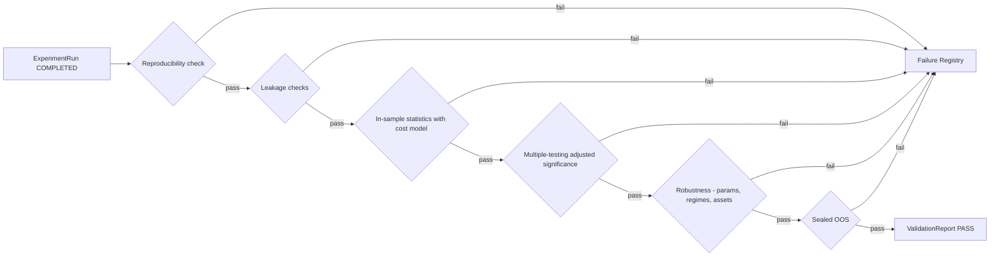
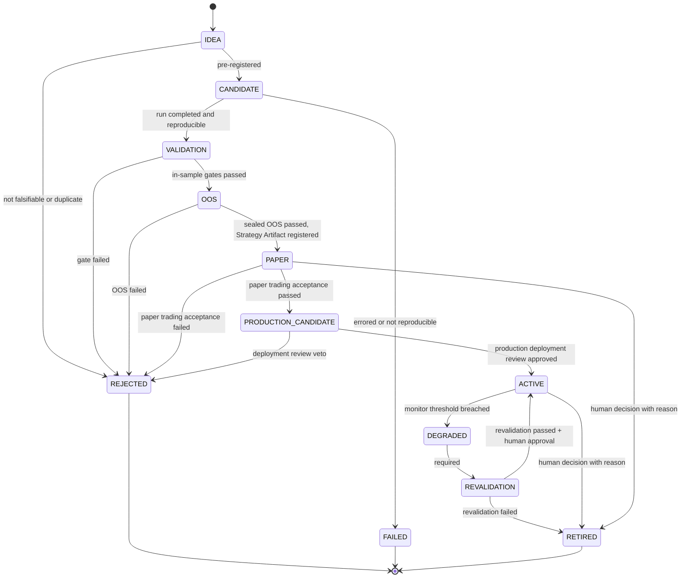

# 07 — Validation & Lifecycle

> 验证规则的**具体内容**由 [research/constitution.md](../research/constitution.md) 定义；本文件定义验证的**流程与状态机**。

## 1. 原则

- 验证是确定性程序，不是 LLM 判断，也不是人工目测。
- 验证规则分三层（[ADR-0007](../adr/0007-validation-architecture-three-layers.md)，Accepted）：**Constitution** = 不可变原则；**Validation Profile** = 版本化的阈值与参数；**Experiment Metadata** = 每个实验实际使用的 Profile 版本与配置。
- 报告绑定 Constitution 版本与 Profile 版本；实验永久保留它使用的 Profile 版本。
- 禁止为了提高回测结果而修改 Constitution（H3 / P14）。Constitution 的修改只能前向生效，不能用于重新评估已失败的对象使其通过。

## 2. Validation Pipeline（D9）

每个门（gate）输出结构化检查结果（check_id、指标、**阈值及其来源 Profile 字段**、是否通过），写入 ValidationReport。
**所有阈值来自实验绑定的 Validation Profile 版本（§5），不得写死在流水线代码中。**

## 3. Experiment / Validation Lifecycle（D6）

> 状态：**已冻结**，对应 [ADR-0006](../adr/0006-strategy-lifecycle.md)（Accepted，2026-09-23，取代 ADR-0002 第 5 条）。修改需新 ADR。

研究对象（Hypothesis、Strategy、Feature 组合等）的晋升状态机：

| 状态 | 含义 |
|---|---|
| IDEA | 未登记的想法 |
| CANDIDATE | 已预登记为 ExperimentSpec |
| VALIDATION | 正在经过样本内验证门 |
| OOS | 正在经过封存样本外检验 |
| PAPER | 单策略的独立观察与模拟验证，尚未进入组合 / Router |
| PRODUCTION_CANDIDATE | 已通过研究验证**且**已通过 Paper Trading 验收；可进入生产部署审查，尚未进入生产 |
| ACTIVE | 被策略组合 / Router 正式启用；带 `execution_mode = SIMULATED \| LIVE` |
| DEGRADED | 监控阈值被突破，等待重新验证 |
| REVALIDATION | 正在重新验证 |
| RETIRED | 正常退役（≠ FAILED） |
| REJECTED | 验证未通过或被否决 |
| FAILED | 技术失败：运行错误 / 不可复现 |

**规则**
- 只允许图中列出的转移；DEGRADED 永远不能直接转为 ACTIVE，必须经过 REVALIDATION。
- `LIVE` 不是生命周期状态，而是 ACTIVE 的 `execution_mode`。Phase 13 之前只允许 `SIMULATED`；`LIVE` 需要独立 Risk Gate + 明确的授权记录。
- REJECTED、FAILED、RETIRED 为终态；重试 = 新版本的新 CANDIDATE，旧记录保留并计入尝试次数。
- 每次转移与 `execution_mode` 变更都只追加、可审计。
- OOS 数据对每个假设族只"开封"一次；开封记录不可撤销。

## 4. 终态记录：Failure Registry 与退役记录

终态分成两类，**不混用**（ADR-0006 §3 第 2 条）：

| 终态 | 记录位置 | 含义 |
|---|---|---|
| REJECTED / FAILED | Failure Registry | 从未成立：验证未通过、被否决，或技术失败 / 不可复现 |
| RETIRED | 退役记录（生命周期历史的一部分） | 曾经成立并被启用，现在停止使用 |

### 4.1 Failure Registry

记录所有 REJECTED / FAILED 对象：

| 字段 | 说明 |
|---|---|
| `subject_ref` | 对象引用 |
| `terminal_state` | REJECTED / FAILED |
| `reason_code` | 来自 `core/errors` 分类（如 `LEAKAGE_DETECTED`、`NOT_SIGNIFICANT_AFTER_MTC`、`OOS_DECAY`、`NOT_REPRODUCIBLE`、`COST_KILLED`） |
| `gate_id` | 失败的门 |
| `evidence` | ValidationReport / Run 引用 |
| `lessons` | 人工或自动总结（可检索，供 Research Memory 使用） |

### 4.2 退役记录（Retirement Record）

RETIRED 对象写入退役记录，**不写入 Failure Registry**：

| 字段 | 说明 |
|---|---|
| `subject_ref` | 对象引用 |
| `retirement_reason` | 退役原因（被替代、市场结构变化、劣化后重新验证未通过、人工决定…） |
| `evidence` | 相关 Revalidation 报告 / 监控证据引用 |
| `active_period` | 曾经 ACTIVE 的时间区间与 `execution_mode` |
| `lessons` | 可检索的总结 |
| `recorded_at` | UTC |

两类记录都是**追加式**的，都属于 Research Memory 的可检索内容（见 research/failure-registry.md）。

## 5. Validation Profile（概念契约）

> 状态：概念契约，冻结于 [ADR-0007](../adr/0007-validation-architecture-three-layers.md)。Phase 0 将其落成 `core/contracts/` 中的代码契约；**参数值**在 Phase 4 校准后冻结（两步冻结 Step 2）。

Profile 引用格式：`vp:{scope_id}@{semver}`，例如 `vp:btcusdt-1h-swing@1.0.0`。

### 5.1 字段

| 字段组 | 字段 | 说明 |
|---|---|---|
| 标识 | `profile_id`、`version`、`content_hash`、`status` | `status ∈ {draft, frozen, superseded}`；`frozen` 后不可变 |
| 适用范围 | `instrument`、`venue`、`timeframe`、`research_class` | 与选择规则（§5.2）匹配 |
| 数据切分 | 研究窗口、封存 OOS 的**固定日期边界**与长度、embargo、walk-forward 配置 | 对应 Constitution 第四章 |
| 样本量 | IS / OOS / 每个状态分组的最小有效独立样本量；有效样本折算方法 | 对应 C-T2 |
| 显著性 | 多重检验校正方法与阈值、过拟合概率阈值、报告项 | 对应 C-T1 |
| 基准 | 空模型设定与分位阈值；按类别适用的市场基准 | 对应 C-T4 |
| 参数稳定性 | 邻域定义、邻域表现下限、时间对齐（bar 偏移）测试 | 对应 C-R1 |
| 成本 | 基准成本模型 `name@version`、压力倍数、延迟压力、盈亏平衡成本要求 | 对应 C-R4、A6 |
| 生命周期 | PAPER 观察期长度、PAPER 验收标准、劣化监控阈值 | 对应 C-G3（ADR-0006 Q-6 仍开放） |
| 溯源 | 校准报告引用、批准 ADR、前一版本 | Step 2 冻结依据 |

> 本文件与 Profile 契约都**不含具体数值**；数值在 Phase 4 校准后写入具体 Profile 版本。

### 5.2 选择规则（ProfileSelectionRule）

- 输入：`instrument`、`timeframe`、预登记的 `research_class`（按预登记的持仓周期类别）。
- 输出：唯一的 `profile_id@version`。
- 规则是确定性的、版本化的；研究者不能自选 Profile（Constitution C-A4）。
- 若实验的实际持仓分布偏离预登记类别超出声明范围，该实验按正确类别的 Profile 重新评估，**不得**因此换到更宽松的 Profile。

### 5.3 不可变性与可重建性

- `frozen` 的 Profile 版本永不修改；修正 = 新版本（Constitution C-A5）。
- 所有版本及其 `content_hash` 保存在 Control Plane，可按版本取回。
- 因此任何实验在任何时点都能重建"当时适用的验证规则" = Constitution 版本 + Profile 版本（Constitution C-P4）。
