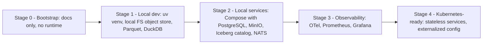

# 08 — Deployment & Runtime

## 1. 目标运行时

| 组件 | 默认技术 | 可替换 |
|---|---|---|
| 容器 | Docker / OCI | Podman 等 OCI 兼容运行时 |
| 编排 | Docker Compose（单机） | Kubernetes（Kubernetes-ready，第一阶段不引入） |
| Control Plane DB | PostgreSQL | 其他 PG 兼容 |
| 对象存储 | S3 兼容（本地开发可用本地 FS / MinIO） | S3、R2、GCS(S3 API) |
| 表格式 | Apache Iceberg | — （冻结为默认；Catalog 可替换） |
| 事件总线 | NATS JetStream | Kafka / Redpanda |
| 可观测性 | OpenTelemetry → Prometheus / Grafana | 任意 OTLP 后端 |

## 2. 部署阶段演进（D11）



| 阶段 | 对应 Roadmap | 前提 |
|---|---|---|
| Stage 0 | 当前 | — |
| Stage 1 | Phase 0 – 1 | Python 版本决定（D-06）、Git 初始化（D-07） |
| Stage 2 | Phase 1 – 2 | Docker 可用（当前**未安装**，需用户授权安装） |
| Stage 3 | Phase 4+ | Stage 2 |
| Stage 4 | Phase 13 之外的未来生产部署阶段 | 生产需求明确；当前 Phase 13 仅做模拟 / 纸面执行，不代表具备实盘或生产部署能力 |

## 3. Kubernetes-ready 约束（从第一天起遵守）

- 服务无本地状态；状态在 PG / Object Storage。
- 配置通过环境变量 / 配置文件注入（12-factor）。
- 健康检查端点：`/healthz`、`/readyz`。
- 日志输出到 stdout，结构化 JSON。
- Worker 任务幂等，可重试。

## 4. 可观测性

- Trace：API 请求、Worker 任务、Experiment Run 全链路（trace_id 写入 Run 元数据）。
- Metrics：采集延迟、数据缺口、任务队列深度、实验吞吐、验证通过率。
- **验证通过率异常升高**应作为告警（可能的泄漏或规则被削弱信号）。

### 4.1 执行服务（Phase 13 框架，仅模拟）

`apps/execution/`（[ADR-0046](../adr/0046-simulated-execution-service.md)，FRAMEWORK_IMPLEMENTED / NOT_VALIDATED）是独立的
执行服务，当前**只有**进程内模拟场所：

- 无网络 I/O、无凭据、无真实场所；`ExecutionMode.LIVE` 与非 `SimulatedVenue` 场所被拒绝；阶梯 PAPER 之后的各级总是拒绝并记录。
- 每个订单先记录、再经 Kill Switch 与二道风控、后成交；订单 / 成交 / 拒绝 / Kill Switch 触发 / 告警 / 阶梯决定都进只追加审计轨迹，
  并发布到事件总线 `execution.*` 主题（当前为进程内总线，ADR-0044；不持久）。
- 风险数值（资金、敞口、杠杆、亏损、回撤阈值、费率）由操作者注入，没有默认值；Kill Switch 没有 reset，恢复 = 人新建服务实例。
- 运行时状态目前都在进程内；满足 §3"服务无本地状态"需要持久审计存储与外部总线，属后续 ADR。

## 5. 当前环境（WSL2）注意

- 研究数据应放在 Linux 文件系统（ext4），避免 `/mnt/c` 跨文件系统 I/O。
- 内存约 15 GiB（WSL 分配），大数据集需分区 + 流式计算（DuckDB / Polars lazy）。
- 本阶段不修改 `.wslconfig`。

## 6. Phase 1 本地数据运行手册

本节只描述 `infrastructure/` 代码**实际做什么**（均已读代码确认，行为随代码变化而变化，不代表额外承诺）；
G3-T 之前的容量结论见 `PROJECT_STATUS.md` §7，长期事实见 `PROJECT_MEMORY.md`。范围：本地单机、
`file://` warehouse + SQLite 或本机 PostgreSQL catalog（`infrastructure/README.md` "本机 PostgreSQL 资源"）；
不覆盖 Docker / Compose / 远程对象存储（Stage 2+，见 §2）。

### 6.1 操作顺序

一条 Binance spot 首切片（`BTCUSDT` / `ETHUSDT` × `agg_trades` / `klines_1m`）的本地数据流，按依赖顺序：

1. **D0 归档采集** `infrastructure.collector.BinanceSpotArchiveCollector` — 下载官方日归档 ZIP，经
   `StorageAdapter.stage` / `publish` 原子发布为内容寻址对象；
2. **D1 归档 parser** `infrastructure.parser.parse_archive` — 由 D2 store 调用，不单独持久化任何东西；
3. **D2 Raw 归档存储** `infrastructure.revision.RawRevisionStore.ingest` — 解析并写入
   `raw.binance_spot_archives` + `raw.binance_spot_agg_trades` / `raw.binance_spot_klines_1m`；
4. **D3D REST 补尾采集** `infrastructure.collector.BinanceSpotRestCollector` — 只在归档还没覆盖到的
   区间补最近数据，写采集 checkpoint；
5. **D3E REST Raw 存储** `infrastructure.revision.RestRevisionStore.ingest_collection` — 把一次**已提交**
   的 D3D 采集变成 `raw.binance_spot_rest_responses` / `raw.binance_spot_rest_agg_trades` /
   `raw.binance_spot_rest_klines_1m` 的 append-only revision；
6. **D3E 跨通道核对** `infrastructure.revision.channel_reconcile.ChannelReconciler.reconcile` — 对一个
   `(data_type, symbol, UTC day)` 分区，证明归档与 REST 的行后逐对比较，只写 `EQUAL` 的
   evidence-only 边到 `raw.binance_spot_precedence_evidence`；在任一通道 ingest 之后运行，也可独立重跑；
7. **E1 Canonical 规范化** `infrastructure.canonical.normalizer.CanonicalNormalizer.normalize_unit` —
   对**一个** Raw source revision（一次归档 ingest 或一次 REST 响应）规范化为 `canonical.trades` /
   `canonical.bars_1m` 行；只能在该 Raw unit 的 ingest **已返回**之后调用，其 Raw 行事后变化会被
   拒绝（见 6.2）；
8. **F1 PIT 选择** `infrastructure.pit.selector.PitSelector.select` — 任意 UTC 半开区间的 point-in-time
   选择；成交数据必须按小时（或更短）分段调用（见 6.4），K 线数据可整天调用；
9. **E3 质量报告** `infrastructure.quality.reporter.QualityReporter.report` — 一个 Canonical 分区
   （表 × 标的 × UTC 日）一行报告；内部按 6.4 的粒度自动分段调用 F1，调用方不需要自己分段；
10. **E4 重采样** `infrastructure.canonical.resample`（纯函数，无 I/O、无时钟）— 只从一次 F1
    **单点**（非区间）`PitSelection` 派生能整除 1440 分钟的更高周期 bar；F1 若给出 `conflicts`
    或区间选择，`resample` 直接拒绝。

每一步都只依赖上一步**已提交**的结果；除 6 可在 4/5 之后独立重跑外，不允许跳步或对尚未 ingest
完成的输入运行下一步。

### 6.2 幂等重跑与崩溃恢复（按模块）

全部步骤都无 journal、无旁路表：**恢复就是用相同输入再调用一次同一个入口**，不需要任何清理脚本。

| 模块 | 幂等 / 恢复机制 |
|---|---|
| D2 `RawRevisionStore.ingest` | 按 revision id 查 `raw.binance_spot_archives`：查到就核对已持久化字段并取回 block base 与知识轴时间；查不到才分配新 block。物件不可变 + D1 parser 确定性，因此重新解析、重建每个 microbatch 与其稳定 batch id 总是得到同样的内容；`commit_batch` 对已提交的 batch id 只核对指纹，不重复写 |
| D3E `RestRevisionStore.ingest_collection` | 只接受**已提交**的 D3D 采集 checkpoint，用同一个只读 collector 严格重放（request 指纹、页序、页身份、正文哈希、D3C 严格重解码）后再持久化；响应 / 元素 revision 按页身份 + 正文字节做键，重复投递找到已提交行，拿回其首次 provenance / block base / `knowledge_time` |
| D3E `ChannelReconciler.reconcile` | 先两次读五张输入表的 head 并要求一致（否则重读，有限次数），再逐对证明 + 比较；`EQUAL` 边先按 `edge_id` 查已提交行，查到就逐字段核对复用其首次 `knowledge_time`，查不到才读注入时钟并提交 |
| E1 `CanonicalNormalizer.normalize_unit` | 已提交 batch id 记录了该 unit 的规划（unit 行数 + microbatch 大小），续跑只按这个计划核对与补齐缺的 batch；**Raw unit 在首次规范化之后发生变化**（行数变了）会被拒绝为完整性错误 —— 只在对应 ingest 已返回之后规范化，不修补 |
| E3 `QualityReporter.report` | `report_id` 由规则集哈希 + 分区 + 当时绑定的输入表 snapshot 派生；已提交的报告被重新推导校验后复用其**首次** `knowledge_time`，不追加第二行 |
| F1 `PitSelector.select` | 只读、从不写；天然可重复调用，每次都是独立证明 |
| E4 `resample` | 纯函数、无 I/O；重跑对相同输入总是逐位相同的输出（`content_sha256` 覆盖市场内容 + 构成 revision id） |

崩溃后的操作只有一句话：**用同样的参数把上一步没跑完的调用再跑一次**；不要手工删除或改写已提交的
Iceberg snapshot、不要跳过某个 unit 去"补写"缺失的行。

### 6.3 内存规则

- 本机所有 `python` / `pytest` / `mypy` / `ruff` 调用一律套 `systemd-run`，禁止裸跑：

  ```bash
  systemd-run --user --scope --quiet -p MemoryMax=<上限> -p MemorySwapMax=0 <命令>
  ```

  WSL 曾因内存耗尽整机崩溃（`PROJECT_STATUS.md` §7）；`MemorySwapMax=0` 让超限直接被 OOM 杀死而不是
  拖慢到假死。`<上限>` 按当次工作量选（探针本身默认拒绝 `--rows` 超过 5 万，见 6.6）。
- 批量写入都按有界 microbatch 分片，不整单元 / 整表物化；默认与上限：

  | 模块 | 默认 microbatch | 上限 |
  |---|---|---|
  | D2 `RawRevisionStore`（归档行） | `DEFAULT_MICROBATCH_ROWS = 25_000` | `MAX_MICROBATCH_ROWS = 250_000` |
  | D3E `RestRevisionStore`（REST 元素） | `DEFAULT_ELEMENT_MICROBATCH_ROWS`（= REST 单页上限） | `MAX_ELEMENT_MICROBATCH_ROWS` |
  | E1 `CanonicalNormalizer` | `DEFAULT_MICROBATCH_ROWS = 25_000` | `MAX_MICROBATCH_ROWS = 250_000` |

  三者都可通过构造函数的 `microbatch_rows` / `element_microbatch_rows` 关键字覆盖；内存吃紧时调小，
  不改变正确性（只改变每次提交的批大小与恢复时的续跑粒度）。
- `PyIcebergCatalogAdapter` 的序号 anchor 读取（`max_int64`）与批量提交都走 PyIceberg 的流式
  `to_arrow_batch_reader` 归约，不整表 `to_arrow()`；但每次分配仍要打开全部匹配数据文件，I/O 随归档
  文件数线性增长（`infrastructure/README.md`）。

### 6.4 成交数据的一小时 PIT 切片

- `QualityReporter` 内部按 `_SLICES`（`infrastructure/quality/reporter.py`）自动分段：`agg_trades` 每
  **1 小时**证明一次并把结果并入同一天的报告，`klines_1m`（1 440 行/天）整天一次证明；调用方永远只
  调 `report(data_type, symbol, day)`，不需要自己按小时循环。
- `PitSelector.select` 本身接受**任意** UTC 半开区间；但按 `PROJECT_STATUS.md` §7 的实测结论，成交数据
  选择结果本身约 11 KB/行，整天选择（约 30 GB）不可行 —— **任何构建成交数据集的调用都必须按小时
  （或更短）分段**，K 线数据（1 440 行/天）可以整天选择。
- `PitSelector` 有一个"键闭包"窗口 `_KEY_REACH = timedelta(days=1)`：一个 key 在窗口 ±1 天内的全部
  revision 会被一起证明、一起判定所属窗口（取最早事件所在的窗口，因此不会被两个窗口重复选中）；
  超过 1 天的两份副本不会被配对，各自在自己的窗口里被当作独立记录（已知边界，需要专门的质量规则
  检测这种数据，见 `PROJECT_STATUS.md` §7）。这意味着按小时选择时会读取相邻分区（前后各一天），
  生产规模下的耗时尚未测量。
- 在 D-QGAP（成交数据整天规模的报告事件列表格式）决定之前，不得对成交数据做整天规模的质量报告；
  按小时的分段报告（当前实现）不受影响。

### 6.5 已知容量限制（PROJECT_STATUS.md §7，只做索引，不重复数值）

- 规范化若整单元一次性读入，约 19 KB/行，一天百万级成交会超出约 15 GiB 的 WSL 内存 —— 已改为固定
  快照 + 分批窗口（G3-S，见 §6.1 第 7 步、§6.3）。
- 分批窗口下规范化 30 万行新增常驻约 0.8 GB，边际约 0.7 KB/行（外推一天约 2～3 GB）。
- 一小时 PIT 选择在 6 万行实测峰值约 0.27 GB；但选择结果本身约 11 KB/行，整天选择不可行（见 6.4）。
- REST 核对（`ChannelReconciler`）每次都要遍历相关表的提交历史找批次，表历史很长时会变慢，尚需在
  G3 容量基线中实测 —— `infrastructure/tools/capacity_probe.py`（§6.6）就是这条基线的起点，但它只跑
  单通道归档路径，不覆盖 REST / reconciler 的历史遍历成本。
- D1 大体量 BTC 日归档的吞吐 / 内存基线仍未做；批量 backfill 前必须先完成容量检查与可恢复
  checkpoint。

### 6.6 容量探针工具

`infrastructure/tools/capacity_probe.py`（G3-T）是一个**运维工具**，不属于生产管线，也不被
`infrastructure/canonical` / `pit` / `quality` / `revision` 依赖。它在一个临时 SQLite catalog +
本地 `file://` warehouse 里合成 N 条铺满一个 UTC 日的 aggTrades，跑 ingest → normalize → 一小时
PIT 选择 → 当天质量报告，逐阶段打印 wall time、`tracemalloc` 峰值与 `ru_maxrss` 增量的 JSON：

```bash
systemd-run --user --scope --quiet -p MemoryMax=3G -p MemorySwapMax=0 \
  uv run python -m infrastructure.tools.capacity_probe --rows 2000
```

`--rows` 超过 50 000 时拒绝运行，除非显式加 `--i-know-memory`（WSL 曾因内存耗尽崩溃）。工具自己的
JSON 输出里带 `notes` 字段，写明它绕过了 D0 / D3D 真实采集、只跑单通道归档路径、`tracemalloc` 看不
到 PyArrow / PyIceberg 的原生内存——运维读结果前应先读这些说明，不要把它当成端到端生产基线。

### 6.7 涉及的设置（`infrastructure/settings.py`）

`Settings`（`pydantic-settings`，前缀 `HLENS_`，可选 `.env`）是本地数据面**唯一**类型化运行时设置边界，
构造本身不做任何 DB / 网络 / 目录副作用：

| 字段 | 用途 |
|---|---|
| `warehouse_uri` / `staging_uri` | 本地 `file://` 绝对路径（`LocalFileStorageAdapter`）；两者必须同文件系统、不得相同路径；默认 `data/warehouse` 与其下 `staging/` |
| `catalog_uri` | PostgreSQL DSN（`SecretStr`，只接受 `postgresql` / `postgresql+<driver>`）；`open_postgres_catalog_adapter` 的唯一入口 |
| `catalog_name` | PyIceberg catalog 名 |
| `http_connect_timeout_seconds` / `http_read_timeout_seconds` / `http_max_retries` / `http_user_agent` | D0 / D3D 的 HTTP 客户端参数 |
| `binance_archive_base_url` / `binance_market_data_base_url` | D0 归档 / D3D REST 的来源 base URL（构造时校验，拒绝凭据 / query / fragment / 危险 path） |
| `binance_rest_max_pages_per_collect` / `binance_rest_min_request_interval_ms` / `binance_rest_max_retry_after_seconds` / `binance_rest_max_response_bytes` | D3D REST 采集的运维安全参数（ADR-0027 §12），不是 Constitution 或 Validation Profile 阈值 |

`infrastructure.catalog.create_phase1_tables` / `infrastructure.catalog.provision_local_postgres`
经 `Settings` 连接真实本机 PostgreSQL（见 `infrastructure/README.md`）。`capacity_probe.py`
**不用** `Settings`：它在临时目录里自建一次性 SQLite catalog + 本地 warehouse，因此完全不触碰
真实 catalog / warehouse，也不需要 `.env`。
