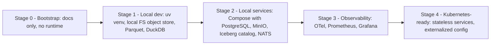

# 08 — Deployment & Runtime

## 1. 目标运行时

| 组件 | 默认技术 | 可替换 |
|---|---|---|
| 容器 | Docker / OCI | Podman 等 OCI 兼容运行时 |
| 编排 | Docker Compose（单机） | Kubernetes（Kubernetes-ready，第一阶段不引入） |
| Control Plane DB | PostgreSQL | 其他 PG 兼容 |
| 对象存储 | S3 兼容（本地开发可用本地 FS / MinIO） | S3、R2、GCS(S3 API) |
| 表格式 | Apache Iceberg | — （冻结为默认；Catalog 可替换） |
| 事件总线 | NATS JetStream | Kafka / Redpanda |
| 可观测性 | OpenTelemetry → Prometheus / Grafana | 任意 OTLP 后端 |

## 2. 部署阶段演进（D11）

| 阶段 | 对应 Roadmap | 前提 |
|---|---|---|
| Stage 0 | 当前 | — |
| Stage 1 | Phase 0 – 1 | Python 版本决定（D-06）、Git 初始化（D-07） |
| Stage 2 | Phase 1 – 2 | Docker 可用（当前**未安装**，需用户授权安装） |
| Stage 3 | Phase 4+ | Stage 2 |
| Stage 4 | Phase 13+ | 生产需求明确 |

## 3. Kubernetes-ready 约束（从第一天起遵守）

- 服务无本地状态；状态在 PG / Object Storage。
- 配置通过环境变量 / 配置文件注入（12-factor）。
- 健康检查端点：`/healthz`、`/readyz`。
- 日志输出到 stdout，结构化 JSON。
- Worker 任务幂等，可重试。

## 4. 可观测性

- Trace：API 请求、Worker 任务、Experiment Run 全链路（trace_id 写入 Run 元数据）。
- Metrics：采集延迟、数据缺口、任务队列深度、实验吞吐、验证通过率。
- **验证通过率异常升高**应作为告警（可能的泄漏或规则被削弱信号）。

## 5. 当前环境（WSL2）注意

- 研究数据应放在 Linux 文件系统（ext4），避免 `/mnt/c` 跨文件系统 I/O。
- 内存约 15 GiB（WSL 分配），大数据集需分区 + 流式计算（DuckDB / Polars lazy）。
- 本阶段不修改 `.wslconfig`。
