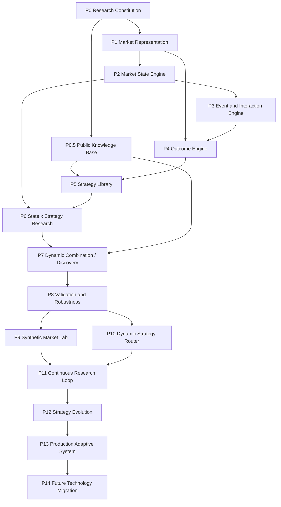

# Roadmap

| 字段 | 值 |
|---|---|
| 状态 | Draft |
| 当前 Phase | **Phase 1 已开启（2026-09-24，分支 `phase/1`）：ADR-0021 ~ 0024、0026、0027 已 Accepted；A3～D2、D3A～D3D 已由 Codex 验收；当前只开放 D3E；Phase 0 已完成（tag `phase-0-complete`）；见 PROJECT_STATUS.md** |
| 规则 | 一个 Phase 只有在用户明确开启后才能开始实现；验收标准全部满足后才能关闭 |

## 依赖图（D10）

> ⚠️ Phase 8（Validation & Robustness）排在 Phase 6/7 之后，但 Phase 6/7 已在做实验。本 Roadmap 的处理方式：**最小验证门（Gate G0–G3 + Sealed OOS）在 Phase 4 结束前必须可用**，Phase 8 是对稳健性的扩展与加固。此解释需用户确认（待决事项 **D-04**）。

---

## 跨 Phase 通用验收规则

以下规则适用于每一个 Phase，不改变 Phase 顺序、范围或开启条件。

- **Provider 接口先于实现**（[ADR-0017](../adr/0017-provider-delivery-schedule.md)）：
  任一 Phase 首次消费某类 Provider 之前，必须先交付该 Provider 的可执行 Protocol、
  输入输出 DTO（带 `schema_version` 并导出 JSON Schema）与 provider-agnostic contract tests；
  三者列入该 Phase 的验收。Provider 实现早于其接口与契约测试的 Phase 不得通过验收。
  Phase 0 只冻结 Provider 的职责、概念输入输出、确定性与版本语义，不交付任何 Protocol。

---

## Phase 0 — Research Constitution

- **目标**：确立研究宪法、领域契约、项目工程基线，使后续一切实验有可裁判的规则。
- **输入**：本架构文档集；用户对待决事项的决定；D-09 的结构决定（H-1 三层结构、H-2 两步冻结）。
- **输出**：批准的 Constitution v1.0.0（纯原则，数值由 Validation Profile 定义，见 H-1 / H-2 与 ADR-0007）；验证架构契约（Validation Profile 字段、Profile 选择规则、Experiment Metadata 字段）；`core/domain` 与 `core/contracts` 的契约代码（Pydantic + JSON Schema 导出）；Lifecycle 状态机代码；错误分类；工程基线（Python 版本、依赖管理、lint/type/test）；ADR 0003+。
- **模块**：`core/*`、`docs/research/constitution.md`、`tests/`。
- **依赖**：无（起点）。
- **验收标准**：Constitution 状态为 Approved **且不含任何数值阈值**（数值属于 Validation Profile）；Validation Profile 与 Experiment Metadata 的契约已定义；所有核心实体有契约与 Schema 导出；状态机只允许定义的转移（测试覆盖）；契约层无基础设施依赖（导入检查测试）；CI/本地测试命令可运行。
- **禁止事项**：实现任何 Feature/Strategy/Backtest；接入真实数据；引入 LLM。
- **可能的失败模式**：契约过度设计导致后续僵化；阈值拍脑袋；契约泄漏具体技术类型；把讨论无限延长而不冻结。

## Phase 0.5 — Public Knowledge Base

- **目标**：建立结构化的公开研究知识库（策略、因子、特征、风控、市场微观结构、失败案例）。
- **输入**：公开论文、书籍、开源项目、博客；旧项目的经验（仅作为知识条目）。
- **输出**：`KnowledgeItem` 契约实例集合；strategy/factor/feature/risk/event/state 各库的首批条目；KnowledgeProvider（检索）初版。
- **模块**：`docs/research/*-library.md`、`knowledge-base.md`、`plugins/`（KnowledgeProvider）。
- **依赖**：P0。
- **验收标准**：每个条目有出处、许可、证据等级、可检验的主张；可按标签/状态/资产检索；无出处条目为零。
- **禁止事项**：把知识条目当作已验证结论；复制受版权保护的全文；让 LLM 未经审阅直接写入知识库。
- **可能的失败模式**：知识库变成未经筛选的收藏夹；出版偏差（只收录"有效"的方法）；主张不可检验。

## Phase 1 — Market Representation

- **目标**：建立 Data Plane：采集 → Raw → Canonical → 基础 Representation。
- **输入**：Binance 公共 spot `BTCUSDT` / `ETHUSDT` 的归档 aggTrades 与 1m klines（D-08 → [ADR-0022](../adr/0022-phase1-market-and-execution-scope.md)）；可能的既有数据（只读导入）。
- **输出**：Collector Adapter；Raw/Canonical Iceberg 表（首批清单见 03-data.md §7）；数据质量报告；Research Dataset + manifest；基础 Representation（时间 bar、成交量 bar 等）；首批 FeatureProvider。
- **模块**：`plugins/`（collector）、`infrastructure/`、`research/features/`。
- **依赖**：P0；D-01 / D-02 / D-10 → [ADR-0021](../adr/0021-phase1-local-data-infrastructure.md)、D-28 → [ADR-0023](../adr/0023-bitemporal-revision-data.md)、D-31 → [ADR-0024](../adr/0024-historical-tradable-universe.md)（均 Accepted）。
- **验收标准**：Canonical 数据有快照 ID 且可时间旅行；质量报告自动生成；point-in-time 测试通过；Feature 结果可复现。逐项证据见下方验收矩阵。
- **禁止事项**：把行情写入 PostgreSQL；以 DuckDB 文件作为唯一存储；修改外部既有数据；Phase 1 ~ 6 运行 NATS；任何账户 / 交易端点或交易密钥。
- **可能的失败模式**：时间戳时区混乱；交易所维护/断线造成静默缺口；符号映射错误；数据量超出 WSL 内存；availability / precedence 证据不足导致历史可用区间缩小或数据集 fail closed。

### Phase 1 验收矩阵

每项必须有可观察证据；"批次"是首次必须满足的批次，之后各批次不得回退。

| # | 验收项 | 可观察证据 | 批次 |
|---|---|---|---|
| 1 | ADR-0021 ~ 0024 Accepted；`03-data.md` 同步；首切片表 / 分区 / 标识符 / PIT I/O / 依赖 / 设置冻结；远程与推送流程成文（ADR-0025） | ADR 索引与 docs 一致性测试 | A2 / A2r |
| 2 | 只新增 03-data.md §6.1 的四个直接依赖，版本锁定在 `uv.lock` | `pyproject.toml` / `uv.lock` diff；禁用包不存在 | A3a |
| 3 | 类型化设置符合 03-data.md §6.2：`/mnt/*` 与非 `file://` warehouse 被拒；`HLENS_CATALOG_URI` 只接受 PostgreSQL DSN（运行时设置拒绝 SQLite）且不外泄；设置代码无测试环境分支 | 设置单元测试 | A3b |
| 4 | 双轴时间、revision、`supersedes` DAG 与 maximal-head 选择的契约、Schema 与 contract tests | ADR-0023 验收矩阵中契约层可表达的各项 | B1 |
| 5 | listing revision、`UniverseSelectionSpec`、成员 / 排除清单、`ResearchDatasetManifest` 的契约、Schema 与 contract tests；`Instrument` / `Kind` 不变 | ADR-0024 契约层各项；manifest 缺绑定项被拒 | B2 |
| 6 | Collector / Storage / Catalog Protocol + DTO + provider-agnostic contract tests 先于任何实现 | 提交顺序；实现提交前 contract tests 已存在 | B3 |
| 7 | `file://` StorageAdapter：staging → 校验 → 同文件系统原子发布；不拼接绝对路径 | B3 Storage contract tests 对实现通过 | C1 |
| 8 | PyIceberg SQL Catalog on PostgreSQL，独立库 / role；集成测试用独立 PostgreSQL test database（并发提交、快照、时间旅行、重启恢复）；SQLite 只经测试 fixture 注入且不计入集成证据 | 集成测试报告；catalog 库中无行情行 | C2 |
| 9 | 03-data.md §7.1 首切片八张表按冻结名与初始分区创建（ADR-0027 的四张 REST 表属 D3B）；partition-spec 演进有等价测试；batch id 幂等 commit | 表 / 分区检查与重试测试 | C3 |
| 10 | 公共归档下载只访问 `HLENS_BINANCE_ARCHIVE_BASE_URL`；先过 `.CHECKSUM` 再经 staging 原子交付；checksum 失败不交付；**不含**解析或 revision 语义 | 下载壳测试与端点静态检查 | D0 |
| 11 | parser `binance.spot.archive.parser@1.0.0`：按文件覆盖日期选单位；解析时间全部落在 `[coverage_start, coverage_end)` 内（零容差）；任一例外整文件拒绝并写质量事件 | 2024-12-31 / 2025-01-01 对照与人为错单位 / 越界测试 | D1 |
| 12 | append-only revision：重放幂等、归档替换追加、`arrival_seq` 不决定优先级、竞争修订 fail closed、崩溃后恢复 | ADR-0023 / 0022 验收矩阵的写入与恢复各项 | D2 |
| 13 | REST 补尾只用 market-data-only base；缺口显式标记，不推断填补 | 端点静态检查与缺口测试 | D3 |
| 14 | WebSocket live tail 只在 backfill、gap reconciliation 与重放幂等验收后启用（可不启用） | 启用条件检查 | D4 |
| 15 | Canonical trades / bars_1m 绑定 Raw lineage；更高周期从 Canonical 派生且重跑按位一致；有快照 ID 且可时间旅行 | lineage 与重跑一致测试；按 snapshot 查询 | E |
| 16 | listing 历史进入 `canonical.instrument_listings`；质量报告按分区自动生成 | 质量报告存在性测试 | E |
| 17 | availability / precedence policy 证据已产出、审阅并有测试；早期 `available_time` 缺证据的 revision 保守取 `ingest_time` 并写证据缺口记录 | 证据记录 + 测试 | D2 / E |
| 18 | PIT 双截止 + maximal head，同输入按位一致。**fail closed**：competing head；排序 revision 所需的 precedence 证据缺失或无法解析；请求的 policy / parser / universe 版本未登记；缺 universe 历史；manifest 不完整。**不是**数据集级失败：某 revision 的早期历史 `available_time` 缺证据——该 revision 取 `available_time = ingest_time`，写质量 / 证据缺口记录，并在 manifest 中绑定（ADR-0023 §2） | ADR-0023 / 0024 PIT 与 universe 验收项 | F |
| 19 | 基础 Representation 与首批 FeatureProvider（接口先行）；Feature guard 只用 `available_time ≤ simulation_time` 且 `knowledge_time ≤ knowledge_cutoff`；Feature 结果可复现 | 可复现与泄漏测试 | F |
| 20 | 首切片端到端：归档 → Raw → Canonical → PIT → Research Dataset + manifest → Representation | 端到端验收记录 | G |
| 21 | 全程：PostgreSQL 无行情、Git 无凭据 / 数据、无账户 / 交易端点、无 NATS；每批 pytest / ruff / ruff format / mypy 全绿；每个被接受的恢复点由 Codex 复核后推送（ADR-0025） | 每批检查输出、静态检查与远程分支 | 全部 |

### Phase 1 恢复序列

顺序固定为 **A3 → B1 → B2 → B3 → C1 → C2 → C3 → D / E / F → G**。每批一个可恢复 commit；门未通过不得进入下一批。
中断或失败时回到上一批已通过 Codex 复核的 commit 重新开始，不在失败状态上叠加。Provider 接口 / DTO / Schema / contract tests
（B1 ~ B3）先于任何实现（C 起）。执行者只提交不推送；Codex 复核通过后推送每个恢复点（ADR-0025）。
每批由 Codex 任务包单独授权；本序列表明方向，不等于授权。

| 批次 | 执行 | 交付 | 可观察门 | 恢复点 |
|---|---|---|---|---|
| A3a / CU-A3-DEPS | Cursor | 最小依赖锁定 | 验收 #2；全量检查通过 | A3a commit（复核后推送） |
| A3b / CU-A3-SETTINGS | Cursor | 类型化设置骨架 | 验收 #3；全量检查通过 | A3b commit（复核后推送） |
| B1 | Claude | D-28 双时间与 revision DAG 契约（`core/` 串行） | 验收 #4；current Schema 导出一致；已有契约不变 | B1 commit |
| B2 | Claude | D-31 universe 契约 + `ResearchDatasetManifest`（`core/` 串行） | 验收 #5 | B2 commit |
| B3 | Claude | Collector / Storage / Catalog Protocol、DTO、contract tests | 验收 #6；无任何实现 | B3 commit |
| C1 | Cursor | 本地 `file://` StorageAdapter（仅此一项） | 验收 #7 | C1 commit |
| C2 | Claude | PyIceberg catalog 语义与幂等提交；创建 catalog 库 / role 前记录 H12 授权 | 验收 #8 | C2 commit |
| C3 | Claude | 八张表的 Schema / 分区 / 演进（`day(...)` 分区写入以 ADR-0026 的 `pyiceberg-core` extra 已锁定为前提） | 验收 #9 | C3 commit |
| D0 / CU-D1-DL | Cursor | 公共归档下载 + checksum + 原子交付；不解析、无 revision 语义 | 验收 #10 | D0 commit |
| D1 ~ D4 | Claude | fail-closed parser 语义 → 修订 / 恢复 / precedence 证据 → REST 补尾（D3，见下）→ 条件式 WS | 验收 #11 ~ #14、#17 | 每个子批一个 commit |
| E | Claude | Canonical trades / bars_1m / listings 与质量报告 | 验收 #15 ~ #17 | 每个子批一个 commit |
| F | Claude | PIT + universe → Research Dataset + manifest；Representation 与 FeatureProvider；质量门 | 验收 #18、#19 | 每个子批一个 commit |
| G | Claude | 端到端验收、修复、关闭文档 | 验收 #20、#21 全部通过；Phase 关闭由 Codex / Raphael 决定 | G commit |

#### D3（REST 补尾）子批次拆分

验收 #13 的前置是 **D3A 设计门**：现有八张表不能诚实承载 REST 的 Raw 三跳 lineage 与跨通道 precedence，
拓扑与语义由 [ADR-0027](../adr/0027-rest-raw-source-and-element-revisions.md) 决定（Accepted 2026-09-25：四张 additive 表；D-33 方案 A 已生效）。
D3A 设计门、D3B 纯基础、D3C 严格 decoder 与 D3D 可重放 collector 均已通过（[D3A 验收](../reviews/2026-09-25-d3a-adr-0027-acceptance.md)、[D3B 验收](../reviews/2026-09-25-d3b-rest-foundations-acceptance.md)、[D3C 验收](../reviews/2026-09-25-d3c-rest-decoder-acceptance.md)、[D3D 验收](../reviews/2026-09-25-d3d-rest-collector-acceptance.md)）；**当前只开放 D3E**。
顺序固定 D3A → D3B → D3C → D3D → D3E，每批一个可恢复 commit，门未过不得进入下一批；D3E 已在 D3D 经 Codex 验收后开放。
每批交付一个**完整**的不变量：后一批只消费前一批已验收的结果，不回头补前一批的半个语义。
下表 "#" 指 ADR-0027 验收矩阵编号。

| 子批 | 执行 | 交付 | 文件边界 | 可观察门 / 测试矩阵 | 恢复点 |
|---|---|---|---|---|---|
| D3A / D3A-R1 | Claude | docs-only：ADR-0027、REST 官方证据、`03-data.md` §7.6、本拆分；R1 按 Codex 复核关闭 F1～F8 并改为四表方案 | `docs/**`、`PROJECT_STATUS.md`、`PROJECT_MEMORY.md` | docs 一致性、全量 pytest / ruff / format / mypy / `uv lock --check` 全绿；无实现代码、无 Schema / 契约 / 八表 / 依赖 / settings 变化；✅ Codex 验收，ADR-0027 Accepted | D3A-R1 `ed526f7` + 接受门 commit |
| D3B | Claude | 四张新表定义 + REST 身份规则（页身份、键、payload hash、`edge_id`、`arrival_seq` 区间）+ REST availability / precedence policy + `binance.spot.delivery-channel@1.0.0` 纯函数（投影、相等判定、证据构造）；**无 HTTP、无 store、无写入** | `infrastructure/catalog/phase1_tables.py`（仅追加）、`infrastructure/revision/rest_identity.py`、`rest_availability.py`、`rest_precedence.py`、`channel_precedence.py`（均新增）、`infrastructure/revision/__init__.py`（导出）、对应 `tests/` | #1、#7（纯函数部分）、#9、#20（policy）、#21（REST 区间常量）；八张冻结表定义哈希与 `IDENTITY_HASH` 回归断言；REST 与归档 `observation_key` 跨模块一致；投影向量（相等、各字段不等、缺字段、超定义域、毫秒 / 微秒 kline 等价、亚毫秒 aggTrade 不等）；`edge_id` 不含时间；真实 PostgreSQL 建 12 表与重启幂等；✅ `3b267a0` + `02c0418` 经 Codex 验收 | D3B accepted commits + 接受门 commit |
| D3C / D3C-R1 | Claude | 严格 decoder `binance.spot.rest.decoder@1.0.0`：纯函数（正文字节 + 规范页身份 + `retrieved_at` + 上一页摘要）→ 元素 + 页摘要（answered 区间、终止原因、续页查询）或拒绝；R1 修复 RFC JSON 框架空白 | `infrastructure/parser/binance_rest.py`、`infrastructure/parser/__init__.py`（导出）、`tests/` | #11 ～ #13 的 decoder 部分：ADR §6 envelope 表逐项正反例；越出目标窗口的合法元素**不**被拒；未结束 K 线；单位错由下界 / `retrieved_at` 上界捕获；截断 / 超长 / 重复键 / 多余字段；✅ `643cf45` + `6b9e670` 经 Codex 验收 | D3C accepted commits + 接受门 commit |
| D3D | Claude | REST collector：结构化 allowlist、按 D3C 分页、不可变 page / collection checkpoint、同 `request_id` 重放不联网、`Retry-After` / 418 / 5xx / 预算、四项新设置 | `infrastructure/collector/binance_rest.py`、`infrastructure/collector/__init__.py`、`infrastructure/settings.py`（四项新字段）、`tests/infrastructure/test_settings.py`、`tests/` | #10、#11 ～ #13 的 collector 部分、#14（含既有 `CollectorAdapter` contract suite 与"夹具第二次返回不同字节"）、#15 的崩溃点 1 / 2、#16 ～ #19；恶意 URL / 额外参数 / 重定向探针；全程 mock transport，另做一次只读 smoke | D3D commit |
| D3E | Claude | REST revision store（response + 元素 revision、REST `arrival_seq` 分配、恢复）+ 跨通道 reconciler（写 `raw.binance_spot_precedence_evidence`，以证据表为幂等 checkpoint）+ 跨通道 graph 的 range guard | `infrastructure/revision/rest_store.py`、`infrastructure/revision/channel_reconcile.py`（均新增）、`infrastructure/revision/__init__.py`、`tests/`；**不改** `identity.py` 与 D2 `store.py` | #2 ～ #8、#11 / #13 的 store 部分、#15 崩溃点 3、#20、#21；两种到达顺序 × 四段 `knowledge_cutoff`；投影不等 / 无对侧 / 重复比较 / reconciler 重跑；真实 PostgreSQL 全量 | D3E commit |

依赖：D3B ← ADR-0027 接受（已满足）；D3C ← D3B（页身份与 decoder 标识符）；D3D ← D3C（分页的续页游标与终止判定来自严格 decoder，
避免 collector 复制第二套解码逻辑）；D3E ← D3B + D3C + D3D。验收 #22（三跳 lineage 端到端）属批次 E / F。
D3B～D3E 均触及身份、双时间、重放或 precedence 语义，由 Claude 执行、Codex 独立复核。

## Phase 2 — Market State Engine

- **目标**：定义并识别市场状态（趋势/震荡、波动率体制、流动性体制、资金费率体制等）。
- **输入**：P1 Feature。
- **输出**：StateSpec + StateProvider；State 表；状态稳定性诊断（持续时间、转移矩阵）。
- **模块**：`research/states/`、`docs/research/state-library.md`。
- **依赖**：P1。
- **验收标准**：状态只依赖过去信息（测试）；状态分布与转移统计可报告；训练型状态模型有固定窗口与种子。
- **禁止事项**：用全样本拟合状态模型后在同样本上研究；用 Outcome 定义状态。
- **可能的失败模式**：状态事后看起来完美但实时不可识别；状态过多导致样本稀薄；状态标签闪烁。

## Phase 3 — Event & Interaction Engine

- **目标**：识别离散事件及其交互、时序关系（事件 A 后的事件 B、状态切换事件）。
- **输入**：Feature、State。
- **输出**：EventSpec + EventProvider；Event 表；事件共现与时序统计。
- **模块**：`research/events/`、`docs/research/event-library.md`。
- **依赖**：P2。
- **验收标准**：事件时间 = 可观测时间；事件定义版本化；交互算子的输出可追溯到上游事件。
- **禁止事项**：事件定义中使用未来确认（如"之后价格反转的顶部"）。
- **可能的失败模式**：事件重叠导致样本非独立；组合爆炸；事件频率过低。

## Phase 4 — Outcome Engine

- **目标**：为事件/信号计算标准化结果标签，建立最小验证门。
- **输入**：Canonical、Event。
- **输出**：OutcomeSpec + OutcomeProvider；Outcome 表；**最小 Validation Pipeline（G0–G3 + Sealed OOS）**；成本模型 v1；**空模型校准报告与冻结的初始 Validation Profile 参数（两步冻结的 Step 2，必须在 Phase 5 之前完成）**。
- **模块**：`research/outcomes/`、`research/validation/`。
- **依赖**：P1、P3。
- **验收标准**：Outcome 不能被作为输入（契约 + 测试保证）；purging/embargo 实现并测试；泄漏检测（打乱测试）可用。
- **禁止事项**：跳过成本模型；在 Outcome 计算中使用未对齐的时间；把 Phase 4 校准当作修改 Constitution 的许可；用实验结果追溯修改该实验使用的 Profile。
- **可能的失败模式**：重叠 horizon 造成虚假显著；标签定义隐含未来信息。

## Phase 5 — Strategy Library

- **目标**：把已知策略（来自知识库）实现为可插拔 StrategyProvider 与 RiskProvider，并逐一验证。
- **输入**：P0.5 知识库；P4 Outcome 与验证门。
- **输出**：StrategySpec / RiskPolicy 集合；BacktestProvider v1；每个策略的 ValidationReport。
- **模块**：`research/`（探索）、`strategies/`、`risk/`（仅晋升者）、`plugins/`（backtest）。
- **依赖**：P0.5、P4。
- **验收标准**：每个策略有出处、参数空间声明、验证报告；失败策略全部入 Failure Registry；Backtest 通过基准一致性测试。
- **禁止事项**：为某策略调整验证规则；未验证策略进入 `strategies/`。
- **可能的失败模式**：公开策略已被套利失效（应被正确记录为失败，而非调参挽救）；回测执行假设过于乐观。

## Phase 6 — State × Strategy Research

- **目标**：研究策略表现如何依赖市场状态，发现条件化优势。
- **输入**：P2 State；P5 策略。
- **输出**：State × Strategy 表现矩阵；条件化假设与实验；验证报告。
- **模块**：`research/hypotheses/`、`research/experiments/`。
- **依赖**：P2、P5。
- **验收标准**：所有条件化尝试计入 trial count；按状态分解的结果通过 C-R2。
- **禁止事项**：事后挑选状态区间；不报告失败的组合。
- **可能的失败模式**：状态切分过细导致过拟合；状态识别延迟使条件化失效。

## Phase 7 — Dynamic Combination / Discovery

- **目标**：用组合/变换算子与（可选）LLM 自动生成假设并批量检验。
- **输入**：知识库、Research Memory、Failure Registry、Feature/State/Event/Strategy 库。
- **输出**：组合算子 DSL；自动假设生成器；LLMProvider 与 KnowledgeProvider 集成；批量实验调度。
- **模块**：`research/hypotheses/`、`plugins/`（llm、knowledge）、`apps/worker`。
- **依赖**：P6、P0.5。
- **验收标准**：每个自动假设有 origin 记录；trial count 自动累计并参与校正；LLM 输出全部 Schema 校验并记录；沙箱生效。
- **禁止事项**：LLM 参与裁决；自动修改验证规则；执行未审查的生成代码。
- **可能的失败模式**：多重检验爆炸（最主要风险）；重复发现同一效应的变体；LLM 幻觉引用。

## Phase 8 — Validation & Robustness

- **目标**：强化验证：完整稳健性套件、Deflated Sharpe、容量、跨资产、walk-forward。
- **输入**：P4 最小验证门；P5–P7 的实验结果。
- **输出**：完整 Validation Pipeline（G4 全部）；验证报告可视化；对已晋升对象的回溯审计。
- **模块**：`research/validation/`、`apps/web`。
- **依赖**：P7（及 D-04 决定）。
- **验收标准**：C-R1–C-R5 全部实现并测试；已知过拟合样例被正确拒绝（负对照测试）。
- **禁止事项**：新规则追溯使已拒绝对象通过。
- **可能的失败模式**：验证过严导致无任何产出（需如实报告而非放宽）；验证过松。

## Phase 9 — Synthetic Market Lab

- **目标**：用合成市场检验方法本身（已知真值下能否发现效应、能否拒绝噪声）。
- **输入**：真实市场统计特征；生成模型。
- **输出**：SyntheticMarketProvider；方法校准报告（假阳性率、检出力）。
- **模块**：`plugins/`（synthetic）、`research/validation/`。
- **依赖**：P8。
- **验收标准**：在纯噪声合成数据上，完整流水线的假阳性率符合声明水平；植入已知效应可被检出。
- **禁止事项**：用合成数据上的结果直接支持真实市场结论。
- **可能的失败模式**：生成器过于简单，校准结果无意义。

## Phase 10 — Dynamic Strategy Router

- **目标**：根据实时 State 在已验证策略之间路由/配权。
- **输入**：ACTIVE 或 PRODUCTION_CANDIDATE 策略；实时 State。
- **输出**：Router（本身作为可验证的策略对象）；纸面交易运行。
- **模块**：`apps/worker`、`strategies/`、`risk/`。
- **依赖**：P8。
- **验收标准**：Router 自身通过完整验证；纸面交易与回测偏差在声明范围内。
- **禁止事项**：Router 使用未验证策略；实盘。
- **可能的失败模式**：路由切换成本吞噬收益；状态识别延迟。

## Phase 11 — Continuous Research Loop

- **目标**：闭环自动化：新数据 → 状态更新 → 假设 → 实验 → 验证 → 记忆，持续运行。
- **输入**：P9、P10 能力。
- **输出**：调度的持续研究循环；研究仪表盘；劣化监控。
- **模块**：`apps/worker`、`apps/web`、NATS 事件流。
- **依赖**：P9、P10。
- **验收标准**：循环可无人值守运行并可审计；每轮产出（含失败）入库；预算（算力/LLM 成本/trial 数）受控。
- **禁止事项**：无限扩大 trial 预算；自动晋升到 ACTIVE。
- **可能的失败模式**：研究漂移为数据挖掘机器；成本失控。

## Phase 12 — Strategy Evolution

- **目标**：基于表现与劣化信号演化策略（变异、组合、退役、替代）。
- **输入**：Research Memory、ACTIVE/DEGRADED 对象。
- **输出**：策略谱系（lineage）；演化算子；退役与替代机制。
- **模块**：`research/`、`core/lifecycle`。
- **依赖**：P11。
- **验收标准**：每个演化后代是新版本、重新验证、谱系可追溯。
- **禁止事项**：在线就地修改 ACTIVE 策略参数。
- **可能的失败模式**：演化过程本身过拟合近期数据。

## Phase 13 — Production Adaptive System

- **目标**：在严格风控下实盘运行自适应系统。
- **输入**：P12 产出；执行场所；风险预算（由用户决定）。
- **输出**：执行服务（独立）、Kill Switch、二道风控、实时监控。
- **模块**：`apps/`（新执行服务）、`risk/`、`infrastructure/`。
- **依赖**：P12；用户对执行范围的明确授权（D-08）。
- **验收标准**：纸面 → 小额实盘 → 扩容的阶梯门槛；所有订单可审计；Kill Switch 演练通过。
- **禁止事项**：研究平面直连执行；无上限杠杆；未经批准上线。
- **可能的失败模式**：实盘与回测偏差；交易所 API 异常；运营风险。

## Phase 14 — Future Technology Migration

- **目标**：在不破坏契约的前提下更新技术栈（K8s、新引擎、新 LLM、新存储）。
- **输入**：10-migration.md；运行经验。
- **输出**：迁移 ADR；新 Adapter；金标准实验重跑报告。
- **模块**：`infrastructure/`、`plugins/`。
- **依赖**：任意时点可局部进行；完整迁移在 P13 之后。
- **验收标准**：契约测试全绿；金标准实验差异在容差内。
- **禁止事项**：借迁移之机修改契约语义或验证规则。
- **可能的失败模式**：迁移导致历史实验不可复现。
